Subscription Churn
================
Julian
May 25, 2017

Motivation
----------

The goal of this analysis is to predict subscription churn and identify factors or behaviors that singificantly influence its probability.

Based on this previous [**survival analysis**](https://github.com/jwinternheimer/analysis/blob/master/business_subscription_survival.md?utm_content=buffer67cab&utm_medium=social&utm_source=twitter.com&utm_campaign=buffer), we will focus on the probability of a subscription churning *within the first 60 days after being created*.

We will hope to infer some causal relationships between the features and subscription churn. This will hopefully lead to some ideas for future pitches and experiments.

Methodology
-----------

In this analysis we will gather data from \[**Looker**\]([**this look**](https://looker.buffer.com/looks/3861) and SQL. We will visualize a few of the distributions of different features and build single-variable models from each of the features in order to get a feel for the predictive power of each feature.

We will also try a decision trees, logistic regression, and finally a random forests model to predict churn and estimate the probability of each subscription churning.

We will use the area under the ROC curve (AUC) as a measure of success for the models. For each different classifier (churn or not-churn) we’d get by picking a different churn probability threshold, we can plot both the true positive rate and false positive rate. This curve is the receiver operating characteristic (ROC) curve. This curve represents every possible tradeoff between sensitivity and specificity that is available.

The area under the curve (AUC) is 1.0 for perfect classifiers and 0.5 for classifiers that do no better than random guessing. I believe this will serve as a good gauge of our classifier models. :)

Thoughts and conclusions
------------------------

We tried several different approaches: single-variable models, decision trees, logistic regression, and random forests. Of those methods, random forests seems to perform the best in terms of churn prediction.

There are several features that seem to be quite important in these models. The billing cycle and account age at the time the subscription was created both seem to be quite important. The number of updates sent in the first 60 days and the number of helpscout conversations had both seem to be important as well.

However, it seems that there are a couple things going on here that aren't accounted for in the model. You could say that monthly customers have more opportunities to churn than yearly -- they renew each month. Also, there is a distinct pattern on a group of annual customers churning very early on -- perhaps they were automatically upgraded, or something.

For these reasons ***I would suggest building separate churn models for annual and monthly subscriptions***. I think that would help us get more granular and learn more about why people churn. It may also help us boost accuracy. Theoretically the models in this analysis should account for monthly and annual plans, but let's go through the exercise of building the models manually just to learn more.

Data collection and prep
------------------------

The data we'll use in this analysis comes from [**this look**](https://looker.buffer.com/looks/3861) which contains subscriptions that were created in 2016 and have at least one successful payment. The dataset includes the follwing features:

-   User ID
-   Number of team members
-   Number of profiles
-   The creation date of the subscription
-   The cancelation date of the subscription
-   The current status of the subscription
-   The plan ID of the subscription
-   The billing interval (month or year)
-   The dollar value of the subscription per payment
-   The number of days it took the user to send 3 updates with Buffer
-   The number of successful charges
-   The country of the credit card
-   The number of NPS survey responses
-   The overall NPS score
-   The number of helpscout conversations

I wanted to normalize the updates data a bit, so we will only look at updates sent in the first 60 days *after* the subscription was created. We may also look at the proportion of subscriptions that churned within the first 60 days.

``` r
# Get the data from Looker
subs <- get_look(3861)
```

    ## Loading required package: httr

Great, we have over 60K subscriptions in our dataset. Let's clean up the data a bit and get it ready for analysis.

``` r
# Rename columns
colnames(subs) <- c('user_id', 'user_joined_at', 'team_members', 'profiles', 
                    'created_at', 'canceled_at', 'id', 'status', 'plan', 'billing_cycle', 
                    'amount', 'days_to_activate', 'country', 'referred_by_marketing', 
                    'visited_before_joining', 'charges', 'nps_responses', 'nps_score',
                    'helpscout_convos')

# Set dates as date objects
subs$user_joined_at <- as.Date(subs$user_joined_at, "%Y-%m-%d")
subs$created_at <- as.Date(subs$created_at, "%Y-%m-%d")
subs$canceled_at <- as.Date(subs$canceled_at, "%Y-%m-%d")

# Set NPS score as a factor
subs$nps_score <- as.factor(subs$nps_score)
```

We also would like to get the number of updates sent by these users *in the first 60 days after starting the subscription*. Let's see if we can't get these updates from a SQL query.

``` r
# Get redshift connection
con <- redshift_connect()
```

``` sql
select 
  subscriptions.id
  , count(distinct updates.id) as updates_count
  , count(distinct updates.profile_id) as update_profiles
from updates
left join users 
  on updates.user_id = users.user_id
left join stripe._subscriptions as subscriptions
  on users.billing_stripe_id = subscriptions.customer
where updates.status != 'service'
and updates.date >= subscriptions.start
and updates.date <= (subscriptions.start + 60)
and date_trunc('year', start) = '2016-01-01'
group by 1
```

Alright! Now let's join the updates counts into the `subs` dataframe.

``` r
# Join updates and subs
subs <- subs %>%
  left_join(updates, by = c('id' = 'id'))
```

Now I want to know how many days users were active in the first 60 days after starting a subscription. Let's write a query to help us get that number.

``` sql
select
  subscriptions.id
  , count(distinct date(actions_taken.date)) as days_active
from stripe._subscriptions as subscriptions
left join users
  on users.billing_stripe_id = subscriptions.customer
left join actions_taken
  on actions_taken.user_id = users.user_id
where date_trunc('year', subscriptions.start) = '2016-01-01'
and actions_taken.date >= subscriptions.start
and actions_taken.date <= (subscriptions.start + 60) 
group by 1
```

Awesome! Let's join the `activity` dataframe to our original `subs` dataframe.

``` r
# Join activity and subs
subs <- subs %>%
  left_join(activity, by = c('id' = 'id'))
```

Great, we've collected all of the data we need so far. Let's take care of missing values.

``` r
# Replace NAs with 0s
subs$helpscout_convos[is.na(subs$helpscout_convos)] <- 0
subs$nps_responses[is.na(subs$nps_responses)] <- 0
subs$updates_count[is.na(subs$updates_count)] <- 0
subs$days_active[is.na(subs$days_active)] <- 0
subs$profiles[is.na(subs$profiles)] <- 0
subs$team_members[is.na(subs$team_members)] <- 0
subs$update_profiles[is.na(subs$update_profiles)] <- 0

# Replace NAs in billing cycle
subs$billing_cycle <- as.character(subs$billing_cycle)
subs$billing_cycle[subs$billing_cycle == ""] <- ifelse("Month" %in% subs$plan, "month", "year")
subs$billing_cycle <- as.factor(subs$billing_cycle)
```

Now let's calculate the length of the subscription in days for those that have cancelled and add an indicator to show if the subscription has been canceled. We may also want to know if a user had churned within the first 60 days, so let's add the indicator variable `churned_within_60_days` as well.

``` r
# Calculate subscription length
subs <- subs %>%
  mutate(length = as.numeric(canceled_at - created_at),
         churned = ifelse(is.na(canceled_at), 0, 1)) %>%
  mutate(churned_within_60_days = ifelse((length <= 60 & !(is.na(length))), 1, 0))
```

We also know that users have differing numbers of profiles, and that the number of profiles is correllated with the number of updates scheduled. To account for this multicollinearity, let's create the metric `updates_per_profile`. We need to also account for users that have 0 values for profiles *and* have updates.

``` r
# Calculate updates per profile
subs <- subs %>%
  mutate(updates_per_profile = ifelse(updates_count > 0 & profiles == 0, 
                                      updates_count / update_profiles, updates_count / profiles))

# Replace NAs with 0
subs$updates_per_profile[is.na(subs$updates_per_profile)] <- 0
subs$updates_per_profile[subs$updates_count == 0] <- 0
```

That's great! One last metric I'd like to create: the age of the Buffer account when the subscription was created.

``` r
# Calculate buffer account age
subs <- subs %>%
  mutate(account_age = as.numeric(created_at - user_joined_at))
```

Now let's move on to the exploratory analysis portion.

Exploratory analysis
--------------------

Now that we've prepped the data, let's summarize and visualize some of its features. For example, how many of these 60K subscriptions have churned?

``` r
subs %>%
  group_by(churned) %>%
  summarise(subscriptions = n_distinct(id)) %>%
  mutate(percentage = subscriptions / sum(subscriptions))
```

    ## # A tibble: 2 x 3
    ##   churned subscriptions percentage
    ##     <dbl>         <int>      <dbl>
    ## 1       0         27357  0.4348109
    ## 2       1         35560  0.5651891

Around 56% of the subscriptions have churned. Interesting! Let's look at the percentage that churned within 60 days.

``` r
subs %>%
  group_by(churned_within_60_days) %>%
  summarise(subscriptions = n_distinct(id)) %>%
  mutate(percentage = subscriptions / sum(subscriptions))
```

    ## # A tibble: 2 x 3
    ##   churned_within_60_days subscriptions percentage
    ##                    <dbl>         <int>      <dbl>
    ## 1                      0         46261  0.7352703
    ## 2                      1         16656  0.2647297

Around 26% of subscriptions churned within 60 days.

Now let's look at the distribution of `updates_per_profile` and see how that correlates with the length of a subscription.

    ## Warning: Removed 620 rows containing non-finite values (stat_density).

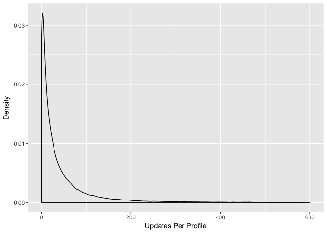

Interesting, this looks to be close to a power-law distribution, with many users having a low `updates_per_profile` value and a few users having very high value. A log transformation might help normalize this data. :)

``` r
# Plot distribution of log updates per profile
ggplot(subs, aes(x = log(updates_per_profile))) +
  geom_density() +
  labs(x = 'Log Updates Per Profile', y = 'Density')
```

    ## Warning: Removed 5300 rows containing non-finite values (stat_density).

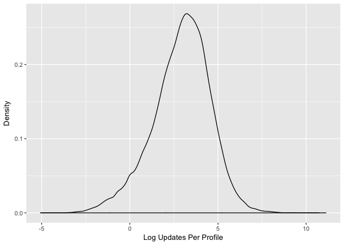

There we are, a nice bell-shaped curve. This transformation might not be necessary -- we'll need to look at the residuals of the model to determine that -- but it's nice to see a bell shape anyway. :)

Let's take a look at the churn rates and see if they correlate with the number of updates scheduled per profile. Because it is a numeric variable, it may be easier to "bin" the data into buckets and calculate the churn rate for each bucket.

We'll use the following code to make 10 bins.

``` r
# Make the cuts to bin the data
cuts <- unique(as.numeric(quantile(subs$updates_per_profile, probs = seq(0, 1, 0.1))))
cuts <- c(-1, cuts)

# Cut the updates per profile into bins
subs <- subs %>%
  mutate(updates_bin = cut(updates_per_profile, cuts))
```

Now, let's look at the number and percentage of subscriptions that have churned for each bin.

``` r
subs %>%
  group_by(updates_bin, churned) %>%
  summarise(subscriptions = n_distinct(id)) %>%
  mutate(percentage = subscriptions / sum(subscriptions)) %>%
  filter(churned == T)
```

    ## Source: local data frame [11 x 4]
    ## Groups: updates_bin [11]
    ## 
    ## # A tibble: 11 x 4
    ##      updates_bin churned subscriptions percentage
    ##           <fctr>   <dbl>         <int>      <dbl>
    ##  1        (-1,0]       1          3336  0.6762619
    ##  2     (0,0.444]       1           894  0.7056038
    ##  3     (0.444,3]       1          4106  0.6458006
    ##  4      (3,6.67]       1          3651  0.6032716
    ##  5   (6.67,11.5]       1          3699  0.5864912
    ##  6   (11.5,18.2]       1          3623  0.5728969
    ##  7   (18.2,27.3]       1          3448  0.5419679
    ##  8   (27.3,41.2]       1          3341  0.5267224
    ##  9   (41.2,64.2]       1          3201  0.5015669
    ## 10    (64.2,118]       1          3078  0.4822184
    ## 11 (118,6.8e+04]       1          3269  0.5165929

Wow! We can see that there seems to be a pretty clear negative correlation between the number of updates sent per profile and the percentage of subscriptions that have churned! Let's plot it out just to see.

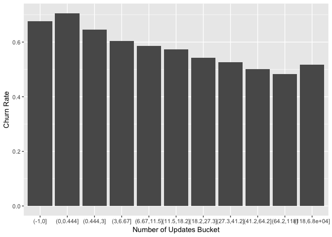

That's pretty neat to see. Now let's look at the `days_active` variable. Let's begin by visualizing its distribution.

``` r
# Plot distribution of days_active
ggplot(subs, aes(x = days_active)) +
  geom_density() +
  scale_x_continuous(limits = c(0, 100))
```

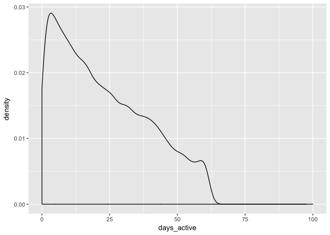

Interestingly, this also seems to have a power-law distribution. Let's see if a log transformation helps again.

``` r
# Plot distribution of the log of days_active
ggplot(subs, aes(x = log(days_active))) +
  geom_density()
```

    ## Warning: Removed 1690 rows containing non-finite values (stat_density).

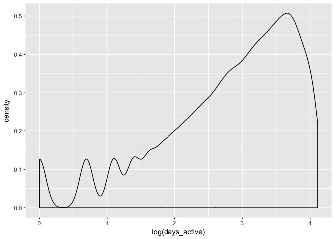

Maybe not! Let's look and see if there is any correlation with churn. We'll use the same approach of cutting the `days_active` number into bins or buckets, and calculating the churn rate for each bucket.

``` r
# Make the cuts to bin the data
cuts <- unique(as.numeric(quantile(subs$days_active, probs = seq(0, 1, 0.1), na.rm = T)))
cuts <- c(-1, cuts)

# Cut the days active variable into bins
subs <- subs %>%
  mutate(days_active_bin = cut(days_active, cuts))
```

Now, let's look at the number and percentage of subscriptions that have churned for each bin.

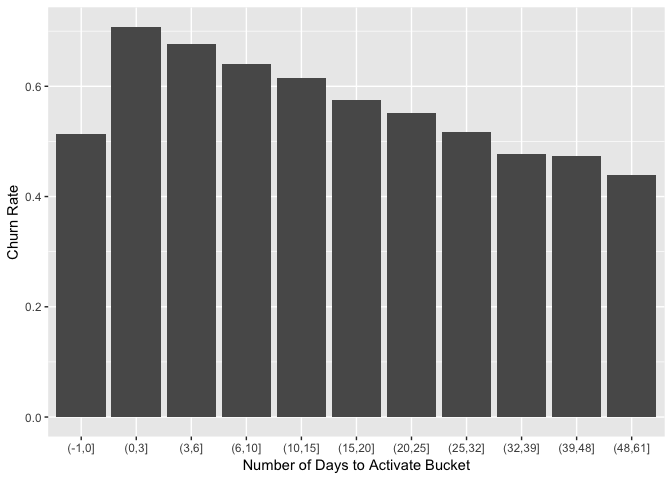

Ok, that's good to see! It looks like there is another clear negative correlation. Interestingly, users that are not active on any day are less likely to churn than those who are active 1 to 2 days out of the first 60!

How about NPS scores? Let's view the churn rate by NPS score.

``` r
# Group subscriptions by NPS score and calculate churn rate
subs %>%
  group_by(nps_score, churned) %>%
  summarise(subscriptions = n_distinct(id)) %>%
  mutate(percentage = subscriptions / sum(subscriptions)) %>%
  filter(churned == T)
```

    ## Source: local data frame [4 x 4]
    ## Groups: nps_score [4]
    ## 
    ## # A tibble: 4 x 4
    ##   nps_score churned subscriptions percentage
    ##      <fctr>   <dbl>         <int>      <dbl>
    ## 1      -100       1          1359  0.5356721
    ## 2         0       1          2756  0.5012732
    ## 3       100       1          8223  0.4824855
    ## 4        NA       1         23283  0.6136957

Interesting! Most users gave Buffer a high NPS rating (9 or 10), yet the churn rate is highest for those people! The churn rate is lowest for those that gave Buffer a 7 or 8.

Single variable models
----------------------

To see how well our prediction model performs, we'll need something to compare it to. Single-variable models can serve as good benchmarks, and they also give us a good indication of how predictive individual features are.

First let's split our dataset into training and testing sets.

``` r
# Set seed for reproducible results
set.seed(2356)

# Set random groups
subs$rgroup <- runif(dim(subs)[[1]])

# Split out training and testing sets
training <- subset(subs, rgroup <= 0.8)
testing <- subset(subs, rgroup > 0.8)
```

Let's start with a very simple model, using the `billing_cycle` variable. Let's make a table that shows the number of subscriptions that churn *in the first 60 days* for each level of `billing_cycle`.

``` r
# Create table
billing_cycle_table <- table(cycle = training[, 'billing_cycle'],
                             churn = training[, 'churned_within_60_days'],
                             useNA = 'ifany')

print(billing_cycle_table)
```

    ##        churn
    ## cycle       0     1
    ##   month 27509 13552
    ##   year  11932   470

We can create our first single-variable model based on the `billing_cycle` like this.

``` r
# First single-variable model
print(billing_cycle_table[, 2]/(billing_cycle_table[, 1] + billing_cycle_table[, 2]))
```

    ##      month       year 
    ## 0.33004554 0.03789711

This is our churn probability prediction for each value of `billing_cycle`! We can now define a function that creates a single-variable model for any categorical variable.

``` r
# Given a vector of outcomes (outCol), a categorical training variable (varCol), 
# and a prediction variable (appCol), use outCol and varCol to build a single-variable model 
# and then apply the model to appCol to get new predictions.

pos <- 1

make_prediction_categorical <- function(outCol, varCol, appCol) {
  
  # Find how often the outcome is positive during training
  pPos <- sum(outCol == pos) / length(outCol)
  
  # We need this to handle NA values
  naTab <- table(as.factor(outCol[is.na(varCol)]))
  
  # Get stats on how often outcome is positive for NA values in training
  pPosWna <- (naTab/sum(naTab))[pos]
  
  vTab <- table(as.factor(outCol),varCol)
  
  # Get stats on how often outcome is positive, conditioned on levels of the variable
  pPosWv <- (vTab[pos, ] + 1.0e-3 * pPos) / (colSums(vTab) + 1.0e-3)
  
  # Make predictions by looking up levels of appCol
  pred <- pPosWv[appCol]
  
  # Add predictions for NA values
  pred[is.na(appCol)] <- pPosWna
  
  # Add in predictions for levels of appCol that weren’t known during training
  pred[is.na(pred)] <- pPos
  
  pred

} 
```

Let's test it out! Now we can apply single-variable models to all of our datasets.

``` r
# Specify categorical varaibles
catVars <- c('plan', 'billing_cycle', 'country', 'referred_by_marketing', 
             'visited_before_joining', 'nps_score')

# Loop through categorical varaibles and mkae predictions
for(v in catVars) {
  
  # Make prediction for each categorical variable
  pi <- paste('pred', v, sep='_')
  
  # Do it for the training and testing datasets
  training[, pi] <- make_prediction_categorical(training[, "churned_within_60_days"], 
                                               training[, v], training[,v]) 
  
  testing[, pi] <- make_prediction_categorical(training[, "churned_within_60_days"], 
                                               training[, v], testing[,v]) 
}
```

Once we have the predictions, we can find the categorical variables that have a good AUC both on the training data and on the testing data not used during training. These are likely the more useful variables.

``` r
library('ROCR')

# Define a function to calculate AUC
calcAUC <- function(predcol,outcol) {
  
  perf <- performance(prediction(predcol,outcol==pos),'auc') 
  as.numeric(perf@y.values)
  
}
```

Now, for each of the categorical variables, we calculate the AUC based on the predictions that we made earlier.

``` r
for(v in catVars) {
  
  # Name the prediction variables
  pi <- paste('pred', v, sep = '_')
  
  # Find the AUC of the variable on the training set
  aucTrain <- calcAUC(training[, pi], training[, "churned_within_60_days"])
  
  # Find the AUC of the variable on the testing set  
  aucTest <- calcAUC(testing[, pi], testing[, "churned_within_60_days"])
    
  # Print the results
  print(sprintf("%s, trainAUC: %4.3f testingAUC: %4.3f", pi, aucTrain, aucTest))
    
}
```

    ## [1] "pred_plan, trainAUC: 0.347 testingAUC: 0.344"
    ## [1] "pred_billing_cycle, trainAUC: 0.365 testingAUC: 0.362"
    ## [1] "pred_country, trainAUC: 0.462 testingAUC: 0.468"
    ## [1] "pred_referred_by_marketing, trainAUC: 0.499 testingAUC: 0.500"
    ## [1] "pred_visited_before_joining, trainAUC: 0.500 testingAUC: 0.500"
    ## [1] "pred_nps_score, trainAUC: 0.458 testingAUC: 0.465"

None of these AUC values appear to be very good. A value of 0.5 is as good as a random guess. Let's look at our numeric variables now.

### Numeric variables

There are many ways to use numeric features to make predictions. A common method is to bin the numeric feature into a number of ranges and then use the range labels as a categorical variable. R can do this with `quantile()` and `cut()` commands.

Let's try to score the numeric variables by AUC.

``` r
# Define a function that makes predictions
make_prediction_numeric <- function(outCol, varCol, appCol) {
  
  # Make the cuts to bin the data
  cuts <- unique(as.numeric(quantile(varCol, probs = seq(0, 1, 0.1), na.rm = T)))
  cuts <- c(-1, cuts)
  
  varC <- cut(varCol, cuts)
  appC <- cut(appCol, cuts)
  
  # Now apply the categorical make prediction function
  make_prediction_categorical(outCol, varC, appC)
  
}
```

Now let's apply this function to the numeric variables.

``` r
# Define numeric variables
numVars <- c('team_members', 'profiles', 'amount', 'days_to_activate','charges',
             'updates_per_profile', 'updates_count','days_active', 'helpscout_convos',
             'account_age', 'charges')

# Loop through the columns and apply the formula
for(v in numVars) {
  
  # Name the prediction column
  pi <- paste('pred', v, sep = '_')
  
  # Make predictions
  training[, pi] <- make_prediction_numeric(training[, "churned_within_60_days"], 
                                               training[, v], training[,v]) 
  
  testing[, pi] <- make_prediction_numeric(training[, "churned_within_60_days"], 
                                               training[, v], testing[,v]) 
  
  
 # Find the AUC of the variable on the training set
  aucTrain <- calcAUC(training[, pi], training[, "churned_within_60_days"])
  
  # Find the AUC of the variable on the testing set  
  aucTest <- calcAUC(testing[, pi], testing[, "churned_within_60_days"])
    
  # Print the results
  print(sprintf("%s, trainAUC: %4.3f testingAUC: %4.3f", pi, aucTrain, aucTest))
    
}
```

    ## [1] "pred_team_members, trainAUC: 0.483 testingAUC: 0.483"
    ## [1] "pred_profiles, trainAUC: 0.458 testingAUC: 0.470"
    ## [1] "pred_amount, trainAUC: 0.360 testingAUC: 0.359"
    ## [1] "pred_days_to_activate, trainAUC: 0.480 testingAUC: 0.479"
    ## [1] "pred_charges, trainAUC: 0.349 testingAUC: 0.353"
    ## [1] "pred_updates_per_profile, trainAUC: 0.416 testingAUC: 0.411"
    ## [1] "pred_updates_count, trainAUC: 0.399 testingAUC: 0.399"
    ## [1] "pred_days_active, trainAUC: 0.412 testingAUC: 0.414"
    ## [1] "pred_helpscout_convos, trainAUC: 0.493 testingAUC: 0.496"
    ## [1] "pred_account_age, trainAUC: 0.346 testingAUC: 0.348"
    ## [1] "pred_charges, trainAUC: 0.349 testingAUC: 0.353"

Cool! That's about it for our single-variable models. Let's try to do better than random guesses then. :)

Decision trees
--------------

Building decision trees involves proposing many possible *data cuts* and then choosing the best cuts based on simultaneous competing criteria of predictive power, cross-validation strength, and interaction with other chosen cuts.

One of the advantages of using a package for decision tree work is not having to worry about the construction details.

``` r
# Import library
library(rpart)

# Define the outcome
outcome <- "churned_within_60_days"

# Define formula to use
formula <- paste(outcome, '~', paste(c(catVars, numVars), collapse = ' + '), sep = '')

# Fit a decision tree model
tmodel <- rpart(formula, data = training)

# Calculate AUC on training set
print(calcAUC(predict(tmodel, newdata = training), training[, outcome]))
```

    ## [1] 0.8370189

``` r
# Calculate AUC on testing set
print(calcAUC(predict(tmodel, newdata = testing), testing[, outcome]))
```

    ## [1] 0.8373238

Wow, this model actually did surprisingly well, and maintained that level on the `testing` set! Let's get a better look into what the decision tree model looks like!

``` r
print(tmodel)
```

    ## n= 53463 
    ## 
    ## node), split, n, deviance, yval
    ##       * denotes terminal node
    ## 
    ##  1) root 53463 10344.38000 0.26227480  
    ##    2) account_age>=0.5 43279  6776.98700 0.19436680  
    ##      4) plan=40TeamMembers,50team,50TeamMembersMonthly,60TeamMembers_v2,agency-yearly,business,business_v2_business_yearly,business_v2_small_yearly,business-yearly,Enterprise 100 users,Enterprise 30 Members V2 Annual,Enterprise-2,enterprise300,Enterprise300_v2,Enterprise400,iOS_Awesome1Month,iOS_Awesome1Year,iOS_SBusiness1Month,iOS_SBusiness1MonthV2,pro-annual,Respond-Medium-v2,Respond-starter-annual-1,small_business_yearly,small-149,solo-9,studio-29 11151   372.63830 0.03461573 *
    ##      5) plan=40TeamMembers_Monthly,awesome_v2_monthly,business_v2_agency_monthly,business_v2_agency_yearly,business_v2_business_monthly,business_v2_small_monthly,business-simple,Enterprise200v2,pro-monthly,respond-pro-monthly,respond-starter-annual,respond-starter-monthly,respond-starter-monthly-v2,small_business 32128  6020.99900 0.24981320  
    ##       10) charges>=1.5 28963  4284.95300 0.18054070  
    ##         20) charges>=4.5 22203  2677.97700 0.14029640 *
    ##         21) charges< 4.5 6760  1452.90600 0.31272190 *
    ##       11) charges< 1.5 3165   325.21200 0.88372830 *
    ##    3) account_age< 0.5 10184  2519.65200 0.55086410  
    ##      6) plan=business_v2_business_monthly,business_v2_small_monthly,business_v2_small_yearly,business-simple,business-yearly,iOS_Awesome1Month,iOS_Awesome1Year,iOS_SBusiness1MonthV2,pro-annual,respond-pro-monthly,small_business_yearly 1438    99.03825 0.07440890 *
    ##      7) plan=agency-yearly,awesome_v2_monthly,awesome_v2_yearly,business,business_v2_agency_monthly,business_v2_business_yearly,pro-monthly,small_business 8746  2040.50200 0.62920190  
    ##       14) charges>=1.5 6733  1677.57300 0.52903610  
    ##         28) charges>=10.5 1154   193.55980 0.21317160 *
    ##         29) charges< 10.5 5579  1345.06300 0.59437180 *
    ##       15) charges< 1.5 2013    69.42474 0.96423250 *

Each row is a *node* of the tree. This tree has 6 nodes. Node 1 is always called the root. Each node, other than the root node, has a parent, and the parent of node *k* is node `floor(k/2)`.

The indentation also indicates how deep in the tree the node is. Each node other than the root is named by what condition must be true to move from the parent to the node.

We can represent this with a graph too.

``` r
# Plot decision tree
par(cex = 0.7)
plot(tmodel)
text(tmodel)
```

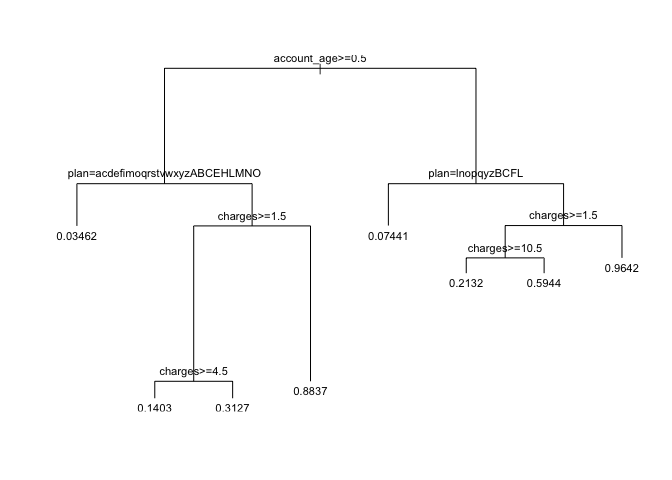

Oh ok, I think I see what's happening. The model is counting the number of successful charges! Of course that will be correlated with the percentage of subscriptions that churn within two months! Let's remove that variable from the model.

``` r
# Redefine numeric variables
numVars <- c('team_members', 'profiles', 'amount', 'days_to_activate', 'updates_per_profile',
             'days_active', 'nps_score', 'helpscout_convos', 'account_age')

# Define formula to use
formula <- paste(outcome, '~', paste(c(catVars, numVars), collapse = ' + '), sep = '')

# Fit a decision tree model
tmodel <- rpart(formula, data = training)

# Calculate AUC on training set
print(calcAUC(predict(tmodel, newdata = training), training[, outcome]))
```

    ## [1] 0.7529727

``` r
# Calculate AUC on testing set
print(calcAUC(predict(tmodel, newdata = testing), testing[, outcome]))
```

    ## [1] 0.7530546

Again the AUC values are quite good, and they don't contain the number of successful charges. Let's take a closer look at the tree model.

``` r
print(tmodel)
```

    ## n= 53463 
    ## 
    ## node), split, n, deviance, yval
    ##       * denotes terminal node
    ## 
    ##  1) root 53463 10344.38000 0.26227480  
    ##    2) account_age>=0.5 43279  6776.98700 0.19436680  
    ##      4) plan=40TeamMembers,50team,50TeamMembersMonthly,60TeamMembers_v2,agency-yearly,business,business_v2_business_yearly,business_v2_small_yearly,business-yearly,Enterprise 100 users,Enterprise 30 Members V2 Annual,Enterprise-2,enterprise300,Enterprise300_v2,Enterprise400,iOS_Awesome1Month,iOS_Awesome1Year,iOS_SBusiness1Month,iOS_SBusiness1MonthV2,pro-annual,Respond-Medium-v2,Respond-starter-annual-1,small_business_yearly,small-149,solo-9,studio-29 11151   372.63830 0.03461573 *
    ##      5) plan=40TeamMembers_Monthly,awesome_v2_monthly,business_v2_agency_monthly,business_v2_agency_yearly,business_v2_business_monthly,business_v2_small_monthly,business-simple,Enterprise200v2,pro-monthly,respond-pro-monthly,respond-starter-annual,respond-starter-monthly,respond-starter-monthly-v2,small_business 32128  6020.99900 0.24981320  
    ##       10) updates_per_profile>=1.171569 28290  4935.68000 0.22516790 *
    ##       11) updates_per_profile< 1.171569 3838   941.47790 0.43147470 *
    ##    3) account_age< 0.5 10184  2519.65200 0.55086410  
    ##      6) plan=business_v2_business_monthly,business_v2_small_monthly,business_v2_small_yearly,business-simple,business-yearly,iOS_Awesome1Month,iOS_Awesome1Year,iOS_SBusiness1MonthV2,pro-annual,respond-pro-monthly,small_business_yearly 1438    99.03825 0.07440890 *
    ##      7) plan=agency-yearly,awesome_v2_monthly,awesome_v2_yearly,business,business_v2_agency_monthly,business_v2_business_yearly,pro-monthly,small_business 8746  2040.50200 0.62920190 *

And let's plot the nodes.

``` r
# Plot decision tree
par(cex = 0.7)
plot(tmodel)
text(tmodel)
```

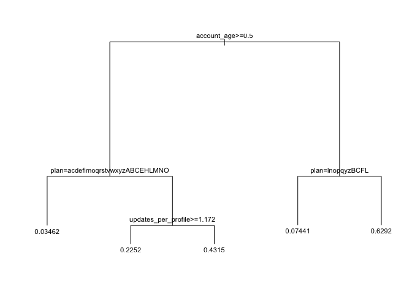

Interesting, the nodes are made up primarily of groups of plan IDs. I'm not sure how useful this will be for us. The first branch, however, is interesting. If the Buffer account was created on the same day, there is a *much* higher churn rate!

Let's remove the `plan` variable from the model now.

``` r
# Redefine categorical variables
catVars <- c('billing_cycle', 'country', 'referred_by_marketing', 'visited_before_joining')

# Define formula to use
formula <- paste(outcome, '~', paste(c(catVars, numVars), collapse = ' + '), sep = '')

# Fit a decision tree model
tmodel <- rpart(formula, data = training)

# Calculate AUC on training set
print(calcAUC(predict(tmodel, newdata = training), training[, outcome]))
```

    ## [1] 0.7521939

``` r
# Calculate AUC on testing set
print(calcAUC(predict(tmodel, newdata = testing), testing[, outcome]))
```

    ## [1] 0.7527268

Great, the AUCs are still relatively good. Let's take a look at that tree now.

``` r
# Print decision tree
print(tmodel)
```

    ## n= 53463 
    ## 
    ## node), split, n, deviance, yval
    ##       * denotes terminal node
    ## 
    ##  1) root 53463 10344.3800 0.2622748  
    ##    2) account_age>=0.5 43279  6776.9870 0.1943668  
    ##      4) billing_cycle=year 11036   369.7081 0.0347046 *
    ##      5) billing_cycle=month 32243  6029.6560 0.2490153  
    ##       10) updates_per_profile>=1.171569 28382  4940.8810 0.2244733 *
    ##       11) updates_per_profile< 1.171569 3861   946.0176 0.4294224 *
    ##    3) account_age< 0.5 10184  2519.6520 0.5508641  
    ##      6) billing_cycle=year 1366    81.4590 0.0636896 *
    ##      7) billing_cycle=month 8818  2063.7660 0.6263325 *

Alright, now we're getting a bit more useful information.

``` r
# Plot decision tree
par(cex = 0.7)
plot(tmodel)
text(tmodel)
```

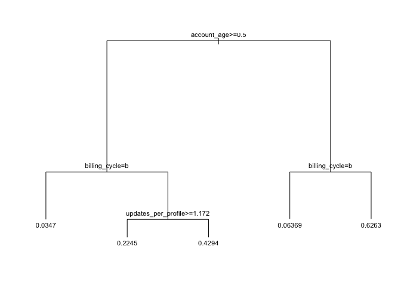

For accounts that are *not* in their first day, if the billing cycle is yearly, only around 3.3% churn in their first 60 days. If the billing cycle is monthly, around 24.9% churn within 60 days.

If the account is not in its first day and the billing cycle is monthly, if the number of updates per profile is greater than 0.36, the churn rate is around 22.9% if the updates per profile is less than 0.36, the churn rate rises to 48%.

For accounts that *are* in their first day, if the billing cycle is yearly, around 6% churn. If the billing cycle is monthly, a whopping 62% churn in the first two months!

Logistic regression
-------------------

Logistic regression is the most important member of a class of models called *generalized linear models*. Logistic regresion can directly predict values that are restricted to the (0, 1) interval, such as probabilities.

Let's build the model.

``` r
# Define formula
formula <- "churned_within_60_days ~ billing_cycle + referred_by_marketing + visited_before_joining + team_members + profiles + amount + days_to_activate + updates_per_profile + days_active + nps_score + helpscout_convos + account_age"

# Train regression model
model <- glm(formula, data = training, family = binomial(link = "logit"))
```

Let's make some predictions for both the training and testing sets.

``` r
# Make predictions
training$pred <- predict(model, newdata = training, type = "response")
testing$pred <- predict(model, newdata = testing, type = "response")
```

Our goal is to use the model to classify new instances into one of two categories. We want the model to give high scores to positive instances and low scores otherwise.

Let's plot the double-density plot of the predictions.

``` r
# Plot double density plot
ggplot(training, aes(x = pred, color = as.factor(churned_within_60_days), 
                     linetype = as.factor(churned_within_60_days))) +
  geom_density() +
  labs(x = "Predicted Churn Probability", y = "", color = "Churned", linetype = "Churned")
```

    ## Warning: Removed 32060 rows containing non-finite values (stat_density).

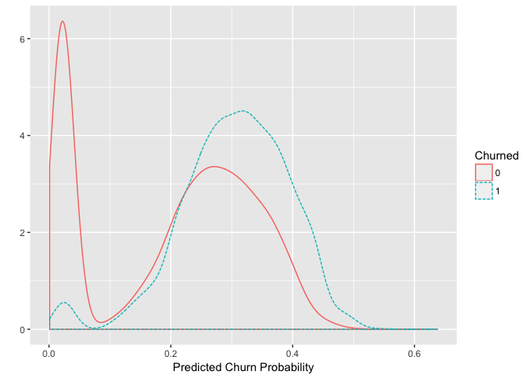

Hmm that's not great. Not too bad. Ideally, we'd like the distribution of scores to be separated, with the scores of the negative instances to be concentrated on the left, and the distribution for the positive instances to be concentrated on the right. In this case, both distributions are concentrated on the left. This isn't surprising

In order to use the model as a classifier, you must pick a threshold, above which scores will be classified as positive and below as negative.

When you pick a threshold, you're trying to balance the *precision* of the classifier (what fraction of the predicted positives are true positives) and its *recall* (how many of the true positives the classifier finds).

If the score distributions of the positive and negative instances are well separated, then we can pick an appropriate threshold in the "valley" between the two peaks. In the current case, the score distributions aren't well separated, which indicates that the model can't build a classifier that simultaneously achieves good recall and good precision.

But we can build a classifier that identifies a subset of situations with a higher-than-average rate of churn. We'll call the ratio of the classifier precision to the average rate of positives the *enrichment rate*.

The higher we set the threshold, the more *precise* the classifier will be; but we'll also miss a higher percentage of at-risk situations.

We'll use the training set to pick a threshold and use the training set to evaluate its performance.

To help pick a threshold, we can use a plot that shows both enrichment and recall as a function of the threshold.

``` r
library(ROCR); library(gridExtra)

# Create a prediction object
predObj <- prediction(training$pred, training$churned_within_60_days)

# Create an ROCR object to calculate precision as a function of threshold
precObj <- performance(predObj, measure = "prec")

# Create an ROCR object to calculate recall as a function of threshold
recObj <- performance(predObj, measure = "rec")

# Extract precision and recall from S4 objects with @ notation
precision <- (precObj@y.values)[[1]]
recall <- (recObj@y.values)[[1]]

# The x values (thresholds) are the same in both predObj and recObj
prec.x <- (precObj@x.values)[[1]]
```

Phew, now let's build a data frame with thresholds, precision, and recall.

``` r
# Build data frame
rocFrame <- data.frame(threshold = prec.x, precision = precision, recall = recall)
```

Now we can build a couple plots.

``` r
# Calculate rate of churn in the training set
pnull <- mean(as.numeric(training$churned_within_60_days))

p1 <- ggplot(rocFrame, aes(x = threshold)) +
  geom_line(aes(y = precision / pnull)) +
  coord_cartesian(xlim = c(0, 0.5), ylim = c(0, 5)) +
  labs(x = "Threshold", y = "", title = "Enrichment and Threshold")

p2 <- ggplot(rocFrame, aes(x = threshold)) +
  geom_line(aes(y = recall)) +
  coord_cartesian(xlim = c(0, 0.5)) +
  labs(x = "Threshold", y = "", title = "Recall and Threshold")

grid.arrange(p1, p2, ncol = 1)
```

    ## Warning: Removed 1 rows containing missing values (geom_path).

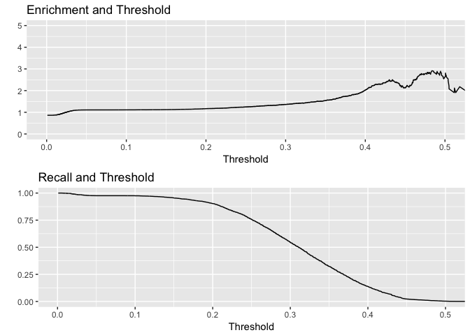

Looking at the plots, you can see that higher thresholds result in more precise classifications, at the cost of missing more cases; a lower threhold will identify more cases, at the cost of many more false positives.

A threshold of 0.3 (which is slightly higher than the overall rate of churn) might be a good tradeoff. The resulting classifier will identify a set of potential churn situations that finds about 70% of all the true churn situations, with a true positive rate 1.5 times higher than the overall population.

Let's evaluate 0.3 as a threshold.

``` r
# Build confusion matrix
confuse <- table(pred = testing$pred > 0.3, churned = testing$churned_within_60_days)
confuse
```

    ##        churned
    ## pred       0    1
    ##   FALSE 2919  578
    ##   TRUE  1152  669

The rows contain predicted negatives and positives, and the columns contain actual negatives and positives. Let's calculate precision and recall.

``` r
# Calculate precision
precision <- confuse[2, 2] / sum(confuse[2, ])
precision
```

    ## [1] 0.3673806

Around 37% of the subscriptions we predicted to churn actually did churn in the testing set.

``` r
# Calculate recall
recall <- confuse[2, 2] / sum(confuse[, 2])
recall
```

    ## [1] 0.5364876

We capture over 70% of the true churn cases in the testing set.

``` r
# Calculate enrichment
enrich <- precision / mean(as.numeric(testing$churned_within_60_days))
enrich
```

    ## [1] 1.402029

The ratio of the classifier precision to the average rate of positives is 1.44. The subscriptions that we predict to churn end up churning at a rate 44% higher than the overall population. :)

Let's calculate the AUCs

``` r
# Calculate AUC on training set
print(calcAUC(training$pred, training[, outcome]))
```

    ## [1] 0.7138923

``` r
# Calculate AUC on testing set
print(calcAUC(testing$pred, testing[, outcome]))
```

    ## [1] 0.7234499

This isn't quite as good as the decision tree model, but is quite interpretable!

``` r
# Summarise glm model
summary(model)
```

    ## 
    ## Call:
    ## glm(formula = formula, family = binomial(link = "logit"), data = training)
    ## 
    ## Deviance Residuals: 
    ##     Min       1Q   Median       3Q      Max  
    ## -1.4251  -0.8265  -0.6122  -0.1605   3.2095  
    ## 
    ## Coefficients:
    ##                             Estimate Std. Error z value Pr(>|z|)    
    ## (Intercept)               -4.081e-02  6.085e-02  -0.671 0.502404    
    ## billing_cycleyear         -2.910e+00  1.073e-01 -27.115  < 2e-16 ***
    ## referred_by_marketingYes  -1.250e-01  1.154e-01  -1.083 0.278861    
    ## visited_before_joiningYes -6.678e-02  5.017e-02  -1.331 0.183192    
    ## team_members              -8.032e-02  2.191e-02  -3.666 0.000246 ***
    ## profiles                  -3.767e-04  7.651e-04  -0.492 0.622513    
    ## amount                     3.162e-04  2.517e-04   1.256 0.209078    
    ## days_to_activate           2.805e-04  1.119e-04   2.507 0.012187 *  
    ## updates_per_profile       -5.387e-05  7.175e-05  -0.751 0.452807    
    ## days_active               -1.719e-02  1.094e-03 -15.709  < 2e-16 ***
    ## nps_score0                -1.889e-01  6.409e-02  -2.948 0.003200 ** 
    ## nps_score100              -2.401e-01  5.665e-02  -4.238 2.25e-05 ***
    ## helpscout_convos           1.753e-02  6.244e-03   2.807 0.004999 ** 
    ## account_age               -5.694e-04  4.633e-05 -12.290  < 2e-16 ***
    ## ---
    ## Signif. codes:  0 '***' 0.001 '**' 0.01 '*' 0.05 '.' 0.1 ' ' 1
    ## 
    ## (Dispersion parameter for binomial family taken to be 1)
    ## 
    ##     Null deviance: 22888  on 21402  degrees of freedom
    ## Residual deviance: 20214  on 21389  degrees of freedom
    ##   (32060 observations deleted due to missingness)
    ## AIC: 20242
    ## 
    ## Number of Fisher Scoring iterations: 6

Random forests
--------------

``` r
# Load library
library(randomForest)

# Specify features
features <- c('team_members', 'profiles', 'billing_cycle', 'updates_count','referred_by_marketing',
              'visited_before_joining', 'account_age', 'days_active', 'nps_responses',
              'helpscout_convos', 'updates_per_profile')

# Train the model
fmodel <- randomForest(x = training[, features], y = as.factor(training$churned_within_60_days),
                       ntree = 500, nodesize = 10, importance = T)
```

``` r
# Define function to calculate log likelihood
loglikelihood <- function(y, py) {
  
  pysmooth <- ifelse(py == 0, 1e-12, ifelse(py == 1, 1-1e-12, py))
  
  sum(y * log(pysmooth) + (1  -y) * log(1 - pysmooth))
  
}

accuracyMeasures <- function(pred, truth, name = "model") {
  
  dev.norm <- -2*loglikelihood(as.numeric(truth), pred)/length(pred)
  
  # Normalize the deviance by the number of data points 
  # so that we can compare the deviance across training and test sets.
  ctable <- table(truth = truth, pred=(pred >= 0.3))
  
  print(ctable)
  
  accuracy <- sum(diag(ctable))/sum(ctable)
  precision <- ctable[2,2]/sum(ctable[,2])
  recall <- ctable[2,2]/sum(ctable[2,])
  f1 <- precision*recall
  
  data.frame(model = name, accuracy = accuracy, f1 = f1, dev.norm)

}

# Report the quality of the model on the training set
accuracyMeasures(predict(fmodel, newdata = training[, features], type = 'prob')[, '1'], 
                 training$churned_within_60_days == 1, name = "random forest, training")
```

    ##        pred
    ## truth   FALSE  TRUE
    ##   FALSE 35425  4016
    ##   TRUE    878 13144

    ##                     model  accuracy        f1  dev.norm
    ## 1 random forest, training 0.9084601 0.7180056 0.5258919

``` r
# Report the quality of the model on the testing set
accuracyMeasures(predict(fmodel, newdata = testing[, features], type = 'prob')[, '1'], 
                 testing$churned_within_60_days == 1, name = "random forest, testing")
```

    ##        pred
    ## truth   FALSE TRUE
    ##   FALSE  8085 1772
    ##   TRUE   1361 2139

    ##                    model  accuracy        f1  dev.norm
    ## 1 random forest, testing 0.7654413 0.3342456 0.9352089

Let's look at how important each variable was to the random forest model.

``` r
# Plot variable importance
varImpPlot(fmodel, type = 1)
```

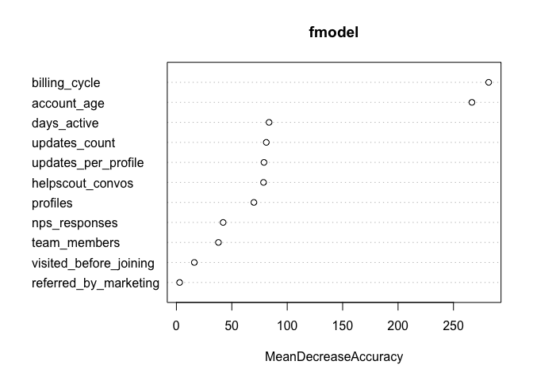

We can see here that `billing_cycle` and `account_age` were both very important, followed (on a smaller scale) by `days_active` and `updates_count`.

Let's calculate AUC.

``` r
# Calculate AUC on training set
print(calcAUC(predict(fmodel, newdata = training[, features], type = 'prob')[, '1'],
      training[, outcome]))
```

    ## [1] 0.9626197

``` r
# Calculate AUC on testing set
print(calcAUC(predict(fmodel, newdata = testing[, features], type = 'prob')[, '1'],
      testing[, outcome]))
```

    ## [1] 0.7957816

This is the best we've gotten so far, but the AUC being much lower for the testing set suggests overfitting. Let's simplify the model by reducing the number of features.

``` r
# Specify features
features <- c('profiles', 'billing_cycle', 'updates_count', 'account_age', 'days_active', 
              'helpscout_convos')

# Train the model
fmodel <- randomForest(x = training[, features], y = as.factor(training$churned_within_60_days),
                       ntree = 500, nodesize = 10, importance = T)
```

Let's report the accuracy of the new model.

``` r
# Report the quality of the model on the training set
accuracyMeasures(predict(fmodel, newdata = training[, features], type = 'prob')[, '1'], 
                 training$churned_within_60_days == 1, name = "random forest, training")
```

    ##        pred
    ## truth   FALSE  TRUE
    ##   FALSE 35198  4243
    ##   TRUE   2663 11359

    ##                     model  accuracy        f1  dev.norm
    ## 1 random forest, training 0.8708266 0.5897799 0.6104995

``` r
# Report the quality of the model on the testing set
accuracyMeasures(predict(fmodel, newdata = testing[, features], type = 'prob')[, '1'], 
                 testing$churned_within_60_days == 1, name = "random forest, testing")
```

    ##        pred
    ## truth   FALSE TRUE
    ##   FALSE  8316 1541
    ##   TRUE   1492 2008

    ##                    model  accuracy        f1  dev.norm
    ## 1 random forest, testing 0.7729281 0.3246036 0.9915489

And calculate the AUCs.

``` r
# Calculate AUC on training set
print(calcAUC(predict(fmodel, newdata = training[, features], type = 'prob')[, '1'],
      training[, outcome]))
```

    ## [1] 0.9377516

``` r
# Calculate AUC on testing set
print(calcAUC(predict(fmodel, newdata = testing[, features], type = 'prob')[, '1'],
      testing[, outcome]))
```

    ## [1] 0.7908306

Thoughts and conclusions
------------------------

We've tried several different approaches: single-variable models, decision trees, logistic regression, and random forests. Of those methods, random forests seems to perform the best in terms of churn prediction.

There are several features that seem to be quite important in these models. The billing cycle and account age at the time the subscription was created both seem to be quite important. The number of updates sent in the first 60 days and the number of helpscout conversations had both seem to be important as well.

However, it seems that there are a couple things going on here that aren't accounted for in the model. You could say that monthly customers have more opportunities to churn than yearly -- they renew each month. Also, there is a distinct pattern on a group of annual customers churning very early on -- perhaps they were automatically upgraded, or something.

For these reasons ***I would suggest building separate churn models for annual and monthly subscriptions***. I think that would help us get more granular and learn more about why people churn. It may also help us boost accuracy. Theoretically the models in this analysis should account for monthly and annual plans, but let's go through the exercise of building the models manually just to learn more.
