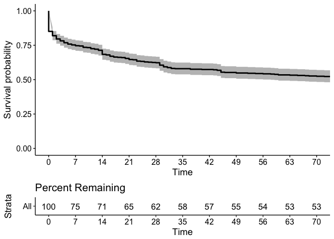

Annual Business Subscription Churn
================

Motivation
----------

The purpose of this analysis is to gain a better understanding of *subscription churn* and the factors that influence it. In particular, we will focus on *annual* subscriptions in this analysis.

Findings and conclusions
------------------------

This sample of 10 customers suggests that there may be some confusion with trials, particularly with the `business_v2_small_yearly` plan.

Several of the customers started and canceled trials *and* asked for refunds. Most of these users have also had previous subscriptions, so we probably had their credit cards on file. These customers may or may have known if, when, and exactly how much they were going to get charged.

In other cases, the `busines_v2_small_yearly` plan might not have been the right fit. Almost all of these subscriptions were canceled very quickly after beginning.

Data collection and tidying
---------------------------

Let's analyze *business* subscriptions created after January 1, 2016. The dataset we use comes from [**this Look**](https://looker.buffer.com/looks/3859). We'll import it to R using the `buffer` package.

``` r
# Get data from Looker
subs <- get_look(3859)
```

There are over 8000 subscriptions in the dataset. Let's do a bit of cleanup and calculate the length of each subscription. The code to do that has been hidden.

After cleaning, this is what the dataframe looks like:

``` r
head(subs)
```

    ##   created_at canceled_at   ended_at   status                 id
    ## 1 2017-05-30        <NA>       <NA> trialing sub_AkYD0eSlHPlGPQ
    ## 2 2017-05-30        <NA>       <NA> trialing sub_AkaLbLQWKLTW46
    ## 3 2017-05-30  2017-05-30 2017-05-30 canceled sub_AkcCBxFK1wdczH
    ## 4 2017-05-30        <NA>       <NA> trialing sub_AkVlGQvzfDEz8c
    ## 5 2017-05-30        <NA>       <NA>   active sub_6xi4qA9yQSG2fR
    ## 6 2017-05-30        <NA>       <NA> trialing sub_AkTYLaaFSVEvaE
    ##                         plan gateway billing_cycle amount
    ## 1   business_v2_small_yearly  Stripe          year   1010
    ## 2   business_v2_small_yearly  Stripe          year   1010
    ## 3   business_v2_small_yearly  Stripe          year   1010
    ## 4   business_v2_small_yearly  Stripe          year   1010
    ## 5 business_v2_agency_monthly  Stripe         month    399
    ## 6   business_v2_small_yearly  Stripe          year   1010
    ##          customer_id length churned
    ## 1 cus_AkYDJ6IiTpgc3T     NA   FALSE
    ## 2 cus_AkaLk0hb6fFmQ1     NA   FALSE
    ## 3 cus_AkcCfaQ1WKSvEE      0    TRUE
    ## 4 cus_AkVlMalKuXzXY9     NA   FALSE
    ## 5 cus_51aU8iNKmnp4WN     NA   FALSE
    ## 6 cus_AkTYKjKtaNv0hG     NA   FALSE

Now, to only look at *annual* subscriptions, let's filter on the `billing_cycle`.

``` r
# Filter out monthly subscriptions
annual <- subs %>%
  filter(billing_cycle == 'year')
```

Survival analysis
-----------------

To get a better understanding of exactly when these Business customers churn, let's do a quick survival analysis. Clasically, survival analysis was used to model the time it takes for people to die of a disease. However it can be used to model and analyze the time it takes for a specific event to occur, churn in this case.

It's particularly useful in this case because of missing data -- there must be subscriptions that will churn in our dataset *that haven't done so yet*. This is called *censoring*, and in particular *right censoring*.

Right censoring occurs when the date of the event is unknown, but is after some known date. Survival analysis can account for this kind of censoring.

There is also left censoring, for example when the date the subscription begain is unknown, but that is less applicable to our case.

The survival function, or survival curve, (`S`) models the probability that the time of the event (`T`) is greater than some specified time (`t`).

Let's build the survival curve and plot it.

``` r
# Kaplan Meier survival curve
annual$survival <- Surv(annual$length, annual$churned)

# Fit the model
fit <- survfit(survival ~ 1, data = annual)

# Create survival plot
ggsurvplot(fit, data = annual, risk.table = "percentage", risk.table.title = "Percent Remaining",
           break.x.by = 60, xlim = c(0, 365))
```


The plot shows the percent of annual Business subscriptions still active X days after creating the subscription, and table below the graph shows the percent of subscription still remaining after X days. By the end of the billing period (one year), only around 22% of subscriptions remain active.

It's also striking to see that only 64% of annual subscriptions are still active 60 days after creation. Looking at the graph, we can see that there is a heavy amount of churn in the first few days. Let's zoom in on this crucial time period.



This plot zooms in on the first 70 days of the subscription. After 7 days, only 75% of the subscriptions remain. This is the biggest dropoff by far, and most of those subscriptions churned on the first day!

Let's look at these subscriptions.

``` r
# Get subscriptions that churned on first day
churned <- annual %>%
  select(-survival) %>%
  filter(length == 0)
```

There are 75 of these subscriptions. **The first day alone accounts for over 14% of *all* churned subscriptions!**

Let's count these subscriptions by payment gateway.

``` r
# Group by payment gateway
churned %>%
  group_by(gateway) %>%
  count
```

    ## # A tibble: 1 x 2
    ##   gateway     n
    ##    <fctr> <int>
    ## 1  Stripe    76

...and let's group by the plan as well.

``` r
# Group by plan
churned %>%
  group_by(plan) %>%
  count %>%
  arrange(desc(n))
```

    ## # A tibble: 5 x 2
    ##                          plan     n
    ##                        <fctr> <int>
    ## 1    business_v2_small_yearly    52
    ## 2       small_business_yearly    14
    ## 3 business_v2_business_yearly     8
    ## 4   business_v2_agency_yearly     1
    ## 5             business-yearly     1

The majority of these cases are small business yearly plans, which is to be expected. Let's grab a random sample of 10 of these subscriptions.

Individual churned customers
----------------------------

Let's start by getting a random sample of 10 customers.

``` r
# Get sample of 10 customers
sample <- churned %>%
  sample_n(size = 10) %>%
  mutate(customer_id = as.character(customer_id))
```

We'll use SQL to look at the stripe events of each customer.

#### Customer 1

Let's look at the stripe events of the first customer in the dataframe.

``` r
cus1 <- sample[1, ]$customer_id
```

``` sql
select 
    date
    , type
    , json_extract_path_text(data, 'object', 'customer') as customer
    , json_extract_path_text(data, 'object','plan','id') as plan_id
    , json_extract_path_text(data, 'object','subscription') as sub_id
    , data
from stripe_api_events events
where json_extract_path_text(data, 'object', 'customer') = ?cus1
order by date desc
limit 100
```

| date                | type                          | customer            | plan\_id                        | sub\_id             | data                                                                                                                                                                                                                                                                                                                                                                                                                                                                                                                                                                                                                                                                                                                                                                                                                                                                                                                                                                                                                                                                                                                                                                                                                                                                                                                                                                                                                                                                                                                                                                                                                                                                                                                                                                                                                                                                                                                            |
|:--------------------|:------------------------------|:--------------------|:--------------------------------|:--------------------|:--------------------------------------------------------------------------------------------------------------------------------------------------------------------------------------------------------------------------------------------------------------------------------------------------------------------------------------------------------------------------------------------------------------------------------------------------------------------------------------------------------------------------------------------------------------------------------------------------------------------------------------------------------------------------------------------------------------------------------------------------------------------------------------------------------------------------------------------------------------------------------------------------------------------------------------------------------------------------------------------------------------------------------------------------------------------------------------------------------------------------------------------------------------------------------------------------------------------------------------------------------------------------------------------------------------------------------------------------------------------------------------------------------------------------------------------------------------------------------------------------------------------------------------------------------------------------------------------------------------------------------------------------------------------------------------------------------------------------------------------------------------------------------------------------------------------------------------------------------------------------------------------------------------------------------|
| 2017-05-10 15:34:57 | charge.succeeded              | cus\_98hpa31Um97QM4 |                                 |                     | {"object":{"application\_fee":null,"livemode":true,"currency":"usd","invoice":"in\_AdCIXTLd68733k","fraud\_details":{},"statement\_descriptor":"Buffer Business Mnthly","captured":true,"on\_behalf\_of":null,"transfer\_group":null,"source":{"customer":"cus\_98hpa31Um97QM4","address\_city":null,"exp\_month":3,"tokenization\_method":null,"name":"Marie R Pazych","country":"US","brand":"American Express","object":"card","metadata":{},"dynamic\_last4":null,"last4":"1003","fingerprint":"gDtrkK4okmuXIoiv","address\_zip\_check":"pass","funding":"credit","exp\_year":2021,"type":"American Express","id":"card\_98hp0N3gXC1kLD","address\_zip":"34109"},"receipt\_number":null,"destination":null,"id":"ch\_AdDGoUZjNaDENY","application":null,"fee\_details":\[{"amount\_refunded":0,"description":"Stripe processing fees","application":null,"currency":"usd","amount":438,"type":"stripe\_fee"}\],"card":{"customer":"cus\_98hpa31Um97QM4","address\_city":null,"exp\_month":3,"tokenization\_method":null,"name":"Marie R Pazych","country":"US","brand":"American Express","object":"card","metadata":{},"dynamic\_last4":null,"last4":"1003","fingerprint":"gDtrkK4okmuXIoiv","address\_zip\_check":"pass","funding":"credit","exp\_year":2021,"type":"American Express","id":"card\_98hp0N3gXC1kLD","address\_zip":"34109"},"balance\_transaction":"txn\_AdDGFChpZGokGq","source\_transfer":null,"receipt\_email":null,"metadata":{},"status":"paid","disputed":false,"refunded":false,"object":"charge","paid":true,"dispute":null,"fee":438,"review":null,"statement\_description":"Buffer Business Mnthly","failure\_code":null,"customer":"cus\_98hpa31Um97QM4","refunds":\[\],"created":1494430496,"shipping":null,"amount":19900,"outcome":{"network\_status":"approved\_by\_network","reason":null,"risk\_level":"normal","type":"authorized","seller\_message":"Payment complete."},"order":null}} |
| 2017-05-10 15:34:57 | invoice.payment\_succeeded    | cus\_98hpa31Um97QM4 |                                 | sub\_9uFC0ZCSA2OxkR | {"object":{"application\_fee":null,"livemode":true,"tax":null,"number":"90c5645303-0003","attempt\_count":1,"currency":"usd","total":19900,"statement\_descriptor":null,"billing":"charge\_automatically","receipt\_number":null,"id":"in\_AdCIXTLd68733k","charge":"ch\_AdDGoUZjNaDENY","closed":true,"period\_end":1494426873,"forgiven":false,"statement\_description":null,"metadata":{},"description":null,"webhooks\_delivered\_at":1494426894,"attempted":true,"object":"invoice","paid":true,"ending\_balance":0,"date":1494426890,"period\_start":1491834873,"subtotal":19900,"payment":"ch\_AdDGoUZjNaDENY","tax\_percent":null,"subscription":"sub\_9uFC0ZCSA2OxkR","customer":"cus\_98hpa31Um97QM4","next\_payment\_attempt":null,"lines":{"subscriptions":\[{"discountable":true,"subscription\_item":"si\_09aQhp47iwqlaZWUYF53zdh0","object":"line\_item","description":null,"subscription":null,"proration":false,"livemode":true,"period":{"start":1494426873,"end":1497105273},"currency":"usd","amount":19900,"plan":{"interval":"month","name":"Medium Business v2 - Monthly","created":1457710757,"object":"plan","interval\_count":1,"statement\_descriptor":"Buffer Business Mnthly","currency":"usd","amount":19900,"livemode":true,"id":"business\_v2\_business\_monthly","statement\_description":"Buffer Business Mnthly","metadata":{}},"quantity":1,"type":"subscription","id":"sub\_9uFC0ZCSA2OxkR","metadata":{}}\]},"starting\_balance":0,"amount\_due":19900}}                                                                                                                                                                                                                                                                                                                                                                                                                                  |
| 2017-05-10 15:34:57 | invoice.updated               | cus\_98hpa31Um97QM4 |                                 | sub\_9uFC0ZCSA2OxkR | {"previous\_attributes":{"next\_payment\_attempt":1494430490,"attempted":false,"paid":false,"charge":null,"ending\_balance":null,"closed":false,"payment":null},"object":{"application\_fee":null,"livemode":true,"tax":null,"number":"90c5645303-0003","attempt\_count":1,"currency":"usd","total":19900,"statement\_descriptor":null,"billing":"charge\_automatically","receipt\_number":null,"id":"in\_AdCIXTLd68733k","charge":"ch\_AdDGoUZjNaDENY","closed":true,"period\_end":1494426873,"forgiven":false,"statement\_description":null,"metadata":{},"description":null,"webhooks\_delivered\_at":1494426894,"attempted":true,"object":"invoice","paid":true,"ending\_balance":0,"date":1494426890,"period\_start":1491834873,"subtotal":19900,"payment":"ch\_AdDGoUZjNaDENY","tax\_percent":null,"subscription":"sub\_9uFC0ZCSA2OxkR","customer":"cus\_98hpa31Um97QM4","next\_payment\_attempt":null,"lines":{"subscriptions":\[{"discountable":true,"subscription\_item":"si\_09aQhp47iwqlaZWUYF53zdh0","object":"line\_item","description":null,"subscription":null,"proration":false,"livemode":true,"period":{"start":1494426873,"end":1497105273},"currency":"usd","amount":19900,"plan":{"interval":"month","name":"Medium Business v2 - Monthly","created":1457710757,"object":"plan","interval\_count":1,"statement\_descriptor":"Buffer Business Mnthly","currency":"usd","amount":19900,"livemode":true,"id":"business\_v2\_business\_monthly","statement\_description":"Buffer Business Mnthly","metadata":{}},"quantity":1,"type":"subscription","id":"sub\_9uFC0ZCSA2OxkR","metadata":{}}\]},"starting\_balance":0,"amount\_due":19900}}                                                                                                                                                                                                                                                                   |
| 2017-05-10 14:34:50 | customer.subscription.updated | cus\_98hpa31Um97QM4 | business\_v2\_business\_monthly |                     | {"previous\_attributes":{"current\_period\_start":1491834873,"current\_period\_end":1494426873},"object":{"status":"active","customer":"cus\_98hpa31Um97QM4","object":"subscription","billing":"charge\_automatically","created":1484058873,"current\_period\_start":1494426873,"items":{"count":1,"url":"/v1/subscription\_items?subscription=sub\_9uFC0ZCSA2OxkR","total\_count":1,"object":"list","has\_more":false,"data":\[{"id":"si\_09aQhp47iwqlaZWUYF53zdh0","object":"subscription\_item","plan":{"interval":"month","name":"Medium Business v2 - Monthly","created":1457710757,"object":"plan","interval\_count":1,"statement\_descriptor":"Buffer Business Mnthly","currency":"usd","amount":19900,"livemode":true,"id":"business\_v2\_business\_monthly","statement\_description":"Buffer Business Mnthly","metadata":{}},"quantity":1,"created":1484058873}\]},"livemode":true,"current\_period\_end":1497105273,"start":1484058873,"application\_fee\_percent":null,"discount":null,"plan":{"interval":"month","name":"Medium Business v2 - Monthly","created":1457710757,"object":"plan","interval\_count":1,"statement\_descriptor":"Buffer Business Mnthly","currency":"usd","amount":19900,"livemode":true,"id":"business\_v2\_business\_monthly","statement\_description":"Buffer Business Mnthly","metadata":{}},"quantity":1,"id":"sub\_9uFC0ZCSA2OxkR","tax\_percent":null,"metadata":{}}}                                                                                                                                                                                                                                                                                                                                                                                                                                                                                                                |
| 2017-05-10 14:34:50 | invoice.created               | cus\_98hpa31Um97QM4 |                                 | sub\_9uFC0ZCSA2OxkR | {"object":{"application\_fee":null,"livemode":true,"tax":null,"number":"90c5645303-0003","attempt\_count":0,"currency":"usd","total":19900,"statement\_descriptor":null,"billing":"charge\_automatically","receipt\_number":null,"id":"in\_AdCIXTLd68733k","closed":false,"period\_end":1494426873,"forgiven":false,"statement\_description":null,"metadata":{},"description":null,"webhooks\_delivered\_at":null,"attempted":false,"object":"invoice","paid":false,"ending\_balance":null,"date":1494426890,"period\_start":1491834873,"subtotal":19900,"payment":null,"tax\_percent":null,"subscription":"sub\_9uFC0ZCSA2OxkR","customer":"cus\_98hpa31Um97QM4","next\_payment\_attempt":1494430490,"lines":{"subscriptions":\[{"discountable":true,"subscription\_item":"si\_09aQhp47iwqlaZWUYF53zdh0","object":"line\_item","description":null,"subscription":null,"proration":false,"livemode":true,"period":{"start":1494426873,"end":1497105273},"currency":"usd","amount":19900,"plan":{"interval":"month","name":"Medium Business v2 - Monthly","created":1457710757,"object":"plan","interval\_count":1,"statement\_descriptor":"Buffer Business Mnthly","currency":"usd","amount":19900,"livemode":true,"id":"business\_v2\_business\_monthly","statement\_description":"Buffer Business Mnthly","metadata":{}},"quantity":1,"type":"subscription","id":"sub\_9uFC0ZCSA2OxkR","metadata":{}}\]},"starting\_balance":0,"amount\_due":19900}}                                                                                                                                                                                                                                                                                                                                                                                                                                                                          |
| 2017-04-10 15:35:16 | invoice.payment\_succeeded    | cus\_98hpa31Um97QM4 |                                 | sub\_9uFC0ZCSA2OxkR | {"object":{"application\_fee":null,"livemode":true,"tax":null,"ending\_balance":0,"currency":"usd","total":19900,"statement\_descriptor":null,"next\_payment\_attempt":null,"receipt\_number":null,"id":"in\_ARxW2LGn0s1qRx","charge":"ch\_ARyUg00XEKI8Ir","closed":true,"period\_end":1491834873,"forgiven":false,"metadata":{},"description":null,"webhooks\_delivered\_at":1491834907,"attempted":true,"payment":"ch\_ARyUg00XEKI8Ir","object":"invoice","paid":true,"attempt\_count":1,"date":1491834898,"period\_start":1489156473,"subtotal":19900,"statement\_description":null,"tax\_percent":null,"subscription":"sub\_9uFC0ZCSA2OxkR","customer":"cus\_98hpa31Um97QM4","lines":{"subscriptions":\[{"discountable":true,"subscription\_item":"si\_09aQhp47iwqlaZWUYF53zdh0","object":"line\_item","description":null,"subscription":null,"proration":false,"livemode":true,"period":{"start":1491834873,"end":1494426873},"currency":"usd","amount":19900,"plan":{"interval":"month","name":"Medium Business v2 - Monthly","created":1457710757,"object":"plan","interval\_count":1,"statement\_descriptor":"Buffer Business Mnthly","currency":"usd","amount":19900,"livemode":true,"id":"business\_v2\_business\_monthly","statement\_description":"Buffer Business Mnthly","metadata":{}},"quantity":1,"type":"subscription","id":"sub\_9uFC0ZCSA2OxkR","metadata":{}}\]},"starting\_balance":0,"amount\_due":19900}}                                                                                                                                                                                                                                                                                                                                                                                                                                                                                               |
| 2017-04-10 15:35:16 | invoice.updated               | cus\_98hpa31Um97QM4 |                                 | sub\_9uFC0ZCSA2OxkR | {"previous\_attributes":{"next\_payment\_attempt":1491838498,"attempted":false,"paid":false,"charge":null,"ending\_balance":null,"closed":false,"payment":null},"object":{"application\_fee":null,"livemode":true,"tax":null,"ending\_balance":0,"currency":"usd","total":19900,"statement\_descriptor":null,"next\_payment\_attempt":null,"receipt\_number":null,"id":"in\_ARxW2LGn0s1qRx","charge":"ch\_ARyUg00XEKI8Ir","closed":true,"period\_end":1491834873,"forgiven":false,"metadata":{},"description":null,"webhooks\_delivered\_at":1491834907,"attempted":true,"payment":"ch\_ARyUg00XEKI8Ir","object":"invoice","paid":true,"attempt\_count":1,"date":1491834898,"period\_start":1489156473,"subtotal":19900,"statement\_description":null,"tax\_percent":null,"subscription":"sub\_9uFC0ZCSA2OxkR","customer":"cus\_98hpa31Um97QM4","lines":{"subscriptions":\[{"discountable":true,"subscription\_item":"si\_09aQhp47iwqlaZWUYF53zdh0","object":"line\_item","description":null,"subscription":null,"proration":false,"livemode":true,"period":{"start":1491834873,"end":1494426873},"currency":"usd","amount":19900,"plan":{"interval":"month","name":"Medium Business v2 - Monthly","created":1457710757,"object":"plan","interval\_count":1,"statement\_descriptor":"Buffer Business Mnthly","currency":"usd","amount":19900,"livemode":true,"id":"business\_v2\_business\_monthly","statement\_description":"Buffer Business Mnthly","metadata":{}},"quantity":1,"type":"subscription","id":"sub\_9uFC0ZCSA2OxkR","metadata":{}}\]},"starting\_balance":0,"amount\_due":19900}}                                                                                                                                                                                                                                                                                                                                |
| 2017-04-10 15:35:15 | charge.succeeded              | cus\_98hpa31Um97QM4 |                                 |                     | {"object":{"application\_fee":null,"livemode":true,"currency":"usd","invoice":"in\_ARxW2LGn0s1qRx","fraud\_details":{},"statement\_descriptor":"Buffer Business Mnthly","captured":true,"on\_behalf\_of":null,"transfer\_group":null,"source":{"customer":"cus\_98hpa31Um97QM4","address\_city":null,"exp\_month":3,"tokenization\_method":null,"name":"Marie R Pazych","country":"US","brand":"American Express","object":"card","metadata":{},"dynamic\_last4":null,"last4":"1003","fingerprint":"gDtrkK4okmuXIoiv","address\_zip\_check":"pass","funding":"credit","exp\_year":2021,"type":"American Express","id":"card\_98hp0N3gXC1kLD","address\_zip":"34109"},"receipt\_number":null,"destination":null,"id":"ch\_ARyUg00XEKI8Ir","application":null,"fee\_details":\[{"amount\_refunded":0,"description":"Stripe processing fees","application":null,"currency":"usd","amount":438,"type":"stripe\_fee"}\],"failure\_code":null,"balance\_transaction":"txn\_ARyUguOIFFYoLp","source\_transfer":null,"receipt\_email":null,"metadata":{},"status":"paid","disputed":false,"refunded":false,"object":"charge","paid":true,"dispute":null,"fee":438,"review":null,"statement\_description":"Buffer Business Mnthly","card":{"customer":"cus\_98hpa31Um97QM4","address\_city":null,"exp\_month":3,"tokenization\_method":null,"name":"Marie R Pazych","country":"US","brand":"American Express","object":"card","metadata":{},"dynamic\_last4":null,"last4":"1003","fingerprint":"gDtrkK4okmuXIoiv","address\_zip\_check":"pass","funding":"credit","exp\_year":2021,"type":"American Express","id":"card\_98hp0N3gXC1kLD","address\_zip":"34109"},"customer":"cus\_98hpa31Um97QM4","refunds":\[\],"created":1491838514,"shipping":null,"amount":19900,"outcome":{"network\_status":"approved\_by\_network","reason":null,"risk\_level":"normal","type":"authorized","seller\_message":"Payment complete."},"order":null}} |
| 2017-04-10 14:34:59 | customer.subscription.updated | cus\_98hpa31Um97QM4 | business\_v2\_business\_monthly |                     | {"previous\_attributes":{"current\_period\_start":1489156473,"current\_period\_end":1491834873},"object":{"status":"active","customer":"cus\_98hpa31Um97QM4","object":"subscription","created":1484058873,"current\_period\_start":1491834873,"items":{"count":1,"url":"/v1/subscription\_items?subscription=sub\_9uFC0ZCSA2OxkR","total\_count":1,"object":"list","has\_more":false,"data":\[{"id":"si\_09aQhp47iwqlaZWUYF53zdh0","object":"subscription\_item","plan":{"interval":"month","name":"Medium Business v2 - Monthly","created":1457710757,"object":"plan","interval\_count":1,"statement\_descriptor":"Buffer Business Mnthly","currency":"usd","amount":19900,"livemode":true,"id":"business\_v2\_business\_monthly","statement\_description":"Buffer Business Mnthly","metadata":{}},"quantity":1,"created":1484058873}\]},"livemode":true,"current\_period\_end":1494426873,"start":1484058873,"application\_fee\_percent":null,"discount":null,"plan":{"interval":"month","name":"Medium Business v2 - Monthly","created":1457710757,"object":"plan","interval\_count":1,"statement\_descriptor":"Buffer Business Mnthly","currency":"usd","amount":19900,"livemode":true,"id":"business\_v2\_business\_monthly","statement\_description":"Buffer Business Mnthly","metadata":{}},"quantity":1,"id":"sub\_9uFC0ZCSA2OxkR","tax\_percent":null,"metadata":{}}}                                                                                                                                                                                                                                                                                                                                                                                                                                                                                                                                                  |
| 2017-04-10 14:34:58 | invoice.created               | cus\_98hpa31Um97QM4 |                                 | sub\_9uFC0ZCSA2OxkR | {"object":{"application\_fee":null,"livemode":true,"tax":null,"attempt\_count":0,"currency":"usd","statement\_descriptor":null,"total":19900,"id":"in\_ARxW2LGn0s1qRx","next\_payment\_attempt":1491838498,"receipt\_number":null,"statement\_description":null,"closed":false,"period\_end":1491834873,"forgiven":false,"metadata":{},"description":null,"webhooks\_delivered\_at":null,"attempted":false,"object":"invoice","paid":false,"ending\_balance":null,"date":1491834898,"period\_start":1489156473,"subtotal":19900,"payment":null,"tax\_percent":null,"subscription":"sub\_9uFC0ZCSA2OxkR","customer":"cus\_98hpa31Um97QM4","lines":{"subscriptions":\[{"discountable":true,"subscription\_item":"si\_09aQhp47iwqlaZWUYF53zdh0","object":"line\_item","description":null,"subscription":null,"proration":false,"livemode":true,"period":{"start":1491834873,"end":1494426873},"currency":"usd","amount":19900,"plan":{"interval":"month","name":"Medium Business v2 - Monthly","created":1457710757,"object":"plan","interval\_count":1,"statement\_descriptor":"Buffer Business Mnthly","currency":"usd","amount":19900,"livemode":true,"id":"business\_v2\_business\_monthly","statement\_description":"Buffer Business Mnthly","metadata":{}},"quantity":1,"type":"subscription","id":"sub\_9uFC0ZCSA2OxkR","metadata":{}}\]},"starting\_balance":0,"amount\_due":19900}}                                                                                                                                                                                                                                                                                                                                                                                                                                                                                                                                       |

This user was previously on a monthly Awesome plan before switching to a yearly Small Business plan. The user decided to cancel the subscription at the end of the billing period shortly after creating the subscription. Let's look at the next customer.

#### Customer 2

``` r
cus2 <- sample[2, ]$customer_id
```

``` sql
select 
    date
    , type
    , json_extract_path_text(data, 'object', 'customer') as customer
    , json_extract_path_text(data, 'object','plan','id') as plan_id
    , json_extract_path_text(data, 'object','subscription') as sub_id
    , data
from stripe_api_events events
where json_extract_path_text(data, 'object', 'customer') = ?cus2
order by date desc
limit 100
```

| date                | type                          | customer            | plan\_id                    | sub\_id             | data                                                                                                                                                                                                                                                                                                                                                                                                                                                                                                                                                                                                                                                                                                                                                                                                                                                                                                                                                                                                                                                                                                                                                                                                                                                                                                                                                                                                                                                                                                                                                                                                                                                                                                                                                                                                                                                                                                                                                                                                                                                                                                                                                                                                                |
|:--------------------|:------------------------------|:--------------------|:----------------------------|:--------------------|:--------------------------------------------------------------------------------------------------------------------------------------------------------------------------------------------------------------------------------------------------------------------------------------------------------------------------------------------------------------------------------------------------------------------------------------------------------------------------------------------------------------------------------------------------------------------------------------------------------------------------------------------------------------------------------------------------------------------------------------------------------------------------------------------------------------------------------------------------------------------------------------------------------------------------------------------------------------------------------------------------------------------------------------------------------------------------------------------------------------------------------------------------------------------------------------------------------------------------------------------------------------------------------------------------------------------------------------------------------------------------------------------------------------------------------------------------------------------------------------------------------------------------------------------------------------------------------------------------------------------------------------------------------------------------------------------------------------------------------------------------------------------------------------------------------------------------------------------------------------------------------------------------------------------------------------------------------------------------------------------------------------------------------------------------------------------------------------------------------------------------------------------------------------------------------------------------------------------|
| 2016-12-29 15:43:30 | charge.refunded               | cus\_9mo95J8RS8Wpm2 |                             |                     | {"previous\_attributes":{"amount\_refunded":null,"fee":2101,"refunds":\[\]},"object":{"application\_fee":null,"livemode":true,"currency":"usd","invoice":"in\_9mp6L0Q3CE3kaO","fraud\_details":{},"statement\_descriptor":null,"captured":true,"fee":1065,"source":{"customer":"cus\_9mo95J8RS8Wpm2","address\_city":null,"exp\_month":8,"tokenization\_method":null,"name":"Elizabeth C. Willen","country":"US","brand":"American Express","object":"card","metadata":{},"dynamic\_last4":null,"last4":"1002","fingerprint":"GQWdm8JdXTYCnjiq","address\_zip\_check":"pass","funding":"credit","exp\_year":2020,"type":"American Express","id":"card\_9mo9yduu4DaYdO","address\_zip":"10027"},"receipt\_number":null,"destination":null,"id":"ch\_9mp6dl4YVQ4AhW","application":null,"fee\_details":\[{"amount\_refunded":1036,"description":"Stripe processing fees","application":null,"currency":"usd","amount":2101,"type":"stripe\_fee"}\],"failure\_code":null,"balance\_transaction":"txn\_9mp6C57t8aK4v6","source\_transfer":null,"receipt\_email":null,"metadata":{},"status":"paid","amount\_refunded":50500,"disputed":false,"refunded":false,"object":"charge","paid":true,"dispute":null,"review":null,"statement\_description":null,"card":{"customer":"cus\_9mo95J8RS8Wpm2","address\_city":null,"exp\_month":8,"tokenization\_method":null,"name":"Elizabeth C. Willen","country":"US","brand":"American Express","object":"card","metadata":{},"dynamic\_last4":null,"last4":"1002","fingerprint":"GQWdm8JdXTYCnjiq","address\_zip\_check":"pass","funding":"credit","exp\_year":2020,"type":"American Express","id":"card\_9mo9yduu4DaYdO","address\_zip":"10027"},"customer":"cus\_9mo95J8RS8Wpm2","refunds":\[{"status":"succeeded","created":1483026209,"receipt\_number":null,"object":"refund","charge":"ch\_9mp6dl4YVQ4AhW","currency":"usd","amount":50500,"balance\_transaction":"txn\_9plbCstwraG6qL","reason":null,"id":"re\_9plbwlkGJ1GlBn","metadata":{}}\],"created":1482347358,"shipping":null,"amount":101000,"outcome":{"network\_status":"approved\_by\_network","reason":null,"risk\_level":"normal","type":"authorized","seller\_message":"Payment complete."},"order":null}} |
| 2016-12-21 19:09:20 | charge.succeeded              | cus\_9mo95J8RS8Wpm2 |                             |                     | {"object":{"application\_fee":null,"livemode":true,"currency":"usd","invoice":"in\_9mp6L0Q3CE3kaO","fraud\_details":{},"statement\_descriptor":null,"captured":true,"fee":2101,"source":{"customer":"cus\_9mo95J8RS8Wpm2","address\_city":null,"exp\_month":8,"tokenization\_method":null,"name":"Elizabeth C. Willen","country":"US","brand":"American Express","object":"card","metadata":{},"dynamic\_last4":null,"last4":"1002","fingerprint":"GQWdm8JdXTYCnjiq","address\_zip\_check":"pass","funding":"credit","exp\_year":2020,"type":"American Express","id":"card\_9mo9yduu4DaYdO","address\_zip":"10027"},"receipt\_number":null,"destination":null,"id":"ch\_9mp6dl4YVQ4AhW","application":null,"fee\_details":\[{"amount\_refunded":0,"description":"Stripe processing fees","application":null,"currency":"usd","amount":2101,"type":"stripe\_fee"}\],"failure\_code":null,"balance\_transaction":"txn\_9mp6C57t8aK4v6","source\_transfer":null,"receipt\_email":null,"metadata":{},"status":"paid","disputed":false,"refunded":false,"object":"charge","paid":true,"dispute":null,"review":null,"statement\_description":null,"card":{"customer":"cus\_9mo95J8RS8Wpm2","address\_city":null,"exp\_month":8,"tokenization\_method":null,"name":"Elizabeth C. Willen","country":"US","brand":"American Express","object":"card","metadata":{},"dynamic\_last4":null,"last4":"1002","fingerprint":"GQWdm8JdXTYCnjiq","address\_zip\_check":"pass","funding":"credit","exp\_year":2020,"type":"American Express","id":"card\_9mo9yduu4DaYdO","address\_zip":"10027"},"customer":"cus\_9mo95J8RS8Wpm2","refunds":\[\],"created":1482347358,"shipping":null,"amount":101000,"outcome":{"network\_status":"approved\_by\_network","reason":null,"risk\_level":"normal","type":"authorized","seller\_message":"Payment complete."},"order":null}}                                                                                                                                                                                                                                                                                                                                                             |
| 2016-12-21 19:09:20 | customer.subscription.created | cus\_9mo95J8RS8Wpm2 | business\_v2\_small\_yearly |                     | {"object":{"customer":"cus\_9mo95J8RS8Wpm2","status":"active","object":"subscription","created":1482347358,"current\_period\_start":1482347358,"livemode":true,"current\_period\_end":1513883358,"start":1482347358,"tax\_percent":null,"plan":{"interval":"year","name":"Small Business v2 - Yearly","created":1457710722,"object":"plan","interval\_count":1,"statement\_descriptor":null,"currency":"usd","amount":101000,"livemode":true,"id":"business\_v2\_small\_yearly","statement\_description":null,"metadata":{}},"discount":null,"quantity":1,"id":"sub\_9mp6QDGKK8qO7c","application\_fee\_percent":null,"metadata":{}}}                                                                                                                                                                                                                                                                                                                                                                                                                                                                                                                                                                                                                                                                                                                                                                                                                                                                                                                                                                                                                                                                                                                                                                                                                                                                                                                                                                                                                                                                                                                                                                               |
| 2016-12-21 19:09:20 | invoice.created               | cus\_9mo95J8RS8Wpm2 |                             | sub\_9mp6QDGKK8qO7c | {"object":{"application\_fee":null,"livemode":true,"tax":null,"ending\_balance":0,"currency":"usd","total":101000,"statement\_descriptor":null,"next\_payment\_attempt":null,"receipt\_number":null,"id":"in\_9mp6L0Q3CE3kaO","charge":"ch\_9mp6dl4YVQ4AhW","closed":true,"period\_end":1482347358,"forgiven":false,"metadata":{},"description":null,"webhooks\_delivered\_at":null,"attempted":true,"payment":"ch\_9mp6dl4YVQ4AhW","object":"invoice","paid":true,"attempt\_count":1,"date":1482347358,"period\_start":1482347358,"subtotal":101000,"statement\_description":null,"tax\_percent":null,"subscription":"sub\_9mp6QDGKK8qO7c","customer":"cus\_9mo95J8RS8Wpm2","lines":{"subscriptions":\[{"discountable":true,"object":"line\_item","description":null,"subscription":null,"proration":false,"livemode":true,"period":{"start":1482347358,"end":1513883358},"currency":"usd","amount":101000,"plan":{"interval":"year","name":"Small Business v2 - Yearly","created":1457710722,"object":"plan","interval\_count":1,"statement\_descriptor":null,"currency":"usd","amount":101000,"livemode":true,"id":"business\_v2\_small\_yearly","statement\_description":null,"metadata":{}},"quantity":1,"type":"subscription","id":"sub\_9mp6QDGKK8qO7c","metadata":{}}\]},"starting\_balance":0,"amount\_due":101000}}                                                                                                                                                                                                                                                                                                                                                                                                                                                                                                                                                                                                                                                                                                                                                                                                                                                                                       |
| 2016-12-21 19:09:20 | invoice.payment\_succeeded    | cus\_9mo95J8RS8Wpm2 |                             | sub\_9mp6QDGKK8qO7c | {"object":{"application\_fee":null,"livemode":true,"tax":null,"ending\_balance":0,"currency":"usd","total":101000,"statement\_descriptor":null,"next\_payment\_attempt":null,"receipt\_number":null,"id":"in\_9mp6L0Q3CE3kaO","charge":"ch\_9mp6dl4YVQ4AhW","closed":true,"period\_end":1482347358,"forgiven":false,"metadata":{},"description":null,"webhooks\_delivered\_at":null,"attempted":true,"payment":"ch\_9mp6dl4YVQ4AhW","object":"invoice","paid":true,"attempt\_count":1,"date":1482347358,"period\_start":1482347358,"subtotal":101000,"statement\_description":null,"tax\_percent":null,"subscription":"sub\_9mp6QDGKK8qO7c","customer":"cus\_9mo95J8RS8Wpm2","lines":{"subscriptions":\[{"discountable":true,"object":"line\_item","description":null,"subscription":null,"proration":false,"livemode":true,"period":{"start":1482347358,"end":1513883358},"currency":"usd","amount":101000,"plan":{"interval":"year","name":"Small Business v2 - Yearly","created":1457710722,"object":"plan","interval\_count":1,"statement\_descriptor":null,"currency":"usd","amount":101000,"livemode":true,"id":"business\_v2\_small\_yearly","statement\_description":null,"metadata":{}},"quantity":1,"type":"subscription","id":"sub\_9mp6QDGKK8qO7c","metadata":{}}\]},"starting\_balance":0,"amount\_due":101000}}                                                                                                                                                                                                                                                                                                                                                                                                                                                                                                                                                                                                                                                                                                                                                                                                                                                                                       |
| 2016-12-21 19:07:17 | charge.failed                 | cus\_9mo95J8RS8Wpm2 |                             |                     | {"object":{"application\_fee":null,"livemode":true,"currency":"usd","fraud\_details":{},"statement\_descriptor":null,"captured":false,"fee":0,"source":{"customer":"cus\_9mo95J8RS8Wpm2","address\_city":null,"exp\_month":8,"tokenization\_method":null,"name":"Elizabeth C. Willen","country":"US","brand":"American Express","object":"card","metadata":{},"dynamic\_last4":null,"last4":"1002","fingerprint":"GQWdm8JdXTYCnjiq","address\_zip\_check":"pass","funding":"credit","exp\_year":2020,"type":"American Express","id":"card\_9mo9yduu4DaYdO","address\_zip":"10027"},"receipt\_number":null,"destination":null,"id":"ch\_9mp4w9e0zarItd","application":null,"fee\_details":\[\],"failure\_code":"card\_declined","balance\_transaction":null,"source\_transfer":null,"receipt\_email":null,"metadata":{},"status":"failed","disputed":false,"refunded":false,"object":"charge","paid":false,"dispute":null,"review":null,"statement\_description":null,"card":{"customer":"cus\_9mo95J8RS8Wpm2","address\_city":null,"exp\_month":8,"tokenization\_method":null,"name":"Elizabeth C. Willen","country":"US","brand":"American Express","object":"card","metadata":{},"dynamic\_last4":null,"last4":"1002","fingerprint":"GQWdm8JdXTYCnjiq","address\_zip\_check":"pass","funding":"credit","exp\_year":2020,"type":"American Express","id":"card\_9mo9yduu4DaYdO","address\_zip":"10027"},"customer":"cus\_9mo95J8RS8Wpm2","refunds":\[\],"created":1482347236,"failure\_message":"Your card was declined.","shipping":null,"amount":101000,"outcome":{"network\_status":"declined\_by\_network","reason":"do\_not\_honor","risk\_level":"normal","type":"issuer\_declined","seller\_message":"The bank returned the decline code `do_not_honor`."},"order":null}}                                                                                                                                                                                                                                                                                                                                                                                                                                    |
| 2016-12-21 19:06:46 | charge.failed                 | cus\_9mo95J8RS8Wpm2 |                             |                     | {"object":{"application\_fee":null,"livemode":true,"currency":"usd","fraud\_details":{},"statement\_descriptor":null,"captured":false,"fee":0,"source":{"customer":"cus\_9mo95J8RS8Wpm2","address\_city":null,"exp\_month":8,"tokenization\_method":null,"name":"Elizabeth C. Willen","country":"US","brand":"American Express","object":"card","metadata":{},"dynamic\_last4":null,"last4":"1002","fingerprint":"GQWdm8JdXTYCnjiq","address\_zip\_check":"pass","funding":"credit","exp\_year":2020,"type":"American Express","id":"card\_9mo9yduu4DaYdO","address\_zip":"10027"},"receipt\_number":null,"destination":null,"id":"ch\_9mp4LjRwoUsPTb","application":null,"fee\_details":\[\],"failure\_code":"card\_declined","balance\_transaction":null,"source\_transfer":null,"receipt\_email":null,"metadata":{},"status":"failed","disputed":false,"refunded":false,"object":"charge","paid":false,"dispute":null,"review":null,"statement\_description":null,"card":{"customer":"cus\_9mo95J8RS8Wpm2","address\_city":null,"exp\_month":8,"tokenization\_method":null,"name":"Elizabeth C. Willen","country":"US","brand":"American Express","object":"card","metadata":{},"dynamic\_last4":null,"last4":"1002","fingerprint":"GQWdm8JdXTYCnjiq","address\_zip\_check":"pass","funding":"credit","exp\_year":2020,"type":"American Express","id":"card\_9mo9yduu4DaYdO","address\_zip":"10027"},"customer":"cus\_9mo95J8RS8Wpm2","refunds":\[\],"created":1482347205,"failure\_message":"Your card was declined.","shipping":null,"amount":9900,"outcome":{"network\_status":"declined\_by\_network","reason":"do\_not\_honor","risk\_level":"normal","type":"issuer\_declined","seller\_message":"The bank returned the decline code `do_not_honor`."},"order":null}}                                                                                                                                                                                                                                                                                                                                                                                                                                      |
| 2016-12-21 19:06:30 | charge.failed                 | cus\_9mo95J8RS8Wpm2 |                             |                     | {"object":{"application\_fee":null,"livemode":true,"currency":"usd","fraud\_details":{},"statement\_descriptor":null,"captured":false,"fee":0,"source":{"customer":"cus\_9mo95J8RS8Wpm2","address\_city":null,"exp\_month":8,"tokenization\_method":null,"name":"Elizabeth C. Willen","country":"US","brand":"American Express","object":"card","metadata":{},"dynamic\_last4":null,"last4":"1002","fingerprint":"GQWdm8JdXTYCnjiq","address\_zip\_check":"pass","funding":"credit","exp\_year":2020,"type":"American Express","id":"card\_9mo9yduu4DaYdO","address\_zip":"10027"},"receipt\_number":null,"destination":null,"id":"ch\_9mp4u70fsu8l6m","application":null,"fee\_details":\[\],"failure\_code":"card\_declined","balance\_transaction":null,"source\_transfer":null,"receipt\_email":null,"metadata":{},"status":"failed","disputed":false,"refunded":false,"object":"charge","paid":false,"dispute":null,"review":null,"statement\_description":null,"card":{"customer":"cus\_9mo95J8RS8Wpm2","address\_city":null,"exp\_month":8,"tokenization\_method":null,"name":"Elizabeth C. Willen","country":"US","brand":"American Express","object":"card","metadata":{},"dynamic\_last4":null,"last4":"1002","fingerprint":"GQWdm8JdXTYCnjiq","address\_zip\_check":"pass","funding":"credit","exp\_year":2020,"type":"American Express","id":"card\_9mo9yduu4DaYdO","address\_zip":"10027"},"customer":"cus\_9mo95J8RS8Wpm2","refunds":\[\],"created":1482347189,"failure\_message":"Your card was declined.","shipping":null,"amount":101000,"outcome":{"network\_status":"declined\_by\_network","reason":"do\_not\_honor","risk\_level":"normal","type":"issuer\_declined","seller\_message":"The bank returned the decline code `do_not_honor`."},"order":null}}                                                                                                                                                                                                                                                                                                                                                                                                                                    |
| 2016-12-21 19:05:02 | charge.failed                 | cus\_9mo95J8RS8Wpm2 |                             |                     | {"object":{"application\_fee":null,"livemode":true,"currency":"usd","fraud\_details":{},"statement\_descriptor":null,"captured":false,"fee":0,"source":{"customer":"cus\_9mo95J8RS8Wpm2","address\_city":null,"exp\_month":8,"tokenization\_method":null,"name":"Elizabeth C. Willen","country":"US","brand":"American Express","object":"card","metadata":{},"dynamic\_last4":null,"last4":"1002","fingerprint":"GQWdm8JdXTYCnjiq","address\_zip\_check":"pass","funding":"credit","exp\_year":2020,"type":"American Express","id":"card\_9mo9yduu4DaYdO","address\_zip":"10027"},"receipt\_number":null,"destination":null,"id":"ch\_9mp2GszneIgeq3","application":null,"fee\_details":\[\],"failure\_code":"card\_declined","balance\_transaction":null,"source\_transfer":null,"receipt\_email":null,"metadata":{},"status":"failed","disputed":false,"refunded":false,"object":"charge","paid":false,"dispute":null,"review":null,"statement\_description":null,"card":{"customer":"cus\_9mo95J8RS8Wpm2","address\_city":null,"exp\_month":8,"tokenization\_method":null,"name":"Elizabeth C. Willen","country":"US","brand":"American Express","object":"card","metadata":{},"dynamic\_last4":null,"last4":"1002","fingerprint":"GQWdm8JdXTYCnjiq","address\_zip\_check":"pass","funding":"credit","exp\_year":2020,"type":"American Express","id":"card\_9mo9yduu4DaYdO","address\_zip":"10027"},"customer":"cus\_9mo95J8RS8Wpm2","refunds":\[\],"created":1482347101,"failure\_message":"Your card was declined.","shipping":null,"amount":101000,"outcome":{"network\_status":"declined\_by\_network","reason":"do\_not\_honor","risk\_level":"normal","type":"issuer\_declined","seller\_message":"The bank returned the decline code `do_not_honor`."},"order":null}}                                                                                                                                                                                                                                                                                                                                                                                                                                    |
| 2016-12-21 18:59:14 | charge.failed                 | cus\_9mo95J8RS8Wpm2 |                             |                     | {"object":{"application\_fee":null,"livemode":true,"currency":"usd","fraud\_details":{},"statement\_descriptor":null,"captured":false,"fee":0,"source":{"customer":"cus\_9mo95J8RS8Wpm2","address\_city":null,"exp\_month":8,"tokenization\_method":null,"name":"Elizabeth C. Willen","country":"US","brand":"American Express","object":"card","metadata":{},"dynamic\_last4":null,"last4":"1002","fingerprint":"GQWdm8JdXTYCnjiq","address\_zip\_check":"pass","funding":"credit","exp\_year":2020,"type":"American Express","id":"card\_9mo9yduu4DaYdO","address\_zip":"10027"},"receipt\_number":null,"destination":null,"id":"ch\_9mowKQJ72FlR5e","application":null,"fee\_details":\[\],"failure\_code":"card\_declined","balance\_transaction":null,"source\_transfer":null,"receipt\_email":null,"metadata":{},"status":"failed","disputed":false,"refunded":false,"object":"charge","paid":false,"dispute":null,"review":null,"statement\_description":null,"card":{"customer":"cus\_9mo95J8RS8Wpm2","address\_city":null,"exp\_month":8,"tokenization\_method":null,"name":"Elizabeth C. Willen","country":"US","brand":"American Express","object":"card","metadata":{},"dynamic\_last4":null,"last4":"1002","fingerprint":"GQWdm8JdXTYCnjiq","address\_zip\_check":"pass","funding":"credit","exp\_year":2020,"type":"American Express","id":"card\_9mo9yduu4DaYdO","address\_zip":"10027"},"customer":"cus\_9mo95J8RS8Wpm2","refunds":\[\],"created":1482346753,"failure\_message":"Your card was declined.","shipping":null,"amount":101000,"outcome":{"network\_status":"declined\_by\_network","reason":"do\_not\_honor","risk\_level":"normal","type":"issuer\_declined","seller\_message":"The bank returned the decline code `do_not_honor`."},"order":null}}                                                                                                                                                                                                                                                                                                                                                                                                                                    |

This customer was also previously on a monthly Awesome plan before switching to an annual Small Business *trial*. The subscription was created, quickly deleted, and a *new*, separate small business plan was created.

#### Customer 3

``` r
cus3 <- sample[3, ]$customer_id
```

``` sql
select 
    date
    , type
    , json_extract_path_text(data, 'object', 'customer') as customer
    , json_extract_path_text(data, 'object','plan','id') as plan_id
    , json_extract_path_text(data, 'object','subscription') as sub_id
    , data
from stripe_api_events events
where json_extract_path_text(data, 'object', 'customer') = ?cus3
order by date desc
limit 100
```

| date                | type                          | customer            | plan\_id                | sub\_id             | data                                                                                                                                                                                                                                                                                                                                                                                                                                                                                                                                                                                                                                                                                                                                                                                                                                                                                                                                                                                                                                                                                                                                                                                                                                                                                                                                                                                                                                                                                                                                                                                                                              |
|:--------------------|:------------------------------|:--------------------|:------------------------|:--------------------|:----------------------------------------------------------------------------------------------------------------------------------------------------------------------------------------------------------------------------------------------------------------------------------------------------------------------------------------------------------------------------------------------------------------------------------------------------------------------------------------------------------------------------------------------------------------------------------------------------------------------------------------------------------------------------------------------------------------------------------------------------------------------------------------------------------------------------------------------------------------------------------------------------------------------------------------------------------------------------------------------------------------------------------------------------------------------------------------------------------------------------------------------------------------------------------------------------------------------------------------------------------------------------------------------------------------------------------------------------------------------------------------------------------------------------------------------------------------------------------------------------------------------------------------------------------------------------------------------------------------------------------|
| 2016-09-23 15:31:08 | customer.subscription.updated | cus\_8M6Njj5c9ucQr2 | small\_business\_yearly |                     | {"previous\_attributes":{"canceled\_at":null,"cancel\_at\_period\_end":null},"object":{"status":"active","customer":"cus\_8M6Njj5c9ucQr2","object":"subscription","cancel\_at\_period\_end":true,"created":1474644649,"canceled\_at":1474644667,"livemode":true,"current\_period\_end":1506180649,"start":1474644649,"current\_period\_start":1474644649,"application\_fee\_percent":null,"discount":null,"plan":{"interval":"year","name":"Small Business v1 - Yearly","created":1376585813,"object":"plan","interval\_count":1,"statement\_descriptor":null,"currency":"usd","amount":51000,"livemode":true,"id":"small\_business\_yearly","statement\_description":null,"metadata":{}},"quantity":1,"id":"sub\_9FQUwIMEVO6EYh","tax\_percent":null,"metadata":{}}}                                                                                                                                                                                                                                                                                                                                                                                                                                                                                                                                                                                                                                                                                                                                                                                                                                                             |
| 2016-09-23 15:30:50 | customer.subscription.created | cus\_8M6Njj5c9ucQr2 | small\_business\_yearly |                     | {"object":{"customer":"cus\_8M6Njj5c9ucQr2","status":"active","object":"subscription","created":1474644649,"current\_period\_start":1474644649,"livemode":true,"current\_period\_end":1506180649,"start":1474644649,"tax\_percent":null,"plan":{"interval":"year","name":"Small Business v1 - Yearly","created":1376585813,"object":"plan","interval\_count":1,"statement\_descriptor":null,"currency":"usd","amount":51000,"livemode":true,"id":"small\_business\_yearly","statement\_description":null,"metadata":{}},"discount":null,"quantity":1,"id":"sub\_9FQUwIMEVO6EYh","application\_fee\_percent":null,"metadata":{}}}                                                                                                                                                                                                                                                                                                                                                                                                                                                                                                                                                                                                                                                                                                                                                                                                                                                                                                                                                                                                  |
| 2016-09-23 15:30:49 | invoice.created               | cus\_8M6Njj5c9ucQr2 |                         | sub\_9FQUwIMEVO6EYh | {"object":{"application\_fee":null,"livemode":true,"tax":null,"ending\_balance":0,"currency":"usd","total":0,"statement\_descriptor":null,"next\_payment\_attempt":null,"receipt\_number":null,"id":"in\_9FQUpIz1h8ifEt","closed":true,"period\_end":1474644649,"forgiven":false,"metadata":{},"description":null,"webhooks\_delivered\_at":null,"attempted":true,"payment":null,"object":"invoice","paid":true,"discount":{"customer":"cus\_8M6Njj5c9ucQr2","coupon":{"object":"coupon","percent\_off":null,"created":1419271134,"livemode":true,"times\_redeemed":4,"amount\_off":51000,"currency":"usd","valid":true,"duration":"once","id":"SB Yearly off once","metadata":{}},"object":"discount","start":1474644616,"id":"di\_08wvcy47iwqlaZWUjo7nvsJu","subscription":null},"attempt\_count":0,"date":1474644649,"period\_start":1474644649,"subtotal":51000,"statement\_description":null,"tax\_percent":null,"subscription":"sub\_9FQUwIMEVO6EYh","customer":"cus\_8M6Njj5c9ucQr2","lines":{"subscriptions":\[{"discountable":true,"object":"line\_item","description":null,"subscription":null,"proration":false,"livemode":true,"period":{"start":1474644649,"end":1506180649},"currency":"usd","amount":51000,"plan":{"interval":"year","name":"Small Business v1 - Yearly","created":1376585813,"object":"plan","interval\_count":1,"statement\_descriptor":null,"currency":"usd","amount":51000,"livemode":true,"id":"small\_business\_yearly","statement\_description":null,"metadata":{}},"quantity":1,"type":"subscription","id":"sub\_9FQUwIMEVO6EYh","metadata":{}}\]},"starting\_balance":0,"amount\_due":0}} |
| 2016-09-23 15:30:49 | invoice.payment\_succeeded    | cus\_8M6Njj5c9ucQr2 |                         | sub\_9FQUwIMEVO6EYh | {"object":{"application\_fee":null,"livemode":true,"tax":null,"ending\_balance":0,"currency":"usd","total":0,"statement\_descriptor":null,"next\_payment\_attempt":null,"receipt\_number":null,"id":"in\_9FQUpIz1h8ifEt","closed":true,"period\_end":1474644649,"forgiven":false,"metadata":{},"description":null,"webhooks\_delivered\_at":null,"attempted":true,"payment":null,"object":"invoice","paid":true,"discount":{"customer":"cus\_8M6Njj5c9ucQr2","coupon":{"object":"coupon","percent\_off":null,"created":1419271134,"livemode":true,"times\_redeemed":4,"amount\_off":51000,"currency":"usd","valid":true,"duration":"once","id":"SB Yearly off once","metadata":{}},"object":"discount","start":1474644616,"id":"di\_08wvcy47iwqlaZWUjo7nvsJu","subscription":null},"attempt\_count":0,"date":1474644649,"period\_start":1474644649,"subtotal":51000,"statement\_description":null,"tax\_percent":null,"subscription":"sub\_9FQUwIMEVO6EYh","customer":"cus\_8M6Njj5c9ucQr2","lines":{"subscriptions":\[{"discountable":true,"object":"line\_item","description":null,"subscription":null,"proration":false,"livemode":true,"period":{"start":1474644649,"end":1506180649},"currency":"usd","amount":51000,"plan":{"interval":"year","name":"Small Business v1 - Yearly","created":1376585813,"object":"plan","interval\_count":1,"statement\_descriptor":null,"currency":"usd","amount":51000,"livemode":true,"id":"small\_business\_yearly","statement\_description":null,"metadata":{}},"quantity":1,"type":"subscription","id":"sub\_9FQUwIMEVO6EYh","metadata":{}}\]},"starting\_balance":0,"amount\_due":0}} |
| 2016-09-23 15:30:40 | customer.subscription.deleted | cus\_8M6Njj5c9ucQr2 | pro-monthly             |                     | {"object":{"status":"canceled","customer":"cus\_8M6Njj5c9ucQr2","object":"subscription","ended\_at":1474644640,"created":1462904401,"canceled\_at":1474644640,"livemode":true,"current\_period\_end":1476123601,"start":1462904401,"current\_period\_start":1473531601,"application\_fee\_percent":null,"discount":null,"plan":{"interval":"month","name":"Pro","created":1321077454,"object":"plan","interval\_count":1,"statement\_descriptor":null,"currency":"usd","amount":1000,"livemode":true,"id":"pro-monthly","statement\_description":null,"metadata":{}},"quantity":1,"id":"sub\_8QWVNsfM9S0hry","tax\_percent":null,"metadata":{}}}                                                                                                                                                                                                                                                                                                                                                                                                                                                                                                                                                                                                                                                                                                                                                                                                                                                                                                                                                                                  |
| 2016-09-23 15:30:16 | customer.discount.created     | cus\_8M6Njj5c9ucQr2 |                         |                     | {"object":{"customer":"cus\_8M6Njj5c9ucQr2","coupon":{"object":"coupon","percent\_off":null,"created":1419271134,"livemode":true,"times\_redeemed":4,"amount\_off":51000,"currency":"usd","valid":true,"duration":"once","id":"SB Yearly off once","metadata":{}},"object":"discount","start":1474644616,"id":"di\_08wvcy47iwqlaZWUjo7nvsJu","subscription":null}}                                                                                                                                                                                                                                                                                                                                                                                                                                                                                                                                                                                                                                                                                                                                                                                                                                                                                                                                                                                                                                                                                                                                                                                                                                                                |
| 2016-09-10 19:23:15 | charge.succeeded              | cus\_8M6Njj5c9ucQr2 |                         |                     | {"object":{"application\_fee":null,"livemode":true,"currency":"usd","invoice":"in\_9AbKTOu9hLrwfw","fraud\_details":{},"statement\_descriptor":null,"captured":true,"fee":51,"receipt\_number":null,"destination":null,"id":"ch\_9AcIUXef1I58Ax","source":{"customer":"cus\_8M6Njj5c9ucQr2","address\_city":null,"exp\_month":4,"tokenization\_method":null,"name":"Joseph D. Alterio","country":"US","brand":"MasterCard","object":"card","metadata":{},"dynamic\_last4":null,"last4":"5305","fingerprint":"n4RtYTUdbstrV59w","address\_zip\_check":"pass","funding":"debit","exp\_year":2019,"type":"MasterCard","id":"card\_8QWVTll5hhuZ54","address\_zip":"98122"},"fee\_details":\[{"amount\_refunded":0,"description":"Stripe processing fees","application":null,"currency":"usd","amount":51,"type":"stripe\_fee"}\],"failure\_code":null,"balance\_transaction":"txn\_9AcIXOKhLDRLMj","source\_transfer":null,"receipt\_email":null,"metadata":{},"status":"paid","disputed":false,"refunded":false,"object":"charge","paid":true,"statement\_description":null,"card":{"customer":"cus\_8M6Njj5c9ucQr2","address\_city":null,"exp\_month":4,"tokenization\_method":null,"name":"Joseph D. Alterio","country":"US","brand":"MasterCard","object":"card","metadata":{},"dynamic\_last4":null,"last4":"5305","fingerprint":"n4RtYTUdbstrV59w","address\_zip\_check":"pass","funding":"debit","exp\_year":2019,"type":"MasterCard","id":"card\_8QWVTll5hhuZ54","address\_zip":"98122"},"customer":"cus\_8M6Njj5c9ucQr2","refunds":\[\],"created":1473535394,"shipping":null,"amount":1000,"dispute":null,"order":null}}     |
| 2016-09-10 19:23:15 | invoice.payment\_succeeded    | cus\_8M6Njj5c9ucQr2 |                         | sub\_8QWVNsfM9S0hry | {"object":{"application\_fee":null,"livemode":true,"tax":null,"ending\_balance":0,"currency":"usd","total":1000,"statement\_descriptor":null,"next\_payment\_attempt":null,"receipt\_number":null,"id":"in\_9AbKTOu9hLrwfw","charge":"ch\_9AcIUXef1I58Ax","closed":true,"period\_end":1473531601,"forgiven":false,"metadata":{},"description":null,"webhooks\_delivered\_at":1473531782,"attempted":true,"payment":"ch\_9AcIUXef1I58Ax","object":"invoice","paid":true,"attempt\_count":1,"date":1473531774,"period\_start":1470853201,"subtotal":1000,"statement\_description":null,"tax\_percent":null,"subscription":"sub\_8QWVNsfM9S0hry","customer":"cus\_8M6Njj5c9ucQr2","lines":{"subscriptions":\[{"discountable":true,"object":"line\_item","description":null,"subscription":null,"proration":false,"livemode":true,"period":{"start":1473531601,"end":1476123601},"currency":"usd","amount":1000,"plan":{"interval":"month","name":"Pro","created":1321077454,"object":"plan","interval\_count":1,"statement\_descriptor":null,"currency":"usd","amount":1000,"livemode":true,"id":"pro-monthly","statement\_description":null,"metadata":{}},"quantity":1,"type":"subscription","id":"sub\_8QWVNsfM9S0hry","metadata":{}}\]},"starting\_balance":0,"amount\_due":1000}}                                                                                                                                                                                                                                                                                                                                               |
| 2016-09-10 19:23:15 | invoice.updated               | cus\_8M6Njj5c9ucQr2 |                         | sub\_8QWVNsfM9S0hry | {"previous\_attributes":{"next\_payment\_attempt":1473535374,"attempted":false,"paid":false,"charge":null,"ending\_balance":null,"closed":false,"payment":null},"object":{"application\_fee":null,"livemode":true,"tax":null,"ending\_balance":0,"currency":"usd","total":1000,"statement\_descriptor":null,"next\_payment\_attempt":null,"receipt\_number":null,"id":"in\_9AbKTOu9hLrwfw","charge":"ch\_9AcIUXef1I58Ax","closed":true,"period\_end":1473531601,"forgiven":false,"metadata":{},"description":null,"webhooks\_delivered\_at":1473531782,"attempted":true,"payment":"ch\_9AcIUXef1I58Ax","object":"invoice","paid":true,"attempt\_count":1,"date":1473531774,"period\_start":1470853201,"subtotal":1000,"statement\_description":null,"tax\_percent":null,"subscription":"sub\_8QWVNsfM9S0hry","customer":"cus\_8M6Njj5c9ucQr2","lines":{"subscriptions":\[{"discountable":true,"object":"line\_item","description":null,"subscription":null,"proration":false,"livemode":true,"period":{"start":1473531601,"end":1476123601},"currency":"usd","amount":1000,"plan":{"interval":"month","name":"Pro","created":1321077454,"object":"plan","interval\_count":1,"statement\_descriptor":null,"currency":"usd","amount":1000,"livemode":true,"id":"pro-monthly","statement\_description":null,"metadata":{}},"quantity":1,"type":"subscription","id":"sub\_8QWVNsfM9S0hry","metadata":{}}\]},"starting\_balance":0,"amount\_due":1000}}                                                                                                                                                                                |
| 2016-09-10 18:22:54 | customer.subscription.updated | cus\_8M6Njj5c9ucQr2 | pro-monthly             |                     | {"previous\_attributes":{"current\_period\_start":1470853201,"current\_period\_end":1473531601},"object":{"customer":"cus\_8M6Njj5c9ucQr2","status":"active","object":"subscription","created":1462904401,"current\_period\_start":1473531601,"livemode":true,"current\_period\_end":1476123601,"start":1462904401,"tax\_percent":null,"plan":{"interval":"month","name":"Pro","created":1321077454,"object":"plan","interval\_count":1,"statement\_descriptor":null,"currency":"usd","amount":1000,"livemode":true,"id":"pro-monthly","statement\_description":null,"metadata":{}},"discount":null,"quantity":1,"id":"sub\_8QWVNsfM9S0hry","application\_fee\_percent":null,"metadata":{}}}                                                                                                                                                                                                                                                                                                                                                                                                                                                                                                                                                                                                                                                                                                                                                                                                                                                                                                                                      |

This customer was also previously on an Awesome monthly plan. The user switched to an annual business *trial* and deleted the subscription 1 second later.

#### Customer 4

``` r
cus4 <- sample[4, ]$customer_id
```

``` sql
select 
    date
    , type
    , json_extract_path_text(data, 'object', 'customer') as customer
    , json_extract_path_text(data, 'object','plan','id') as plan_id
    , json_extract_path_text(data, 'object','subscription') as sub_id
    , data
from stripe_api_events events
where json_extract_path_text(data, 'object', 'customer') = ?cus4
order by date desc
limit 100
```

| date                | type                          | customer            | plan\_id                    | sub\_id             | data                                                                                                                                                                                                                                                                                                                                                                                                                                                                                                                                                                                                                                                                                                                                                                                                                                                                                                                                                                                                                                                                                                                                                                                                                                                                                                                                                                                                                                                                                                                                                                                                                                                                                                                                                                      |
|:--------------------|:------------------------------|:--------------------|:----------------------------|:--------------------|:--------------------------------------------------------------------------------------------------------------------------------------------------------------------------------------------------------------------------------------------------------------------------------------------------------------------------------------------------------------------------------------------------------------------------------------------------------------------------------------------------------------------------------------------------------------------------------------------------------------------------------------------------------------------------------------------------------------------------------------------------------------------------------------------------------------------------------------------------------------------------------------------------------------------------------------------------------------------------------------------------------------------------------------------------------------------------------------------------------------------------------------------------------------------------------------------------------------------------------------------------------------------------------------------------------------------------------------------------------------------------------------------------------------------------------------------------------------------------------------------------------------------------------------------------------------------------------------------------------------------------------------------------------------------------------------------------------------------------------------------------------------------------|
| 2016-12-16 04:27:11 | customer.card.created         | cus\_9f0LavGmb6sMt7 |                             |                     | {"object":{"customer":"cus\_9f0LavGmb6sMt7","cvc\_check":"pass","exp\_month":6,"tokenization\_method":null,"name":"BOYAC ","country":"AU","brand":"MasterCard","object":"card","address\_city":null,"dynamic\_last4":null,"last4":"0675","metadata":{},"fingerprint":"3aMENHDM8Al9FLTO","funding":"credit","exp\_year":2018,"type":"MasterCard","id":"card\_9kikYMdW2uWXwb","address\_zip":""}}                                                                                                                                                                                                                                                                                                                                                                                                                                                                                                                                                                                                                                                                                                                                                                                                                                                                                                                                                                                                                                                                                                                                                                                                                                                                                                                                                                           |
| 2016-12-16 04:27:11 | customer.card.deleted         | cus\_9f0LavGmb6sMt7 |                             |                     | {"object":{"customer":"cus\_9f0LavGmb6sMt7","cvc\_check":"pass","exp\_month":6,"tokenization\_method":null,"name":"BOYAC ","country":"AU","brand":"MasterCard","object":"card","address\_city":null,"dynamic\_last4":null,"last4":"0675","metadata":{},"fingerprint":"3aMENHDM8Al9FLTO","funding":"credit","exp\_year":2018,"type":"MasterCard","id":"card\_9kikIT9sBa2sPI","address\_zip":""}}                                                                                                                                                                                                                                                                                                                                                                                                                                                                                                                                                                                                                                                                                                                                                                                                                                                                                                                                                                                                                                                                                                                                                                                                                                                                                                                                                                           |
| 2016-12-16 04:27:10 | customer.card.created         | cus\_9f0LavGmb6sMt7 |                             |                     | {"object":{"customer":"cus\_9f0LavGmb6sMt7","cvc\_check":"pass","exp\_month":6,"tokenization\_method":null,"name":"BOYAC ","country":"AU","brand":"MasterCard","object":"card","address\_city":null,"dynamic\_last4":null,"last4":"0675","metadata":{},"fingerprint":"3aMENHDM8Al9FLTO","funding":"credit","exp\_year":2018,"type":"MasterCard","id":"card\_9kikIT9sBa2sPI","address\_zip":""}}                                                                                                                                                                                                                                                                                                                                                                                                                                                                                                                                                                                                                                                                                                                                                                                                                                                                                                                                                                                                                                                                                                                                                                                                                                                                                                                                                                           |
| 2016-12-16 04:27:10 | customer.card.deleted         | cus\_9f0LavGmb6sMt7 |                             |                     | {"object":{"customer":"cus\_9f0LavGmb6sMt7","cvc\_check":"pass","exp\_month":6,"tokenization\_method":null,"name":"BOYAC ","country":"AU","brand":"MasterCard","object":"card","address\_city":null,"dynamic\_last4":null,"last4":"0675","metadata":{},"fingerprint":"3aMENHDM8Al9FLTO","funding":"credit","exp\_year":2018,"type":"MasterCard","id":"card\_9kikIl2YTKDX8m","address\_zip":""}}                                                                                                                                                                                                                                                                                                                                                                                                                                                                                                                                                                                                                                                                                                                                                                                                                                                                                                                                                                                                                                                                                                                                                                                                                                                                                                                                                                           |
| 2016-12-16 04:27:09 | charge.succeeded              | cus\_9f0LavGmb6sMt7 |                             |                     | {"object":{"application\_fee":null,"livemode":true,"currency":"usd","invoice":"in\_9kikn9KbMHNkFE","fraud\_details":{},"statement\_descriptor":null,"captured":true,"fee":2101,"source":{"customer":"cus\_9f0LavGmb6sMt7","cvc\_check":"pass","exp\_month":6,"tokenization\_method":null,"name":"BOYAC ","country":"AU","brand":"MasterCard","object":"card","address\_city":null,"dynamic\_last4":null,"last4":"0675","metadata":{},"fingerprint":"3aMENHDM8Al9FLTO","funding":"credit","exp\_year":2018,"type":"MasterCard","id":"card\_9kikIl2YTKDX8m","address\_zip":""},"receipt\_number":null,"destination":null,"id":"ch\_9kikF8b0ciMMXZ","application":null,"fee\_details":\[{"amount\_refunded":0,"description":"Stripe processing fees","application":null,"currency":"usd","amount":2101,"type":"stripe\_fee"}\],"failure\_code":null,"balance\_transaction":"txn\_9kikxIEI2f4Rn2","source\_transfer":null,"receipt\_email":null,"metadata":{},"status":"paid","disputed":false,"refunded":false,"object":"charge","paid":true,"dispute":null,"review":null,"statement\_description":null,"card":{"customer":"cus\_9f0LavGmb6sMt7","cvc\_check":"pass","exp\_month":6,"tokenization\_method":null,"name":"BOYAC ","country":"AU","brand":"MasterCard","object":"card","address\_city":null,"dynamic\_last4":null,"last4":"0675","metadata":{},"fingerprint":"3aMENHDM8Al9FLTO","funding":"credit","exp\_year":2018,"type":"MasterCard","id":"card\_9kikIl2YTKDX8m","address\_zip":""},"customer":"cus\_9f0LavGmb6sMt7","refunds":\[\],"created":1481862427,"shipping":null,"amount":101000,"outcome":{"network\_status":"approved\_by\_network","reason":null,"risk\_level":"normal","type":"authorized","seller\_message":"Payment complete."},"order":null}} |
| 2016-12-16 04:27:09 | customer.subscription.created | cus\_9f0LavGmb6sMt7 | business\_v2\_small\_yearly |                     | {"object":{"customer":"cus\_9f0LavGmb6sMt7","status":"active","object":"subscription","created":1481862427,"current\_period\_start":1481862427,"livemode":true,"current\_period\_end":1513398427,"start":1481862427,"tax\_percent":null,"plan":{"interval":"year","name":"Small Business v2 - Yearly","created":1457710722,"object":"plan","interval\_count":1,"statement\_descriptor":null,"currency":"usd","amount":101000,"livemode":true,"id":"business\_v2\_small\_yearly","statement\_description":null,"metadata":{}},"discount":null,"quantity":1,"id":"sub\_9kik0Msh6clJjw","application\_fee\_percent":null,"metadata":{}}}                                                                                                                                                                                                                                                                                                                                                                                                                                                                                                                                                                                                                                                                                                                                                                                                                                                                                                                                                                                                                                                                                                                                     |
| 2016-12-16 04:27:09 | invoice.created               | cus\_9f0LavGmb6sMt7 |                             | sub\_9kik0Msh6clJjw | {"object":{"application\_fee":null,"livemode":true,"tax":null,"ending\_balance":0,"currency":"usd","total":101000,"statement\_descriptor":null,"next\_payment\_attempt":null,"receipt\_number":null,"id":"in\_9kikn9KbMHNkFE","charge":"ch\_9kikF8b0ciMMXZ","closed":true,"period\_end":1481862427,"forgiven":false,"metadata":{},"description":null,"webhooks\_delivered\_at":null,"attempted":true,"payment":"ch\_9kikF8b0ciMMXZ","object":"invoice","paid":true,"attempt\_count":1,"date":1481862427,"period\_start":1481862427,"subtotal":101000,"statement\_description":null,"tax\_percent":null,"subscription":"sub\_9kik0Msh6clJjw","customer":"cus\_9f0LavGmb6sMt7","lines":{"subscriptions":\[{"discountable":true,"object":"line\_item","description":null,"subscription":null,"proration":false,"livemode":true,"period":{"start":1481862427,"end":1513398427},"currency":"usd","amount":101000,"plan":{"interval":"year","name":"Small Business v2 - Yearly","created":1457710722,"object":"plan","interval\_count":1,"statement\_descriptor":null,"currency":"usd","amount":101000,"livemode":true,"id":"business\_v2\_small\_yearly","statement\_description":null,"metadata":{}},"quantity":1,"type":"subscription","id":"sub\_9kik0Msh6clJjw","metadata":{}}\]},"starting\_balance":0,"amount\_due":101000}}                                                                                                                                                                                                                                                                                                                                                                                                                                             |
| 2016-12-16 04:27:09 | invoice.payment\_succeeded    | cus\_9f0LavGmb6sMt7 |                             | sub\_9kik0Msh6clJjw | {"object":{"application\_fee":null,"livemode":true,"tax":null,"ending\_balance":0,"currency":"usd","total":101000,"statement\_descriptor":null,"next\_payment\_attempt":null,"receipt\_number":null,"id":"in\_9kikn9KbMHNkFE","charge":"ch\_9kikF8b0ciMMXZ","closed":true,"period\_end":1481862427,"forgiven":false,"metadata":{},"description":null,"webhooks\_delivered\_at":null,"attempted":true,"payment":"ch\_9kikF8b0ciMMXZ","object":"invoice","paid":true,"attempt\_count":1,"date":1481862427,"period\_start":1481862427,"subtotal":101000,"statement\_description":null,"tax\_percent":null,"subscription":"sub\_9kik0Msh6clJjw","customer":"cus\_9f0LavGmb6sMt7","lines":{"subscriptions":\[{"discountable":true,"object":"line\_item","description":null,"subscription":null,"proration":false,"livemode":true,"period":{"start":1481862427,"end":1513398427},"currency":"usd","amount":101000,"plan":{"interval":"year","name":"Small Business v2 - Yearly","created":1457710722,"object":"plan","interval\_count":1,"statement\_descriptor":null,"currency":"usd","amount":101000,"livemode":true,"id":"business\_v2\_small\_yearly","statement\_description":null,"metadata":{}},"quantity":1,"type":"subscription","id":"sub\_9kik0Msh6clJjw","metadata":{}}\]},"starting\_balance":0,"amount\_due":101000}}                                                                                                                                                                                                                                                                                                                                                                                                                                             |
| 2016-12-16 04:27:07 | customer.card.created         | cus\_9f0LavGmb6sMt7 |                             |                     | {"object":{"customer":"cus\_9f0LavGmb6sMt7","cvc\_check":"pass","exp\_month":6,"tokenization\_method":null,"name":"BOYAC ","country":"AU","brand":"MasterCard","object":"card","address\_city":null,"dynamic\_last4":null,"last4":"0675","metadata":{},"fingerprint":"3aMENHDM8Al9FLTO","funding":"credit","exp\_year":2018,"type":"MasterCard","id":"card\_9kikIl2YTKDX8m","address\_zip":""}}                                                                                                                                                                                                                                                                                                                                                                                                                                                                                                                                                                                                                                                                                                                                                                                                                                                                                                                                                                                                                                                                                                                                                                                                                                                                                                                                                                           |
| 2016-12-16 04:27:07 | customer.card.deleted         | cus\_9f0LavGmb6sMt7 |                             |                     | {"object":{"customer":"cus\_9f0LavGmb6sMt7","cvc\_check":"pass","exp\_month":6,"tokenization\_method":null,"name":"BOYAC ","country":"AU","brand":"MasterCard","object":"card","address\_city":null,"dynamic\_last4":null,"last4":"0675","metadata":{},"fingerprint":"3aMENHDM8Al9FLTO","funding":"credit","exp\_year":2018,"type":"MasterCard","id":"card\_9kikkoLkA4XAiP","address\_zip":""}}                                                                                                                                                                                                                                                                                                                                                                                                                                                                                                                                                                                                                                                                                                                                                                                                                                                                                                                                                                                                                                                                                                                                                                                                                                                                                                                                                                           |

This customer was also on an Awesome monthly plan, switched to a Small Business yearly plan, and canceled it 10 minutes later.

#### Customer 5

``` r
cus5 <- sample[5, ]$customer_id
```

``` sql
select 
    date
    , type
    , json_extract_path_text(data, 'object', 'customer') as customer
    , json_extract_path_text(data, 'object','plan','id') as plan_id
    , json_extract_path_text(data, 'object','subscription') as sub_id
    , data
from stripe_api_events events
where json_extract_path_text(data, 'object', 'customer') = ?cus5
order by date desc
limit 100
```

| date                | type                          | customer            | plan\_id                | sub\_id             | data                                                                                                                                                                                                                                                                                                                                                                                                                                                                                                                                                                                                                                                                                                                                                                                                                                                                                                                                                                                                                                                                                                                                                                                                                                              |
|:--------------------|:------------------------------|:--------------------|:------------------------|:--------------------|:--------------------------------------------------------------------------------------------------------------------------------------------------------------------------------------------------------------------------------------------------------------------------------------------------------------------------------------------------------------------------------------------------------------------------------------------------------------------------------------------------------------------------------------------------------------------------------------------------------------------------------------------------------------------------------------------------------------------------------------------------------------------------------------------------------------------------------------------------------------------------------------------------------------------------------------------------------------------------------------------------------------------------------------------------------------------------------------------------------------------------------------------------------------------------------------------------------------------------------------------------|
| 2016-12-15 00:06:38 | customer.card.updated         | cus\_7t4C1QNj0rIVDY |                         |                     | {"previous\_attributes":{"cvc\_check":"pass","exp\_year":2016},"object":{"customer":"cus\_7t4C1QNj0rIVDY","address\_city":null,"exp\_month":12,"funding":"credit","country":"GB","brand":"MasterCard","object":"card","last4":"4497","dynamic\_last4":null,"tokenization\_method":null,"exp\_year":2019,"fingerprint":"TlWU6oCgAFxTrobf","type":"MasterCard","id":"card\_7t4Ch5AFvi0s4N","metadata":{}}}                                                                                                                                                                                                                                                                                                                                                                                                                                                                                                                                                                                                                                                                                                                                                                                                                                          |
| 2016-06-04 05:32:38 | customer.card.updated         | cus\_7t4C1QNj0rIVDY |                         |                     | {"previous\_attributes":{"last4":"4189","brand":"Visa","type":"Visa","fingerprint":"ZlMNFxgF45L6R2D8"},"object":{"customer":"cus\_7t4C1QNj0rIVDY","cvc\_check":"pass","exp\_month":12,"tokenization\_method":null,"country":"GB","brand":"MasterCard","object":"card","address\_city":null,"dynamic\_last4":null,"last4":"4497","fingerprint":"TlWU6oCgAFxTrobf","funding":"credit","exp\_year":2016,"type":"MasterCard","id":"card\_7t4Ch5AFvi0s4N","metadata":{}}}                                                                                                                                                                                                                                                                                                                                                                                                                                                                                                                                                                                                                                                                                                                                                                              |
| 2016-02-11 11:43:22 | customer.subscription.deleted | cus\_7t4C1QNj0rIVDY | small\_business\_yearly |                     | {"object":{"status":"canceled","customer":"cus\_7t4C1QNj0rIVDY","trial\_start":1455187944,"current\_period\_start":1455187944,"ended\_at":1455191002,"start":1455187944,"canceled\_at":1455191002,"object":"subscription","current\_period\_end":1457183194,"application\_fee\_percent":null,"discount":null,"trial\_end":1457183194,"plan":{"interval":"year","name":"Small Business Yearly","created":1376585813,"object":"plan","interval\_count":1,"statement\_descriptor":null,"currency":"usd","amount":51000,"livemode":true,"id":"small\_business\_yearly","statement\_description":null,"metadata":{}},"quantity":1,"id":"sub\_7t4Cizu2rm1NHW","tax\_percent":null,"metadata":{}}}                                                                                                                                                                                                                                                                                                                                                                                                                                                                                                                                                       |
| 2016-02-11 10:52:24 | customer.card.created         | cus\_7t4C1QNj0rIVDY |                         |                     | {"object":{"customer":"cus\_7t4C1QNj0rIVDY","cvc\_check":"pass","exp\_month":12,"tokenization\_method":null,"country":"GB","brand":"Visa","object":"card","address\_city":null,"dynamic\_last4":null,"last4":"4189","fingerprint":"ZlMNFxgF45L6R2D8","funding":"credit","exp\_year":2016,"type":"Visa","id":"card\_7t4Ch5AFvi0s4N","metadata":{}}}                                                                                                                                                                                                                                                                                                                                                                                                                                                                                                                                                                                                                                                                                                                                                                                                                                                                                                |
| 2016-02-11 10:52:24 | customer.subscription.created | cus\_7t4C1QNj0rIVDY | small\_business\_yearly |                     | {"object":{"customer":"cus\_7t4C1QNj0rIVDY","status":"trialing","trial\_start":1455187944,"start":1455187944,"current\_period\_start":1455187944,"object":"subscription","current\_period\_end":1457183194,"discount":null,"trial\_end":1457183194,"tax\_percent":null,"plan":{"interval":"year","name":"Small Business Yearly","created":1376585813,"object":"plan","interval\_count":1,"statement\_descriptor":null,"currency":"usd","amount":51000,"livemode":true,"id":"small\_business\_yearly","statement\_description":null,"metadata":{}},"quantity":1,"id":"sub\_7t4Cizu2rm1NHW","application\_fee\_percent":null,"metadata":{}}}                                                                                                                                                                                                                                                                                                                                                                                                                                                                                                                                                                                                        |
| 2016-02-11 10:52:24 | invoice.created               | cus\_7t4C1QNj0rIVDY |                         | sub\_7t4Cizu2rm1NHW | {"object":{"application\_fee":null,"livemode":true,"tax":null,"attempt\_count":0,"currency":"usd","statement\_descriptor":null,"total":0,"id":"in\_7t4Cm0AMBz5G2x","next\_payment\_attempt":null,"receipt\_number":null,"statement\_description":null,"closed":true,"period\_end":1455187944,"forgiven":false,"metadata":{},"description":null,"webhooks\_delivered\_at":null,"attempted":true,"object":"invoice","paid":true,"ending\_balance":0,"date":1455187944,"period\_start":1455187944,"subtotal":0,"payment":null,"tax\_percent":null,"subscription":"sub\_7t4Cizu2rm1NHW","customer":"cus\_7t4C1QNj0rIVDY","lines":{"subscriptions":\[{"discountable":true,"object":"line\_item","description":null,"subscription":null,"proration":false,"livemode":true,"period":{"start":1455187944,"end":1457183194},"currency":"usd","amount":0,"plan":{"interval":"year","name":"Small Business Yearly","created":1376585813,"object":"plan","interval\_count":1,"statement\_descriptor":null,"currency":"usd","amount":51000,"livemode":true,"id":"small\_business\_yearly","statement\_description":null,"metadata":{}},"quantity":1,"type":"subscription","id":"sub\_7t4Cizu2rm1NHW","metadata":{}}\]},"starting\_balance":0,"amount\_due":0}} |
| 2016-02-11 10:52:24 | invoice.payment\_succeeded    | cus\_7t4C1QNj0rIVDY |                         | sub\_7t4Cizu2rm1NHW | {"object":{"application\_fee":null,"livemode":true,"tax":null,"attempt\_count":0,"currency":"usd","statement\_descriptor":null,"total":0,"id":"in\_7t4Cm0AMBz5G2x","next\_payment\_attempt":null,"receipt\_number":null,"statement\_description":null,"closed":true,"period\_end":1455187944,"forgiven":false,"metadata":{},"description":null,"webhooks\_delivered\_at":null,"attempted":true,"object":"invoice","paid":true,"ending\_balance":0,"date":1455187944,"period\_start":1455187944,"subtotal":0,"payment":null,"tax\_percent":null,"subscription":"sub\_7t4Cizu2rm1NHW","customer":"cus\_7t4C1QNj0rIVDY","lines":{"subscriptions":\[{"discountable":true,"object":"line\_item","description":null,"subscription":null,"proration":false,"livemode":true,"period":{"start":1455187944,"end":1457183194},"currency":"usd","amount":0,"plan":{"interval":"year","name":"Small Business Yearly","created":1376585813,"object":"plan","interval\_count":1,"statement\_descriptor":null,"currency":"usd","amount":51000,"livemode":true,"id":"small\_business\_yearly","statement\_description":null,"metadata":{}},"quantity":1,"type":"subscription","id":"sub\_7t4Cizu2rm1NHW","metadata":{}}\]},"starting\_balance":0,"amount\_due":0}} |

This customer was a new customer, started a Small Business yearly plan, paid, and canceled it 30 seconds later.

#### Customer 6

``` r
cus6 <- sample[6, ]$customer_id
```

``` sql
select 
    date
    , type
    , json_extract_path_text(data, 'object', 'customer') as customer
    , json_extract_path_text(data, 'object','plan','id') as plan_id
    , json_extract_path_text(data, 'object','subscription') as sub_id
    , data
from stripe_api_events events
where json_extract_path_text(data, 'object', 'customer') = ?cus6
order by date desc
limit 100
```

| date                | type                          | customer            | plan\_id                       | sub\_id             | data                                                                                                                                                                                                                                                                                                                                                                                                                                                                                                                                                                                                                                                                                                                                                                                                                                                                                                                                                                                                                                                                                                                                                                                                                                                                                                                                                                                                                                                                                                                                                                                                                                                                                                                                                                                                                                              |
|:--------------------|:------------------------------|:--------------------|:-------------------------------|:--------------------|:--------------------------------------------------------------------------------------------------------------------------------------------------------------------------------------------------------------------------------------------------------------------------------------------------------------------------------------------------------------------------------------------------------------------------------------------------------------------------------------------------------------------------------------------------------------------------------------------------------------------------------------------------------------------------------------------------------------------------------------------------------------------------------------------------------------------------------------------------------------------------------------------------------------------------------------------------------------------------------------------------------------------------------------------------------------------------------------------------------------------------------------------------------------------------------------------------------------------------------------------------------------------------------------------------------------------------------------------------------------------------------------------------------------------------------------------------------------------------------------------------------------------------------------------------------------------------------------------------------------------------------------------------------------------------------------------------------------------------------------------------------------------------------------------------------------------------------------------------|
| 2016-12-30 14:56:56 | customer.subscription.created | cus\_9pqmCGAorkDjgW | business\_v2\_business\_yearly |                     | {"object":{"customer":"cus\_9pqmCGAorkDjgW","status":"active","object":"subscription","created":1483109814,"current\_period\_start":1483109814,"livemode":true,"current\_period\_end":1514645814,"start":1483109814,"tax\_percent":null,"plan":{"interval":"year","name":"Medium Business v2 - Yearly","created":1457710785,"object":"plan","interval\_count":1,"statement\_descriptor":null,"currency":"usd","amount":203000,"livemode":true,"id":"business\_v2\_business\_yearly","statement\_description":null,"metadata":{}},"discount":null,"quantity":1,"id":"sub\_9q84PN9QHwT7qr","application\_fee\_percent":null,"metadata":{}}}                                                                                                                                                                                                                                                                                                                                                                                                                                                                                                                                                                                                                                                                                                                                                                                                                                                                                                                                                                                                                                                                                                                                                                                                         |
| 2016-12-30 14:56:56 | invoice.payment\_succeeded    | cus\_9pqmCGAorkDjgW |                                | sub\_9q84PN9QHwT7qr | {"object":{"application\_fee":null,"livemode":true,"tax":null,"ending\_balance":0,"currency":"usd","total":203000,"statement\_descriptor":null,"next\_payment\_attempt":null,"receipt\_number":null,"id":"in\_9q84zdFhTa2wS9","charge":"ch\_9q84URpSrfGCrB","closed":true,"period\_end":1483109814,"forgiven":false,"metadata":{},"description":null,"webhooks\_delivered\_at":null,"attempted":true,"payment":"ch\_9q84URpSrfGCrB","object":"invoice","paid":true,"attempt\_count":1,"date":1483109814,"period\_start":1483109814,"subtotal":203000,"statement\_description":null,"tax\_percent":null,"subscription":"sub\_9q84PN9QHwT7qr","customer":"cus\_9pqmCGAorkDjgW","lines":{"subscriptions":\[{"discountable":true,"object":"line\_item","description":null,"subscription":null,"proration":false,"livemode":true,"period":{"start":1483109814,"end":1514645814},"currency":"usd","amount":203000,"plan":{"interval":"year","name":"Medium Business v2 - Yearly","created":1457710785,"object":"plan","interval\_count":1,"statement\_descriptor":null,"currency":"usd","amount":203000,"livemode":true,"id":"business\_v2\_business\_yearly","statement\_description":null,"metadata":{}},"quantity":1,"type":"subscription","id":"sub\_9q84PN9QHwT7qr","metadata":{}}\]},"starting\_balance":0,"amount\_due":203000}}                                                                                                                                                                                                                                                                                                                                                                                                                                                                                                                 |
| 2016-12-30 14:56:55 | charge.succeeded              | cus\_9pqmCGAorkDjgW |                                |                     | {"object":{"application\_fee":null,"livemode":true,"currency":"usd","invoice":"in\_9q84zdFhTa2wS9","fraud\_details":{},"statement\_descriptor":null,"captured":true,"fee":4192,"source":{"customer":"cus\_9pqmCGAorkDjgW","address\_city":null,"exp\_month":12,"tokenization\_method":null,"name":" Claire Corbett","country":"US","brand":"American Express","object":"card","metadata":{},"dynamic\_last4":null,"last4":"1058","fingerprint":"k10uDHsCjsXtlQkI","address\_zip\_check":"pass","funding":"credit","exp\_year":2021,"type":"American Express","id":"card\_9pqmyGXfSEKCIS","address\_zip":"20015"},"receipt\_number":null,"destination":null,"id":"ch\_9q84URpSrfGCrB","application":null,"fee\_details":\[{"amount\_refunded":0,"description":"Stripe processing fees","application":null,"currency":"usd","amount":4192,"type":"stripe\_fee"}\],"failure\_code":null,"balance\_transaction":"txn\_9q84kbQ829nsRn","source\_transfer":null,"receipt\_email":null,"metadata":{},"status":"paid","disputed":false,"refunded":false,"object":"charge","paid":true,"dispute":null,"review":null,"statement\_description":null,"card":{"customer":"cus\_9pqmCGAorkDjgW","address\_city":null,"exp\_month":12,"tokenization\_method":null,"name":" Claire Corbett","country":"US","brand":"American Express","object":"card","metadata":{},"dynamic\_last4":null,"last4":"1058","fingerprint":"k10uDHsCjsXtlQkI","address\_zip\_check":"pass","funding":"credit","exp\_year":2021,"type":"American Express","id":"card\_9pqmyGXfSEKCIS","address\_zip":"20015"},"customer":"cus\_9pqmCGAorkDjgW","refunds":\[\],"created":1483109814,"shipping":null,"amount":203000,"outcome":{"network\_status":"approved\_by\_network","reason":null,"risk\_level":"normal","type":"authorized","seller\_message":"Payment complete."},"order":null}} |
| 2016-12-30 14:56:55 | invoice.created               | cus\_9pqmCGAorkDjgW |                                | sub\_9q84PN9QHwT7qr | {"object":{"application\_fee":null,"livemode":true,"tax":null,"ending\_balance":0,"currency":"usd","total":203000,"statement\_descriptor":null,"next\_payment\_attempt":null,"receipt\_number":null,"id":"in\_9q84zdFhTa2wS9","charge":"ch\_9q84URpSrfGCrB","closed":true,"period\_end":1483109814,"forgiven":false,"metadata":{},"description":null,"webhooks\_delivered\_at":null,"attempted":true,"payment":"ch\_9q84URpSrfGCrB","object":"invoice","paid":true,"attempt\_count":1,"date":1483109814,"period\_start":1483109814,"subtotal":203000,"statement\_description":null,"tax\_percent":null,"subscription":"sub\_9q84PN9QHwT7qr","customer":"cus\_9pqmCGAorkDjgW","lines":{"subscriptions":\[{"discountable":true,"object":"line\_item","description":null,"subscription":null,"proration":false,"livemode":true,"period":{"start":1483109814,"end":1514645814},"currency":"usd","amount":203000,"plan":{"interval":"year","name":"Medium Business v2 - Yearly","created":1457710785,"object":"plan","interval\_count":1,"statement\_descriptor":null,"currency":"usd","amount":203000,"livemode":true,"id":"business\_v2\_business\_yearly","statement\_description":null,"metadata":{}},"quantity":1,"type":"subscription","id":"sub\_9q84PN9QHwT7qr","metadata":{}}\]},"starting\_balance":0,"amount\_due":203000}}                                                                                                                                                                                                                                                                                                                                                                                                                                                                                                                 |
| 2016-12-30 14:46:01 | charge.failed                 | cus\_9pqmCGAorkDjgW |                                |                     | {"object":{"application\_fee":null,"livemode":true,"currency":"usd","fraud\_details":{},"statement\_descriptor":null,"captured":false,"fee":0,"source":{"customer":"cus\_9pqmCGAorkDjgW","address\_city":null,"exp\_month":12,"tokenization\_method":null,"name":" Claire Corbett","country":"US","brand":"American Express","object":"card","metadata":{},"dynamic\_last4":null,"last4":"1058","fingerprint":"k10uDHsCjsXtlQkI","address\_zip\_check":"pass","funding":"credit","exp\_year":2021,"type":"American Express","id":"card\_9pqmyGXfSEKCIS","address\_zip":"20015"},"receipt\_number":null,"destination":null,"id":"ch\_9q7t7F9WJwEoBt","application":null,"fee\_details":\[\],"failure\_code":"card\_declined","balance\_transaction":null,"source\_transfer":null,"receipt\_email":null,"metadata":{},"status":"failed","disputed":false,"refunded":false,"object":"charge","paid":false,"dispute":null,"review":null,"statement\_description":null,"card":{"customer":"cus\_9pqmCGAorkDjgW","address\_city":null,"exp\_month":12,"tokenization\_method":null,"name":" Claire Corbett","country":"US","brand":"American Express","object":"card","metadata":{},"dynamic\_last4":null,"last4":"1058","fingerprint":"k10uDHsCjsXtlQkI","address\_zip\_check":"pass","funding":"credit","exp\_year":2021,"type":"American Express","id":"card\_9pqmyGXfSEKCIS","address\_zip":"20015"},"customer":"cus\_9pqmCGAorkDjgW","refunds":\[\],"created":1483109160,"failure\_message":"Your card was declined.","shipping":null,"amount":203000,"outcome":{"network\_status":"declined\_by\_network","reason":"do\_not\_honor","risk\_level":"normal","type":"issuer\_declined","seller\_message":"The bank returned the decline code `do_not_honor`."},"order":null}}                                                                        |
| 2016-12-30 14:45:16 | charge.failed                 | cus\_9pqmCGAorkDjgW |                                |                     | {"object":{"application\_fee":null,"livemode":true,"currency":"usd","fraud\_details":{},"statement\_descriptor":null,"captured":false,"fee":0,"source":{"customer":"cus\_9pqmCGAorkDjgW","cvc\_check":"fail","exp\_month":12,"tokenization\_method":null,"name":"Claire Corbett","country":"US","brand":"American Express","object":"card","address\_city":null,"dynamic\_last4":null,"last4":"1058","metadata":{},"fingerprint":"k10uDHsCjsXtlQkI","address\_zip\_check":"pass","funding":"credit","exp\_year":2021,"type":"American Express","id":"card\_9q7s7g8sqJWJ6Z","address\_zip":"20015"},"receipt\_number":null,"destination":null,"id":"ch\_9q7ss6f3GCBBqI","application":null,"fee\_details":\[\],"failure\_code":"card\_declined","balance\_transaction":null,"source\_transfer":null,"receipt\_email":null,"metadata":{},"status":"failed","disputed":false,"refunded":false,"object":"charge","paid":false,"dispute":null,"review":null,"statement\_description":null,"card":{"customer":"cus\_9pqmCGAorkDjgW","cvc\_check":"fail","exp\_month":12,"tokenization\_method":null,"name":"Claire Corbett","country":"US","brand":"American Express","object":"card","address\_city":null,"dynamic\_last4":null,"last4":"1058","metadata":{},"fingerprint":"k10uDHsCjsXtlQkI","address\_zip\_check":"pass","funding":"credit","exp\_year":2021,"type":"American Express","id":"card\_9q7s7g8sqJWJ6Z","address\_zip":"20015"},"customer":"cus\_9pqmCGAorkDjgW","refunds":\[\],"created":1483109115,"failure\_message":"Your card was declined.","shipping":null,"amount":10200,"outcome":{"network\_status":"declined\_by\_network","reason":"do\_not\_honor","risk\_level":"normal","type":"issuer\_declined","seller\_message":"The bank returned the decline code `do_not_honor`."},"order":null}}                                   |
| 2016-12-30 14:44:22 | charge.failed                 | cus\_9pqmCGAorkDjgW |                                |                     | {"object":{"application\_fee":null,"livemode":true,"currency":"usd","fraud\_details":{},"statement\_descriptor":null,"captured":false,"fee":0,"source":{"customer":"cus\_9pqmCGAorkDjgW","cvc\_check":"pass","exp\_month":12,"tokenization\_method":null,"name":"Claire Corbett","country":"US","brand":"American Express","object":"card","address\_city":null,"dynamic\_last4":null,"last4":"1058","metadata":{},"fingerprint":"k10uDHsCjsXtlQkI","address\_zip\_check":"pass","funding":"credit","exp\_year":2021,"type":"American Express","id":"card\_9q7r90PJ8SOlbH","address\_zip":"20015"},"receipt\_number":null,"destination":null,"id":"ch\_9q7syydoueImwi","application":null,"fee\_details":\[\],"failure\_code":"card\_declined","balance\_transaction":null,"source\_transfer":null,"receipt\_email":null,"metadata":{},"status":"failed","disputed":false,"refunded":false,"object":"charge","paid":false,"dispute":null,"review":null,"statement\_description":null,"card":{"customer":"cus\_9pqmCGAorkDjgW","cvc\_check":"pass","exp\_month":12,"tokenization\_method":null,"name":"Claire Corbett","country":"US","brand":"American Express","object":"card","address\_city":null,"dynamic\_last4":null,"last4":"1058","metadata":{},"fingerprint":"k10uDHsCjsXtlQkI","address\_zip\_check":"pass","funding":"credit","exp\_year":2021,"type":"American Express","id":"card\_9q7r90PJ8SOlbH","address\_zip":"20015"},"customer":"cus\_9pqmCGAorkDjgW","refunds":\[\],"created":1483109061,"failure\_message":"Your card was declined.","shipping":null,"amount":10200,"outcome":{"network\_status":"declined\_by\_network","reason":"do\_not\_honor","risk\_level":"normal","type":"issuer\_declined","seller\_message":"The bank returned the decline code `do_not_honor`."},"order":null}}                                   |
| 2016-12-30 14:43:23 | charge.failed                 | cus\_9pqmCGAorkDjgW |                                |                     | {"object":{"application\_fee":null,"livemode":true,"currency":"usd","fraud\_details":{},"statement\_descriptor":null,"captured":false,"fee":0,"source":{"customer":"cus\_9pqmCGAorkDjgW","cvc\_check":"pass","exp\_month":12,"tokenization\_method":null,"name":"Claire Corbett","country":"US","brand":"American Express","object":"card","address\_city":null,"dynamic\_last4":null,"last4":"1058","metadata":{},"fingerprint":"k10uDHsCjsXtlQkI","address\_zip\_check":"pass","funding":"credit","exp\_year":2021,"type":"American Express","id":"card\_9q7rd1n0g3UX8u","address\_zip":"20015"},"receipt\_number":null,"destination":null,"id":"ch\_9q7r4FgaoeaidT","application":null,"fee\_details":\[\],"failure\_code":"card\_declined","balance\_transaction":null,"source\_transfer":null,"receipt\_email":null,"metadata":{},"status":"failed","disputed":false,"refunded":false,"object":"charge","paid":false,"dispute":null,"review":null,"statement\_description":null,"card":{"customer":"cus\_9pqmCGAorkDjgW","cvc\_check":"pass","exp\_month":12,"tokenization\_method":null,"name":"Claire Corbett","country":"US","brand":"American Express","object":"card","address\_city":null,"dynamic\_last4":null,"last4":"1058","metadata":{},"fingerprint":"k10uDHsCjsXtlQkI","address\_zip\_check":"pass","funding":"credit","exp\_year":2021,"type":"American Express","id":"card\_9q7rd1n0g3UX8u","address\_zip":"20015"},"customer":"cus\_9pqmCGAorkDjgW","refunds":\[\],"created":1483109002,"failure\_message":"Your card was declined.","shipping":null,"amount":10200,"outcome":{"network\_status":"declined\_by\_network","reason":"do\_not\_honor","risk\_level":"normal","type":"issuer\_declined","seller\_message":"The bank returned the decline code `do_not_honor`."},"order":null}}                                   |
| 2016-12-30 14:42:24 | charge.failed                 | cus\_9pqmCGAorkDjgW |                                |                     | {"object":{"application\_fee":null,"livemode":true,"currency":"usd","fraud\_details":{},"statement\_descriptor":null,"captured":false,"fee":0,"source":{"customer":"cus\_9pqmCGAorkDjgW","cvc\_check":"pass","exp\_month":12,"tokenization\_method":null,"name":"Claire Corbett","country":"US","brand":"American Express","object":"card","address\_city":null,"dynamic\_last4":null,"last4":"1058","metadata":{},"fingerprint":"k10uDHsCjsXtlQkI","address\_zip\_check":"pass","funding":"credit","exp\_year":2021,"type":"American Express","id":"card\_9q7q8V02VaJUgS","address\_zip":"20015"},"receipt\_number":null,"destination":null,"id":"ch\_9q7qy3z21IocYw","application":null,"fee\_details":\[\],"failure\_code":"card\_declined","balance\_transaction":null,"source\_transfer":null,"receipt\_email":null,"metadata":{},"status":"failed","disputed":false,"refunded":false,"object":"charge","paid":false,"dispute":null,"review":null,"statement\_description":null,"card":{"customer":"cus\_9pqmCGAorkDjgW","cvc\_check":"pass","exp\_month":12,"tokenization\_method":null,"name":"Claire Corbett","country":"US","brand":"American Express","object":"card","address\_city":null,"dynamic\_last4":null,"last4":"1058","metadata":{},"fingerprint":"k10uDHsCjsXtlQkI","address\_zip\_check":"pass","funding":"credit","exp\_year":2021,"type":"American Express","id":"card\_9q7q8V02VaJUgS","address\_zip":"20015"},"customer":"cus\_9pqmCGAorkDjgW","refunds":\[\],"created":1483108943,"failure\_message":"Your card was declined.","shipping":null,"amount":10200,"outcome":{"network\_status":"declined\_by\_network","reason":"do\_not\_honor","risk\_level":"normal","type":"issuer\_declined","seller\_message":"The bank returned the decline code `do_not_honor`."},"order":null}}                                   |
| 2016-12-29 21:05:09 | customer.subscription.deleted | cus\_9pqmCGAorkDjgW | business\_v2\_business\_yearly |                     | {"object":{"status":"canceled","customer":"cus\_9pqmCGAorkDjgW","trial\_start":1483045507,"livemode":true,"ended\_at":1483045509,"created":1483045507,"canceled\_at":1483045509,"object":"subscription","current\_period\_end":1484252588,"start":1483045507,"current\_period\_start":1483045507,"application\_fee\_percent":null,"discount":null,"trial\_end":1484252588,"plan":{"interval":"year","name":"Medium Business v2 - Yearly","created":1457710785,"object":"plan","interval\_count":1,"statement\_descriptor":null,"currency":"usd","amount":203000,"livemode":true,"id":"business\_v2\_business\_yearly","statement\_description":null,"metadata":{}},"quantity":1,"id":"sub\_9pqmrmeOlg2i7X","tax\_percent":null,"metadata":{}}}                                                                                                                                                                                                                                                                                                                                                                                                                                                                                                                                                                                                                                                                                                                                                                                                                                                                                                                                                                                                                                                                                                    |

This customer was also on a monthly Awesome plan. The user started a Small Business yearly trial, canceled it quickly, and created a new active Small Business yearly subscription.

#### Customer 7

``` r
cus7 <- sample[7, ]$customer_id
```

``` sql
select 
    date
    , type
    , json_extract_path_text(data, 'object', 'customer') as customer
    , json_extract_path_text(data, 'object','plan','id') as plan_id
    , json_extract_path_text(data, 'object','subscription') as sub_id
    , data
from stripe_api_events events
where json_extract_path_text(data, 'object', 'customer') = ?cus7
order by date desc
limit 100
```

| date                | type                                   | customer            | plan\_id                    | sub\_id             | data                                                                                                                                                                                                                                                                                                                                                                                                                                                                                                                                                                                                                                                                                                                                                                                                                                                                                                                                                                                                                                                                                                                                                                                                                                                                                                                                                                                                                                                                                                                      |
|:--------------------|:---------------------------------------|:--------------------|:----------------------------|:--------------------|:--------------------------------------------------------------------------------------------------------------------------------------------------------------------------------------------------------------------------------------------------------------------------------------------------------------------------------------------------------------------------------------------------------------------------------------------------------------------------------------------------------------------------------------------------------------------------------------------------------------------------------------------------------------------------------------------------------------------------------------------------------------------------------------------------------------------------------------------------------------------------------------------------------------------------------------------------------------------------------------------------------------------------------------------------------------------------------------------------------------------------------------------------------------------------------------------------------------------------------------------------------------------------------------------------------------------------------------------------------------------------------------------------------------------------------------------------------------------------------------------------------------------------|
| 2017-05-22 14:03:56 | customer.subscription.deleted          | cus\_AhgTIr3CkDMNit | business\_v2\_small\_yearly |                     | {"object":{"status":"canceled","customer":"cus\_AhgTIr3CkDMNit","trial\_start":1495461693,"livemode":true,"ended\_at":1495461835,"billing":"charge\_automatically","created":1495461693,"canceled\_at":1495461835,"items":{"count":1,"url":"/v1/subscription\_items?subscription=sub\_AhgTYj9HKusMFa","total\_count":1,"object":"list","has\_more":false,"data":\[{"id":"si\_0AMH6H47iwqlaZWU9aOxY03A","object":"subscription\_item","plan":{"interval":"year","name":"Small Business v2 - Yearly","created":1457710722,"object":"plan","interval\_count":1,"statement\_descriptor":"Buffer Business Yearly","currency":"usd","amount":101000,"livemode":true,"id":"business\_v2\_small\_yearly","statement\_description":"Buffer Business Yearly","metadata":{}},"quantity":1,"created":1495461694}\]},"object":"subscription","current\_period\_end":1526997813,"start":1495461693,"current\_period\_start":1495461813,"application\_fee\_percent":null,"discount":null,"trial\_end":1495461813,"plan":{"interval":"year","name":"Small Business v2 - Yearly","created":1457710722,"object":"plan","interval\_count":1,"statement\_descriptor":"Buffer Business Yearly","currency":"usd","amount":101000,"livemode":true,"id":"business\_v2\_small\_yearly","statement\_description":"Buffer Business Yearly","metadata":{}},"quantity":1,"id":"sub\_AhgTYj9HKusMFa","tax\_percent":null,"metadata":{}}}                                                                                                                |
| 2017-05-22 14:03:55 | invoice.updated                        | cus\_AhgTIr3CkDMNit |                             | sub\_AhgTYj9HKusMFa | {"previous\_attributes":{"next\_payment\_attempt":1495465430,"closed":false},"object":{"application\_fee":null,"livemode":true,"tax":null,"number":"bbff0718c0-0002","attempt\_count":0,"currency":"usd","total":101000,"statement\_descriptor":null,"billing":"charge\_automatically","receipt\_number":null,"id":"in\_AhgVTU8DVN3F1a","closed":true,"period\_end":1495461813,"forgiven":false,"statement\_description":null,"metadata":{},"description":null,"webhooks\_delivered\_at":null,"attempted":false,"object":"invoice","paid":false,"ending\_balance":null,"date":1495461830,"period\_start":1495461693,"subtotal":101000,"payment":null,"tax\_percent":null,"subscription":"sub\_AhgTYj9HKusMFa","customer":"cus\_AhgTIr3CkDMNit","next\_payment\_attempt":null,"lines":{"subscriptions":\[{"discountable":true,"subscription\_item":"si\_0AMH6H47iwqlaZWU9aOxY03A","object":"line\_item","description":null,"subscription":null,"proration":false,"livemode":true,"period":{"start":1495461813,"end":1526997813},"currency":"usd","amount":101000,"plan":{"interval":"year","name":"Small Business v2 - Yearly","created":1457710722,"object":"plan","interval\_count":1,"statement\_descriptor":"Buffer Business Yearly","currency":"usd","amount":101000,"livemode":true,"id":"business\_v2\_small\_yearly","statement\_description":"Buffer Business Yearly","metadata":{}},"quantity":1,"type":"subscription","id":"sub\_AhgTYj9HKusMFa","metadata":{}}\]},"starting\_balance":0,"amount\_due":101000}} |
| 2017-05-22 14:03:50 | customer.subscription.updated          | cus\_AhgTIr3CkDMNit | business\_v2\_small\_yearly |                     | {"previous\_attributes":{"current\_period\_start":1495461693,"status":"trialing","current\_period\_end":1495461813},"object":{"status":"active","customer":"cus\_AhgTIr3CkDMNit","trial\_start":1495461693,"livemode":true,"billing":"charge\_automatically","created":1495461693,"current\_period\_start":1495461813,"items":{"count":1,"url":"/v1/subscription\_items?subscription=sub\_AhgTYj9HKusMFa","total\_count":1,"object":"list","has\_more":false,"data":\[{"id":"si\_0AMH6H47iwqlaZWU9aOxY03A","object":"subscription\_item","plan":{"interval":"year","name":"Small Business v2 - Yearly","created":1457710722,"object":"plan","interval\_count":1,"statement\_descriptor":"Buffer Business Yearly","currency":"usd","amount":101000,"livemode":true,"id":"business\_v2\_small\_yearly","statement\_description":"Buffer Business Yearly","metadata":{}},"quantity":1,"created":1495461694}\]},"object":"subscription","current\_period\_end":1526997813,"start":1495461693,"application\_fee\_percent":null,"discount":null,"trial\_end":1495461813,"plan":{"interval":"year","name":"Small Business v2 - Yearly","created":1457710722,"object":"plan","interval\_count":1,"statement\_descriptor":"Buffer Business Yearly","currency":"usd","amount":101000,"livemode":true,"id":"business\_v2\_small\_yearly","statement\_description":"Buffer Business Yearly","metadata":{}},"quantity":1,"id":"sub\_AhgTYj9HKusMFa","tax\_percent":null,"metadata":{}}}                                                |
| 2017-05-22 14:03:50 | invoice.created                        | cus\_AhgTIr3CkDMNit |                             | sub\_AhgTYj9HKusMFa | {"object":{"application\_fee":null,"livemode":true,"tax":null,"number":"bbff0718c0-0002","attempt\_count":0,"currency":"usd","total":101000,"statement\_descriptor":null,"billing":"charge\_automatically","receipt\_number":null,"id":"in\_AhgVTU8DVN3F1a","closed":false,"period\_end":1495461813,"forgiven":false,"statement\_description":null,"metadata":{},"description":null,"webhooks\_delivered\_at":null,"attempted":false,"object":"invoice","paid":false,"ending\_balance":null,"date":1495461830,"period\_start":1495461693,"subtotal":101000,"payment":null,"tax\_percent":null,"subscription":"sub\_AhgTYj9HKusMFa","customer":"cus\_AhgTIr3CkDMNit","next\_payment\_attempt":1495465430,"lines":{"subscriptions":\[{"discountable":true,"subscription\_item":"si\_0AMH6H47iwqlaZWU9aOxY03A","object":"line\_item","description":null,"subscription":null,"proration":false,"livemode":true,"period":{"start":1495461813,"end":1526997813},"currency":"usd","amount":101000,"plan":{"interval":"year","name":"Small Business v2 - Yearly","created":1457710722,"object":"plan","interval\_count":1,"statement\_descriptor":"Buffer Business Yearly","currency":"usd","amount":101000,"livemode":true,"id":"business\_v2\_small\_yearly","statement\_description":"Buffer Business Yearly","metadata":{}},"quantity":1,"type":"subscription","id":"sub\_AhgTYj9HKusMFa","metadata":{}}\]},"starting\_balance":0,"amount\_due":101000}}                                                                      |
| 2017-05-22 14:02:10 | customer.subscription.trial\_will\_end | cus\_AhgTIr3CkDMNit | business\_v2\_small\_yearly |                     | {"object":{"status":"trialing","customer":"cus\_AhgTIr3CkDMNit","trial\_start":1495461693,"livemode":true,"billing":"charge\_automatically","created":1495461693,"current\_period\_start":1495461693,"items":{"count":1,"url":"/v1/subscription\_items?subscription=sub\_AhgTYj9HKusMFa","total\_count":1,"object":"list","has\_more":false,"data":\[{"id":"si\_0AMH6H47iwqlaZWU9aOxY03A","object":"subscription\_item","plan":{"interval":"year","name":"Small Business v2 - Yearly","created":1457710722,"object":"plan","interval\_count":1,"statement\_descriptor":"Buffer Business Yearly","currency":"usd","amount":101000,"livemode":true,"id":"business\_v2\_small\_yearly","statement\_description":"Buffer Business Yearly","metadata":{}},"quantity":1,"created":1495461694}\]},"object":"subscription","current\_period\_end":1495461813,"start":1495461693,"application\_fee\_percent":null,"discount":null,"trial\_end":1495461813,"plan":{"interval":"year","name":"Small Business v2 - Yearly","created":1457710722,"object":"plan","interval\_count":1,"statement\_descriptor":"Buffer Business Yearly","currency":"usd","amount":101000,"livemode":true,"id":"business\_v2\_small\_yearly","statement\_description":"Buffer Business Yearly","metadata":{}},"quantity":1,"id":"sub\_AhgTYj9HKusMFa","tax\_percent":null,"metadata":{}}}                                                                                                                                                                 |
| 2017-05-22 14:01:34 | customer.subscription.created          | cus\_AhgTIr3CkDMNit | business\_v2\_small\_yearly |                     | {"object":{"status":"trialing","customer":"cus\_AhgTIr3CkDMNit","trial\_start":1495461693,"livemode":true,"billing":"charge\_automatically","created":1495461693,"current\_period\_start":1495461693,"items":{"count":1,"url":"/v1/subscription\_items?subscription=sub\_AhgTYj9HKusMFa","total\_count":1,"object":"list","has\_more":false,"data":\[{"id":"si\_0AMH6H47iwqlaZWU9aOxY03A","object":"subscription\_item","plan":{"interval":"year","name":"Small Business v2 - Yearly","created":1457710722,"object":"plan","interval\_count":1,"statement\_descriptor":"Buffer Business Yearly","currency":"usd","amount":101000,"livemode":true,"id":"business\_v2\_small\_yearly","statement\_description":"Buffer Business Yearly","metadata":{}},"quantity":1,"created":1495461694}\]},"object":"subscription","current\_period\_end":1495461813,"start":1495461693,"application\_fee\_percent":null,"discount":null,"trial\_end":1495461813,"plan":{"interval":"year","name":"Small Business v2 - Yearly","created":1457710722,"object":"plan","interval\_count":1,"statement\_descriptor":"Buffer Business Yearly","currency":"usd","amount":101000,"livemode":true,"id":"business\_v2\_small\_yearly","statement\_description":"Buffer Business Yearly","metadata":{}},"quantity":1,"id":"sub\_AhgTYj9HKusMFa","tax\_percent":null,"metadata":{}}}                                                                                                                                                                 |
| 2017-05-22 14:01:34 | invoice.payment\_succeeded             | cus\_AhgTIr3CkDMNit |                             | sub\_AhgTYj9HKusMFa | {"object":{"application\_fee":null,"livemode":true,"tax":null,"number":"bbff0718c0-0001","attempt\_count":0,"currency":"usd","total":0,"statement\_descriptor":null,"billing":"charge\_automatically","receipt\_number":null,"id":"in\_AhgT43H5iNBxG7","closed":true,"period\_end":1495461693,"forgiven":false,"statement\_description":null,"metadata":{},"description":null,"webhooks\_delivered\_at":null,"attempted":true,"object":"invoice","paid":true,"ending\_balance":0,"date":1495461693,"period\_start":1495461693,"subtotal":0,"payment":null,"tax\_percent":null,"subscription":"sub\_AhgTYj9HKusMFa","customer":"cus\_AhgTIr3CkDMNit","next\_payment\_attempt":null,"lines":{"subscriptions":\[{"discountable":true,"subscription\_item":"si\_0AMH6H47iwqlaZWU9aOxY03A","object":"line\_item","description":null,"subscription":null,"proration":false,"livemode":true,"period":{"start":1495461693,"end":1495461813},"currency":"usd","amount":0,"plan":{"interval":"year","name":"Small Business v2 - Yearly","created":1457710722,"object":"plan","interval\_count":1,"statement\_descriptor":"Buffer Business Yearly","currency":"usd","amount":101000,"livemode":true,"id":"business\_v2\_small\_yearly","statement\_description":"Buffer Business Yearly","metadata":{}},"quantity":1,"type":"subscription","id":"sub\_AhgTYj9HKusMFa","metadata":{}}\]},"starting\_balance":0,"amount\_due":0}}                                                                                                      |
| 2017-05-22 14:01:33 | invoice.created                        | cus\_AhgTIr3CkDMNit |                             | sub\_AhgTYj9HKusMFa | {"object":{"application\_fee":null,"livemode":true,"tax":null,"number":"bbff0718c0-0001","attempt\_count":0,"currency":"usd","total":0,"statement\_descriptor":null,"billing":"charge\_automatically","receipt\_number":null,"id":"in\_AhgT43H5iNBxG7","closed":true,"period\_end":1495461693,"forgiven":false,"statement\_description":null,"metadata":{},"description":null,"webhooks\_delivered\_at":null,"attempted":true,"object":"invoice","paid":true,"ending\_balance":0,"date":1495461693,"period\_start":1495461693,"subtotal":0,"payment":null,"tax\_percent":null,"subscription":"sub\_AhgTYj9HKusMFa","customer":"cus\_AhgTIr3CkDMNit","next\_payment\_attempt":null,"lines":{"subscriptions":\[{"discountable":true,"subscription\_item":"si\_0AMH6H47iwqlaZWU9aOxY03A","object":"line\_item","description":null,"subscription":null,"proration":false,"livemode":true,"period":{"start":1495461693,"end":1495461813},"currency":"usd","amount":0,"plan":{"interval":"year","name":"Small Business v2 - Yearly","created":1457710722,"object":"plan","interval\_count":1,"statement\_descriptor":"Buffer Business Yearly","currency":"usd","amount":101000,"livemode":true,"id":"business\_v2\_small\_yearly","statement\_description":"Buffer Business Yearly","metadata":{}},"quantity":1,"type":"subscription","id":"sub\_AhgTYj9HKusMFa","metadata":{}}\]},"starting\_balance":0,"amount\_due":0}}                                                                                                      |

This customer started a Small Business yearly trial, was charged, got a refund, and canceled the subscription.

#### Customer 8

``` r
cus8 <- sample[8, ]$customer_id
```

``` sql
select 
    date
    , type
    , json_extract_path_text(data, 'object', 'customer') as customer
    , json_extract_path_text(data, 'object','plan','id') as plan_id
    , json_extract_path_text(data, 'object','subscription') as sub_id
    , data
from stripe_api_events events
where json_extract_path_text(data, 'object', 'customer') = ?cus8
order by date desc
limit 100
```

| date                | type                          | customer            | plan\_id                    | sub\_id             | data                                                                                                                                                                                                                                                                                                                                                                                                                                                                                                                                                                                                                                                                                                                                                                                                                                                                                                                                                                                                                                                                                                                                                                                                                                                                                                                                                                                                                                                                                                                                                                                                                    |
|:--------------------|:------------------------------|:--------------------|:----------------------------|:--------------------|:------------------------------------------------------------------------------------------------------------------------------------------------------------------------------------------------------------------------------------------------------------------------------------------------------------------------------------------------------------------------------------------------------------------------------------------------------------------------------------------------------------------------------------------------------------------------------------------------------------------------------------------------------------------------------------------------------------------------------------------------------------------------------------------------------------------------------------------------------------------------------------------------------------------------------------------------------------------------------------------------------------------------------------------------------------------------------------------------------------------------------------------------------------------------------------------------------------------------------------------------------------------------------------------------------------------------------------------------------------------------------------------------------------------------------------------------------------------------------------------------------------------------------------------------------------------------------------------------------------------------|
| 2016-12-12 16:04:52 | customer.subscription.deleted | cus\_9VDRaz5RN9Je0R | business\_v2\_small\_yearly |                     | {"object":{"status":"canceled","customer":"cus\_9VDRaz5RN9Je0R","trial\_start":1481558689,"livemode":true,"ended\_at":1481558692,"created":1481558689,"canceled\_at":1481558692,"object":"subscription","current\_period\_end":1483546646,"start":1481558689,"current\_period\_start":1481558689,"application\_fee\_percent":null,"discount":null,"trial\_end":1483546646,"plan":{"interval":"year","name":"Small Business v2 - Yearly","created":1457710722,"object":"plan","interval\_count":1,"statement\_descriptor":null,"currency":"usd","amount":101000,"livemode":true,"id":"business\_v2\_small\_yearly","statement\_description":null,"metadata":{}},"quantity":1,"id":"sub\_9jP6bHYVGyuUs1","tax\_percent":null,"metadata":{}}}                                                                                                                                                                                                                                                                                                                                                                                                                                                                                                                                                                                                                                                                                                                                                                                                                                                                              |
| 2016-12-12 16:04:50 | customer.subscription.created | cus\_9VDRaz5RN9Je0R | business\_v2\_small\_yearly |                     | {"object":{"status":"trialing","customer":"cus\_9VDRaz5RN9Je0R","trial\_start":1481558689,"livemode":true,"created":1481558689,"current\_period\_start":1481558689,"object":"subscription","current\_period\_end":1483546646,"start":1481558689,"application\_fee\_percent":null,"discount":null,"trial\_end":1483546646,"plan":{"interval":"year","name":"Small Business v2 - Yearly","created":1457710722,"object":"plan","interval\_count":1,"statement\_descriptor":null,"currency":"usd","amount":101000,"livemode":true,"id":"business\_v2\_small\_yearly","statement\_description":null,"metadata":{}},"quantity":1,"id":"sub\_9jP6bHYVGyuUs1","tax\_percent":null,"metadata":{}}}                                                                                                                                                                                                                                                                                                                                                                                                                                                                                                                                                                                                                                                                                                                                                                                                                                                                                                                               |
| 2016-12-12 16:04:50 | invoice.payment\_succeeded    | cus\_9VDRaz5RN9Je0R |                             | sub\_9jP6bHYVGyuUs1 | {"object":{"application\_fee":null,"livemode":true,"tax":null,"ending\_balance":0,"currency":"usd","total":0,"statement\_descriptor":null,"next\_payment\_attempt":null,"receipt\_number":null,"id":"in\_9jP6DaCTa2GjX6","closed":true,"period\_end":1481558689,"forgiven":false,"metadata":{},"description":null,"webhooks\_delivered\_at":null,"attempted":true,"payment":null,"object":"invoice","paid":true,"discount":{"customer":"cus\_9VDRaz5RN9Je0R","coupon":{"object":"coupon","percent\_off":50,"created":1337164832,"livemode":true,"times\_redeemed":2434,"amount\_off":null,"currency":null,"valid":true,"duration":"forever","id":"nonprofit","metadata":{}},"object":"discount","start":1480952946,"id":"di\_09NOiE47iwqlaZWUHBg7TkW2","subscription":null},"attempt\_count":0,"date":1481558689,"period\_start":1481558689,"subtotal":0,"statement\_description":null,"tax\_percent":null,"subscription":"sub\_9jP6bHYVGyuUs1","customer":"cus\_9VDRaz5RN9Je0R","lines":{"subscriptions":\[{"discountable":true,"object":"line\_item","description":null,"subscription":null,"proration":false,"livemode":true,"period":{"start":1481558689,"end":1483546646},"currency":"usd","amount":0,"plan":{"interval":"year","name":"Small Business v2 - Yearly","created":1457710722,"object":"plan","interval\_count":1,"statement\_descriptor":null,"currency":"usd","amount":101000,"livemode":true,"id":"business\_v2\_small\_yearly","statement\_description":null,"metadata":{}},"quantity":1,"type":"subscription","id":"sub\_9jP6bHYVGyuUs1","metadata":{}}\]},"starting\_balance":0,"amount\_due":0}} |
| 2016-12-12 16:04:49 | customer.card.created         | cus\_9VDRaz5RN9Je0R |                             |                     | {"object":{"customer":"cus\_9VDRaz5RN9Je0R","cvc\_check":"pass","exp\_month":6,"tokenization\_method":null,"name":"Sayar Lonial","country":"US","brand":"American Express","object":"card","address\_city":null,"dynamic\_last4":null,"last4":"3005","metadata":{},"fingerprint":"4Kqjg3CSSOKjZJgS","address\_zip\_check":"pass","funding":"credit","exp\_year":2019,"type":"American Express","id":"card\_9jP65v7JSF1vR7","address\_zip":"11201"}}                                                                                                                                                                                                                                                                                                                                                                                                                                                                                                                                                                                                                                                                                                                                                                                                                                                                                                                                                                                                                                                                                                                                                                     |
| 2016-12-12 16:04:49 | invoice.created               | cus\_9VDRaz5RN9Je0R |                             | sub\_9jP6bHYVGyuUs1 | {"object":{"application\_fee":null,"livemode":true,"tax":null,"ending\_balance":0,"currency":"usd","total":0,"statement\_descriptor":null,"next\_payment\_attempt":null,"receipt\_number":null,"id":"in\_9jP6DaCTa2GjX6","closed":true,"period\_end":1481558689,"forgiven":false,"metadata":{},"description":null,"webhooks\_delivered\_at":null,"attempted":true,"payment":null,"object":"invoice","paid":true,"discount":{"customer":"cus\_9VDRaz5RN9Je0R","coupon":{"object":"coupon","percent\_off":50,"created":1337164832,"livemode":true,"times\_redeemed":2434,"amount\_off":null,"currency":null,"valid":true,"duration":"forever","id":"nonprofit","metadata":{}},"object":"discount","start":1480952946,"id":"di\_09NOiE47iwqlaZWUHBg7TkW2","subscription":null},"attempt\_count":0,"date":1481558689,"period\_start":1481558689,"subtotal":0,"statement\_description":null,"tax\_percent":null,"subscription":"sub\_9jP6bHYVGyuUs1","customer":"cus\_9VDRaz5RN9Je0R","lines":{"subscriptions":\[{"discountable":true,"object":"line\_item","description":null,"subscription":null,"proration":false,"livemode":true,"period":{"start":1481558689,"end":1483546646},"currency":"usd","amount":0,"plan":{"interval":"year","name":"Small Business v2 - Yearly","created":1457710722,"object":"plan","interval\_count":1,"statement\_descriptor":null,"currency":"usd","amount":101000,"livemode":true,"id":"business\_v2\_small\_yearly","statement\_description":null,"metadata":{}},"quantity":1,"type":"subscription","id":"sub\_9jP6bHYVGyuUs1","metadata":{}}\]},"starting\_balance":0,"amount\_due":0}} |
| 2016-12-05 15:49:06 | customer.discount.created     | cus\_9VDRaz5RN9Je0R |                             |                     | {"object":{"customer":"cus\_9VDRaz5RN9Je0R","coupon":{"object":"coupon","percent\_off":50,"created":1337164832,"livemode":true,"times\_redeemed":2419,"amount\_off":null,"currency":null,"valid":true,"duration":"forever","id":"nonprofit","metadata":{}},"object":"discount","start":1480952946,"id":"di\_09NOiE47iwqlaZWUHBg7TkW2","subscription":null}}                                                                                                                                                                                                                                                                                                                                                                                                                                                                                                                                                                                                                                                                                                                                                                                                                                                                                                                                                                                                                                                                                                                                                                                                                                                             |
| 2016-11-11 19:06:16 | customer.subscription.deleted | cus\_9VDRaz5RN9Je0R | pro-monthly                 |                     | {"object":{"status":"canceled","customer":"cus\_9VDRaz5RN9Je0R","trial\_start":1478286351,"livemode":true,"ended\_at":1478891175,"created":1478286351,"canceled\_at":1478891175,"object":"subscription","current\_period\_end":1481483151,"start":1478286351,"current\_period\_start":1478891151,"application\_fee\_percent":null,"discount":null,"trial\_end":1478891151,"plan":{"interval":"month","name":"Pro","created":1321077454,"object":"plan","interval\_count":1,"statement\_descriptor":null,"currency":"usd","amount":1000,"livemode":true,"id":"pro-monthly","statement\_description":null,"metadata":{}},"quantity":1,"id":"sub\_9VDRXTadBQhBVx","tax\_percent":null,"metadata":{}}}                                                                                                                                                                                                                                                                                                                                                                                                                                                                                                                                                                                                                                                                                                                                                                                                                                                                                                                      |
| 2016-11-11 19:06:16 | invoice.updated               | cus\_9VDRaz5RN9Je0R |                             | sub\_9VDRXTadBQhBVx | {"previous\_attributes":{"next\_payment\_attempt":1478894763,"closed":false},"object":{"application\_fee":null,"livemode":true,"tax":null,"attempt\_count":0,"currency":"usd","statement\_descriptor":null,"total":1000,"id":"in\_9Xq19odMfwaxT2","next\_payment\_attempt":null,"receipt\_number":null,"statement\_description":null,"closed":true,"period\_end":1478891151,"forgiven":false,"metadata":{},"description":null,"webhooks\_delivered\_at":1478891170,"attempted":false,"object":"invoice","paid":false,"ending\_balance":null,"date":1478891163,"period\_start":1478286351,"subtotal":1000,"payment":null,"tax\_percent":null,"subscription":"sub\_9VDRXTadBQhBVx","customer":"cus\_9VDRaz5RN9Je0R","lines":{"subscriptions":\[{"discountable":true,"object":"line\_item","description":null,"subscription":null,"proration":false,"livemode":true,"period":{"start":1478891151,"end":1481483151},"currency":"usd","amount":1000,"plan":{"interval":"month","name":"Pro","created":1321077454,"object":"plan","interval\_count":1,"statement\_descriptor":null,"currency":"usd","amount":1000,"livemode":true,"id":"pro-monthly","statement\_description":null,"metadata":{}},"quantity":1,"type":"subscription","id":"sub\_9VDRXTadBQhBVx","metadata":{}}\]},"starting\_balance":0,"amount\_due":1000}}                                                                                                                                                                                                                                                                                                  |
| 2016-11-11 19:06:04 | customer.subscription.updated | cus\_9VDRaz5RN9Je0R | pro-monthly                 |                     | {"previous\_attributes":{"current\_period\_start":1478286351,"status":"trialing","current\_period\_end":1478891151},"object":{"status":"active","customer":"cus\_9VDRaz5RN9Je0R","trial\_start":1478286351,"livemode":true,"created":1478286351,"current\_period\_start":1478891151,"object":"subscription","current\_period\_end":1481483151,"start":1478286351,"application\_fee\_percent":null,"discount":null,"trial\_end":1478891151,"plan":{"interval":"month","name":"Pro","created":1321077454,"object":"plan","interval\_count":1,"statement\_descriptor":null,"currency":"usd","amount":1000,"livemode":true,"id":"pro-monthly","statement\_description":null,"metadata":{}},"quantity":1,"id":"sub\_9VDRXTadBQhBVx","tax\_percent":null,"metadata":{}}}                                                                                                                                                                                                                                                                                                                                                                                                                                                                                                                                                                                                                                                                                                                                                                                                                                                      |
| 2016-11-11 19:06:04 | invoice.created               | cus\_9VDRaz5RN9Je0R |                             | sub\_9VDRXTadBQhBVx | {"object":{"application\_fee":null,"livemode":true,"tax":null,"attempt\_count":0,"currency":"usd","statement\_descriptor":null,"total":1000,"id":"in\_9Xq19odMfwaxT2","next\_payment\_attempt":1478894763,"receipt\_number":null,"statement\_description":null,"closed":false,"period\_end":1478891151,"forgiven":false,"metadata":{},"description":null,"webhooks\_delivered\_at":null,"attempted":false,"object":"invoice","paid":false,"ending\_balance":null,"date":1478891163,"period\_start":1478286351,"subtotal":1000,"payment":null,"tax\_percent":null,"subscription":"sub\_9VDRXTadBQhBVx","customer":"cus\_9VDRaz5RN9Je0R","lines":{"subscriptions":\[{"discountable":true,"object":"line\_item","description":null,"subscription":null,"proration":false,"livemode":true,"period":{"start":1478891151,"end":1481483151},"currency":"usd","amount":1000,"plan":{"interval":"month","name":"Pro","created":1321077454,"object":"plan","interval\_count":1,"statement\_descriptor":null,"currency":"usd","amount":1000,"livemode":true,"id":"pro-monthly","statement\_description":null,"metadata":{}},"quantity":1,"type":"subscription","id":"sub\_9VDRXTadBQhBVx","metadata":{}}\]},"starting\_balance":0,"amount\_due":1000}}                                                                                                                                                                                                                                                                                                                                                                             |

This seems like a normal customer that started a yearly trial, canceled it, and ended up on an active Small Business yearly subscription.

#### Customer 9

``` r
cus9 <- sample[9, ]$customer_id
```

``` sql
select 
    date
    , type
    , json_extract_path_text(data, 'object', 'customer') as customer
    , json_extract_path_text(data, 'object','plan','id') as plan_id
    , json_extract_path_text(data, 'object','subscription') as sub_id
    , data
from stripe_api_events events
where json_extract_path_text(data, 'object', 'customer') = ?cus9
order by date desc
limit 100
```

| date                | type                          | customer            | plan\_id        | sub\_id             | data                                                                                                                                                                                                                                                                                                                                                                                                                                                                                                                                                                                                                                                                                                                                                                                                                                                                                                                                                                                                                                                                                                                                                                                                                                                                                                                                                                                                                                                                                                                                                                                                                                                                                                                                                                   |
|:--------------------|:------------------------------|:--------------------|:----------------|:--------------------|:-----------------------------------------------------------------------------------------------------------------------------------------------------------------------------------------------------------------------------------------------------------------------------------------------------------------------------------------------------------------------------------------------------------------------------------------------------------------------------------------------------------------------------------------------------------------------------------------------------------------------------------------------------------------------------------------------------------------------------------------------------------------------------------------------------------------------------------------------------------------------------------------------------------------------------------------------------------------------------------------------------------------------------------------------------------------------------------------------------------------------------------------------------------------------------------------------------------------------------------------------------------------------------------------------------------------------------------------------------------------------------------------------------------------------------------------------------------------------------------------------------------------------------------------------------------------------------------------------------------------------------------------------------------------------------------------------------------------------------------------------------------------------|
| 2017-05-01 02:50:59 | charge.succeeded              | cus\_2njkiaIC7N1taa |                 |                     | {"object":{"application\_fee":null,"livemode":true,"currency":"usd","invoice":"in\_AZctwXqqbYRII4","fraud\_details":{},"statement\_descriptor":"Buffer Business Mnthly","captured":true,"on\_behalf\_of":null,"transfer\_group":null,"source":{"customer":"cus\_2njkiaIC7N1taa","address\_city":null,"exp\_month":8,"funding":"credit","country":"US","brand":"American Express","object":"card","last4":"1009","dynamic\_last4":null,"tokenization\_method":null,"exp\_year":2020,"fingerprint":"EGUaN6KQjvblCCaT","type":"American Express","id":"card\_2njkDXSYw66088","metadata":{}},"receipt\_number":null,"destination":null,"id":"ch\_AZduKqUDOzBmlD","application":null,"fee\_details":\[{"amount\_refunded":0,"description":"Stripe processing fees","application":null,"currency":"usd","amount":133,"type":"stripe\_fee"}\],"failure\_code":null,"balance\_transaction":"txn\_AZdu3zs94fZVT4","source\_transfer":null,"receipt\_email":null,"metadata":{},"status":"paid","disputed":false,"refunded":false,"object":"charge","paid":true,"dispute":null,"fee":133,"review":null,"statement\_description":"Buffer Business Mnthly","card":{"customer":"cus\_2njkiaIC7N1taa","address\_city":null,"exp\_month":8,"funding":"credit","country":"US","brand":"American Express","object":"card","last4":"1009","dynamic\_last4":null,"tokenization\_method":null,"exp\_year":2020,"fingerprint":"EGUaN6KQjvblCCaT","type":"American Express","id":"card\_2njkDXSYw66088","metadata":{}},"customer":"cus\_2njkiaIC7N1taa","refunds":\[\],"created":1493607058,"shipping":null,"amount":5000,"outcome":{"network\_status":"approved\_by\_network","reason":null,"risk\_level":"normal","type":"authorized","seller\_message":"Payment complete."},"order":null}} |
| 2017-05-01 02:50:59 | invoice.payment\_succeeded    | cus\_2njkiaIC7N1taa |                 | sub\_8jipaIjaTOkJ2r | {"object":{"application\_fee":null,"livemode":true,"tax":null,"number":"c35be8af57-0003","attempt\_count":1,"currency":"usd","total":5000,"statement\_descriptor":null,"billing":"charge\_automatically","receipt\_number":null,"id":"in\_AZctwXqqbYRII4","charge":"ch\_AZduKqUDOzBmlD","closed":true,"period\_end":1493597984,"forgiven":false,"metadata":{},"description":null,"webhooks\_delivered\_at":1493603304,"attempted":true,"payment":"ch\_AZduKqUDOzBmlD","object":"invoice","paid":true,"ending\_balance":0,"date":1493603297,"period\_start":1491005984,"subtotal":5000,"statement\_description":null,"tax\_percent":null,"subscription":"sub\_8jipaIjaTOkJ2r","customer":"cus\_2njkiaIC7N1taa","next\_payment\_attempt":null,"lines":{"subscriptions":\[{"discountable":true,"subscription\_item":"si\_08SFNk47iwqlaZWUXiWbrfqo","object":"line\_item","description":null,"subscription":null,"proration":false,"livemode":true,"period":{"start":1493597984,"end":1496276384},"currency":"usd","amount":5000,"plan":{"interval":"month","name":"Small Business v1 - Monthly","created":1374268497,"object":"plan","interval\_count":1,"statement\_descriptor":"Buffer Business Mnthly","currency":"usd","amount":5000,"livemode":true,"id":"small\_business","statement\_description":"Buffer Business Mnthly","metadata":{}},"quantity":1,"type":"subscription","id":"sub\_8jipaIjaTOkJ2r","metadata":{}}\]},"starting\_balance":0,"amount\_due":5000}}                                                                                                                                                                                                                                                                                               |
| 2017-05-01 02:50:59 | invoice.updated               | cus\_2njkiaIC7N1taa |                 | sub\_8jipaIjaTOkJ2r | {"previous\_attributes":{"next\_payment\_attempt":1493606897,"attempted":false,"paid":false,"charge":null,"ending\_balance":null,"closed":false,"payment":null},"object":{"application\_fee":null,"livemode":true,"tax":null,"number":"c35be8af57-0003","attempt\_count":1,"currency":"usd","total":5000,"statement\_descriptor":null,"billing":"charge\_automatically","receipt\_number":null,"id":"in\_AZctwXqqbYRII4","charge":"ch\_AZduKqUDOzBmlD","closed":true,"period\_end":1493597984,"forgiven":false,"metadata":{},"description":null,"webhooks\_delivered\_at":1493603304,"attempted":true,"payment":"ch\_AZduKqUDOzBmlD","object":"invoice","paid":true,"ending\_balance":0,"date":1493603297,"period\_start":1491005984,"subtotal":5000,"statement\_description":null,"tax\_percent":null,"subscription":"sub\_8jipaIjaTOkJ2r","customer":"cus\_2njkiaIC7N1taa","next\_payment\_attempt":null,"lines":{"subscriptions":\[{"discountable":true,"subscription\_item":"si\_08SFNk47iwqlaZWUXiWbrfqo","object":"line\_item","description":null,"subscription":null,"proration":false,"livemode":true,"period":{"start":1493597984,"end":1496276384},"currency":"usd","amount":5000,"plan":{"interval":"month","name":"Small Business v1 - Monthly","created":1374268497,"object":"plan","interval\_count":1,"statement\_descriptor":"Buffer Business Mnthly","currency":"usd","amount":5000,"livemode":true,"id":"small\_business","statement\_description":"Buffer Business Mnthly","metadata":{}},"quantity":1,"type":"subscription","id":"sub\_8jipaIjaTOkJ2r","metadata":{}}\]},"starting\_balance":0,"amount\_due":5000}}                                                                                                                                |
| 2017-05-01 01:48:17 | customer.subscription.updated | cus\_2njkiaIC7N1taa | small\_business |                     | {"previous\_attributes":{"current\_period\_start":1491005984,"current\_period\_end":1493597984},"object":{"status":"active","customer":"cus\_2njkiaIC7N1taa","object":"subscription","billing":"charge\_automatically","created":1467332384,"current\_period\_start":1493597984,"items":{"count":1,"url":"/v1/subscription\_items?subscription=sub\_8jipaIjaTOkJ2r","total\_count":1,"object":"list","has\_more":false,"data":\[{"id":"si\_08SFNk47iwqlaZWUXiWbrfqo","object":"subscription\_item","plan":{"interval":"month","name":"Small Business v1 - Monthly","created":1374268497,"object":"plan","interval\_count":1,"statement\_descriptor":"Buffer Business Mnthly","currency":"usd","amount":5000,"livemode":true,"id":"small\_business","statement\_description":"Buffer Business Mnthly","metadata":{}},"quantity":1,"created":1467332385}\]},"livemode":true,"current\_period\_end":1496276384,"start":1467332384,"application\_fee\_percent":null,"discount":null,"plan":{"interval":"month","name":"Small Business v1 - Monthly","created":1374268497,"object":"plan","interval\_count":1,"statement\_descriptor":"Buffer Business Mnthly","currency":"usd","amount":5000,"livemode":true,"id":"small\_business","statement\_description":"Buffer Business Mnthly","metadata":{}},"quantity":1,"id":"sub\_8jipaIjaTOkJ2r","tax\_percent":null,"metadata":{}}}                                                                                                                                                                                                                                                                                                                                                                                           |
| 2017-05-01 01:48:17 | invoice.created               | cus\_2njkiaIC7N1taa |                 | sub\_8jipaIjaTOkJ2r | {"object":{"application\_fee":null,"livemode":true,"tax":null,"number":"c35be8af57-0003","ending\_balance":null,"currency":"usd","total":5000,"statement\_descriptor":null,"billing":"charge\_automatically","receipt\_number":null,"id":"in\_AZctwXqqbYRII4","closed":false,"period\_end":1493597984,"forgiven":false,"metadata":{},"description":null,"webhooks\_delivered\_at":null,"attempted":false,"payment":null,"object":"invoice","paid":false,"attempt\_count":0,"date":1493603297,"period\_start":1491005984,"subtotal":5000,"statement\_description":null,"tax\_percent":null,"subscription":"sub\_8jipaIjaTOkJ2r","customer":"cus\_2njkiaIC7N1taa","next\_payment\_attempt":1493606897,"lines":{"subscriptions":\[{"discountable":true,"subscription\_item":"si\_08SFNk47iwqlaZWUXiWbrfqo","object":"line\_item","description":null,"subscription":null,"proration":false,"livemode":true,"period":{"start":1493597984,"end":1496276384},"currency":"usd","amount":5000,"plan":{"interval":"month","name":"Small Business v1 - Monthly","created":1374268497,"object":"plan","interval\_count":1,"statement\_descriptor":"Buffer Business Mnthly","currency":"usd","amount":5000,"livemode":true,"id":"small\_business","statement\_description":"Buffer Business Mnthly","metadata":{}},"quantity":1,"type":"subscription","id":"sub\_8jipaIjaTOkJ2r","metadata":{}}\]},"starting\_balance":0,"amount\_due":5000}}                                                                                                                                                                                                                                                                                                                                       |
| 2017-04-01 02:37:39 | invoice.payment\_succeeded    | cus\_2njkiaIC7N1taa |                 | sub\_8jipaIjaTOkJ2r | {"object":{"application\_fee":null,"livemode":true,"tax":null,"ending\_balance":0,"currency":"usd","total":5000,"statement\_descriptor":null,"next\_payment\_attempt":null,"receipt\_number":null,"id":"in\_AONuePTFBLAfIU","charge":"ch\_AOOvvhUqT5Onjh","closed":true,"period\_end":1491005984,"forgiven":false,"metadata":{},"description":null,"webhooks\_delivered\_at":1491010497,"attempted":true,"payment":"ch\_AOOvvhUqT5Onjh","object":"invoice","paid":true,"attempt\_count":1,"date":1491010487,"period\_start":1488327584,"subtotal":5000,"statement\_description":null,"tax\_percent":null,"subscription":"sub\_8jipaIjaTOkJ2r","customer":"cus\_2njkiaIC7N1taa","lines":{"subscriptions":\[{"discountable":true,"subscription\_item":"si\_08SFNk47iwqlaZWUXiWbrfqo","object":"line\_item","description":null,"subscription":null,"proration":false,"livemode":true,"period":{"start":1491005984,"end":1493597984},"currency":"usd","amount":5000,"plan":{"interval":"month","name":"Small Business v1 - Monthly","created":1374268497,"object":"plan","interval\_count":1,"statement\_descriptor":"Buffer Business Mnthly","currency":"usd","amount":5000,"livemode":true,"id":"small\_business","statement\_description":"Buffer Business Mnthly","metadata":{}},"quantity":1,"type":"subscription","id":"sub\_8jipaIjaTOkJ2r","metadata":{}}\]},"starting\_balance":0,"amount\_due":5000}}                                                                                                                                                                                                                                                                                                                                                            |
| 2017-04-01 02:37:39 | invoice.updated               | cus\_2njkiaIC7N1taa |                 | sub\_8jipaIjaTOkJ2r | {"previous\_attributes":{"next\_payment\_attempt":1491014087,"attempted":false,"paid":false,"charge":null,"ending\_balance":null,"closed":false,"payment":null},"object":{"application\_fee":null,"livemode":true,"tax":null,"ending\_balance":0,"currency":"usd","total":5000,"statement\_descriptor":null,"next\_payment\_attempt":null,"receipt\_number":null,"id":"in\_AONuePTFBLAfIU","charge":"ch\_AOOvvhUqT5Onjh","closed":true,"period\_end":1491005984,"forgiven":false,"metadata":{},"description":null,"webhooks\_delivered\_at":1491010497,"attempted":true,"payment":"ch\_AOOvvhUqT5Onjh","object":"invoice","paid":true,"attempt\_count":1,"date":1491010487,"period\_start":1488327584,"subtotal":5000,"statement\_description":null,"tax\_percent":null,"subscription":"sub\_8jipaIjaTOkJ2r","customer":"cus\_2njkiaIC7N1taa","lines":{"subscriptions":\[{"discountable":true,"subscription\_item":"si\_08SFNk47iwqlaZWUXiWbrfqo","object":"line\_item","description":null,"subscription":null,"proration":false,"livemode":true,"period":{"start":1491005984,"end":1493597984},"currency":"usd","amount":5000,"plan":{"interval":"month","name":"Small Business v1 - Monthly","created":1374268497,"object":"plan","interval\_count":1,"statement\_descriptor":"Buffer Business Mnthly","currency":"usd","amount":5000,"livemode":true,"id":"small\_business","statement\_description":"Buffer Business Mnthly","metadata":{}},"quantity":1,"type":"subscription","id":"sub\_8jipaIjaTOkJ2r","metadata":{}}\]},"starting\_balance":0,"amount\_due":5000}}                                                                                                                                                                                             |
| 2017-04-01 02:37:38 | charge.succeeded              | cus\_2njkiaIC7N1taa |                 |                     | {"object":{"application\_fee":null,"livemode":true,"currency":"usd","invoice":"in\_AONuePTFBLAfIU","fraud\_details":{},"statement\_descriptor":"Buffer Business Mnthly","captured":true,"on\_behalf\_of":null,"transfer\_group":null,"source":{"customer":"cus\_2njkiaIC7N1taa","address\_city":null,"exp\_month":8,"funding":"credit","country":"US","brand":"American Express","object":"card","last4":"1009","dynamic\_last4":null,"tokenization\_method":null,"exp\_year":2020,"fingerprint":"EGUaN6KQjvblCCaT","type":"American Express","id":"card\_2njkDXSYw66088","metadata":{}},"receipt\_number":null,"destination":null,"id":"ch\_AOOvvhUqT5Onjh","application":null,"fee\_details":\[{"amount\_refunded":0,"description":"Stripe processing fees","application":null,"currency":"usd","amount":133,"type":"stripe\_fee"}\],"failure\_code":null,"balance\_transaction":"txn\_AOOvOceHXeQdO5","source\_transfer":null,"receipt\_email":null,"metadata":{},"status":"paid","disputed":false,"refunded":false,"object":"charge","paid":true,"dispute":null,"fee":133,"review":null,"statement\_description":"Buffer Business Mnthly","card":{"customer":"cus\_2njkiaIC7N1taa","address\_city":null,"exp\_month":8,"funding":"credit","country":"US","brand":"American Express","object":"card","last4":"1009","dynamic\_last4":null,"tokenization\_method":null,"exp\_year":2020,"fingerprint":"EGUaN6KQjvblCCaT","type":"American Express","id":"card\_2njkDXSYw66088","metadata":{}},"customer":"cus\_2njkiaIC7N1taa","refunds":\[\],"created":1491014258,"shipping":null,"amount":5000,"outcome":{"network\_status":"approved\_by\_network","reason":null,"risk\_level":"normal","type":"authorized","seller\_message":"Payment complete."},"order":null}} |
| 2017-04-01 01:34:47 | customer.subscription.updated | cus\_2njkiaIC7N1taa | small\_business |                     | {"previous\_attributes":{"current\_period\_start":1488327584,"current\_period\_end":1491005984},"object":{"status":"active","customer":"cus\_2njkiaIC7N1taa","object":"subscription","created":1467332384,"current\_period\_start":1491005984,"items":{"count":1,"url":"/v1/subscription\_items?subscription=sub\_8jipaIjaTOkJ2r","total\_count":1,"object":"list","has\_more":false,"data":\[{"id":"si\_08SFNk47iwqlaZWUXiWbrfqo","object":"subscription\_item","plan":{"interval":"month","name":"Small Business v1 - Monthly","created":1374268497,"object":"plan","interval\_count":1,"statement\_descriptor":"Buffer Business Mnthly","currency":"usd","amount":5000,"livemode":true,"id":"small\_business","statement\_description":"Buffer Business Mnthly","metadata":{}},"quantity":1,"created":1467332385}\]},"livemode":true,"current\_period\_end":1493597984,"start":1467332384,"application\_fee\_percent":null,"discount":null,"plan":{"interval":"month","name":"Small Business v1 - Monthly","created":1374268497,"object":"plan","interval\_count":1,"statement\_descriptor":"Buffer Business Mnthly","currency":"usd","amount":5000,"livemode":true,"id":"small\_business","statement\_description":"Buffer Business Mnthly","metadata":{}},"quantity":1,"id":"sub\_8jipaIjaTOkJ2r","tax\_percent":null,"metadata":{}}}                                                                                                                                                                                                                                                                                                                                                                                                                             |
| 2017-04-01 01:34:47 | invoice.created               | cus\_2njkiaIC7N1taa |                 | sub\_8jipaIjaTOkJ2r | {"object":{"application\_fee":null,"livemode":true,"tax":null,"attempt\_count":0,"currency":"usd","statement\_descriptor":null,"total":5000,"id":"in\_AONuePTFBLAfIU","next\_payment\_attempt":1491014087,"receipt\_number":null,"statement\_description":null,"closed":false,"period\_end":1491005984,"forgiven":false,"metadata":{},"description":null,"webhooks\_delivered\_at":null,"attempted":false,"object":"invoice","paid":false,"ending\_balance":null,"date":1491010487,"period\_start":1488327584,"subtotal":5000,"payment":null,"tax\_percent":null,"subscription":"sub\_8jipaIjaTOkJ2r","customer":"cus\_2njkiaIC7N1taa","lines":{"subscriptions":\[{"discountable":true,"subscription\_item":"si\_08SFNk47iwqlaZWUXiWbrfqo","object":"line\_item","description":null,"subscription":null,"proration":false,"livemode":true,"period":{"start":1491005984,"end":1493597984},"currency":"usd","amount":5000,"plan":{"interval":"month","name":"Small Business v1 - Monthly","created":1374268497,"object":"plan","interval\_count":1,"statement\_descriptor":"Buffer Business Mnthly","currency":"usd","amount":5000,"livemode":true,"id":"small\_business","statement\_description":"Buffer Business Mnthly","metadata":{}},"quantity":1,"type":"subscription","id":"sub\_8jipaIjaTOkJ2r","metadata":{}}\]},"starting\_balance":0,"amount\_due":5000}}                                                                                                                                                                                                                                                                                                                                                                                                    |

This customer switched back and forth between an Awesome yearly and Small Business yearly subscription before finally getting a refund and canceling the Small Business subscription.

#### Customer 10

``` r
cus10 <- sample[10, ]$customer_id
```

``` sql
select 
    date
    , type
    , json_extract_path_text(data, 'object', 'customer') as customer
    , json_extract_path_text(data, 'object','plan','id') as plan_id
    , json_extract_path_text(data, 'object','subscription') as sub_id
    , data
from stripe_api_events events
where json_extract_path_text(data, 'object', 'customer') = ?cus10
order by date desc
limit 100
```

| date                | type                          | customer            | plan\_id                    | sub\_id             | data                                                                                                                                                                                                                                                                                                                                                                                                                                                                                                                                                                                                                                                                                                                                                                                                                                                                                                                                                                                                                                                                                                                                                                                                                                                                                                                                                                                                                 |
|:--------------------|:------------------------------|:--------------------|:----------------------------|:--------------------|:---------------------------------------------------------------------------------------------------------------------------------------------------------------------------------------------------------------------------------------------------------------------------------------------------------------------------------------------------------------------------------------------------------------------------------------------------------------------------------------------------------------------------------------------------------------------------------------------------------------------------------------------------------------------------------------------------------------------------------------------------------------------------------------------------------------------------------------------------------------------------------------------------------------------------------------------------------------------------------------------------------------------------------------------------------------------------------------------------------------------------------------------------------------------------------------------------------------------------------------------------------------------------------------------------------------------------------------------------------------------------------------------------------------------|
| 2017-05-26 10:00:45 | customer.subscription.deleted | cus\_Aj7NiCRNEgcXPw | business\_v2\_small\_yearly |                     | {"object":{"status":"canceled","customer":"cus\_Aj7NiCRNEgcXPw","trial\_start":1495792436,"livemode":true,"ended\_at":1495792845,"billing":"charge\_automatically","created":1495792436,"canceled\_at":1495792845,"items":{"count":1,"url":"/v1/subscription\_items?subscription=sub\_Aj7NSvU9gm1DZM","total\_count":1,"object":"list","has\_more":false,"data":\[{"id":"si\_0ANf8q47iwqlaZWUksku3S6l","object":"subscription\_item","plan":{"interval":"year","name":"Small Business v2 - Yearly","created":1457710722,"object":"plan","interval\_count":1,"statement\_descriptor":"Buffer Business Yearly","currency":"usd","amount":101000,"livemode":true,"id":"business\_v2\_small\_yearly","statement\_description":"Buffer Business Yearly","metadata":{}},"quantity":1,"created":1495792436}\]},"object":"subscription","current\_period\_end":1497002035,"start":1495792436,"current\_period\_start":1495792436,"application\_fee\_percent":null,"discount":null,"trial\_end":1497002035,"plan":{"interval":"year","name":"Small Business v2 - Yearly","created":1457710722,"object":"plan","interval\_count":1,"statement\_descriptor":"Buffer Business Yearly","currency":"usd","amount":101000,"livemode":true,"id":"business\_v2\_small\_yearly","statement\_description":"Buffer Business Yearly","metadata":{}},"quantity":1,"id":"sub\_Aj7NSvU9gm1DZM","tax\_percent":null,"metadata":{}}}           |
| 2017-05-26 09:53:56 | customer.subscription.created | cus\_Aj7NiCRNEgcXPw | business\_v2\_small\_yearly |                     | {"object":{"status":"trialing","customer":"cus\_Aj7NiCRNEgcXPw","trial\_start":1495792436,"livemode":true,"billing":"charge\_automatically","created":1495792436,"current\_period\_start":1495792436,"items":{"count":1,"url":"/v1/subscription\_items?subscription=sub\_Aj7NSvU9gm1DZM","total\_count":1,"object":"list","has\_more":false,"data":\[{"id":"si\_0ANf8q47iwqlaZWUksku3S6l","object":"subscription\_item","plan":{"interval":"year","name":"Small Business v2 - Yearly","created":1457710722,"object":"plan","interval\_count":1,"statement\_descriptor":"Buffer Business Yearly","currency":"usd","amount":101000,"livemode":true,"id":"business\_v2\_small\_yearly","statement\_description":"Buffer Business Yearly","metadata":{}},"quantity":1,"created":1495792436}\]},"object":"subscription","current\_period\_end":1497002035,"start":1495792436,"application\_fee\_percent":null,"discount":null,"trial\_end":1497002035,"plan":{"interval":"year","name":"Small Business v2 - Yearly","created":1457710722,"object":"plan","interval\_count":1,"statement\_descriptor":"Buffer Business Yearly","currency":"usd","amount":101000,"livemode":true,"id":"business\_v2\_small\_yearly","statement\_description":"Buffer Business Yearly","metadata":{}},"quantity":1,"id":"sub\_Aj7NSvU9gm1DZM","tax\_percent":null,"metadata":{}}}                                                            |
| 2017-05-26 09:53:56 | invoice.created               | cus\_Aj7NiCRNEgcXPw |                             | sub\_Aj7NSvU9gm1DZM | {"object":{"application\_fee":null,"livemode":true,"tax":null,"number":"14544caa76-0001","attempt\_count":0,"currency":"usd","total":0,"statement\_descriptor":null,"billing":"charge\_automatically","receipt\_number":null,"id":"in\_Aj7NLL6rQGwzs9","closed":true,"period\_end":1495792436,"forgiven":false,"statement\_description":null,"metadata":{},"description":null,"webhooks\_delivered\_at":null,"attempted":true,"object":"invoice","paid":true,"ending\_balance":0,"date":1495792436,"period\_start":1495792436,"subtotal":0,"payment":null,"tax\_percent":null,"subscription":"sub\_Aj7NSvU9gm1DZM","customer":"cus\_Aj7NiCRNEgcXPw","next\_payment\_attempt":null,"lines":{"subscriptions":\[{"discountable":true,"subscription\_item":"si\_0ANf8q47iwqlaZWUksku3S6l","object":"line\_item","description":null,"subscription":null,"proration":false,"livemode":true,"period":{"start":1495792436,"end":1497002035},"currency":"usd","amount":0,"plan":{"interval":"year","name":"Small Business v2 - Yearly","created":1457710722,"object":"plan","interval\_count":1,"statement\_descriptor":"Buffer Business Yearly","currency":"usd","amount":101000,"livemode":true,"id":"business\_v2\_small\_yearly","statement\_description":"Buffer Business Yearly","metadata":{}},"quantity":1,"type":"subscription","id":"sub\_Aj7NSvU9gm1DZM","metadata":{}}\]},"starting\_balance":0,"amount\_due":0}} |
| 2017-05-26 09:53:56 | invoice.payment\_succeeded    | cus\_Aj7NiCRNEgcXPw |                             | sub\_Aj7NSvU9gm1DZM | {"object":{"application\_fee":null,"livemode":true,"tax":null,"number":"14544caa76-0001","attempt\_count":0,"currency":"usd","total":0,"statement\_descriptor":null,"billing":"charge\_automatically","receipt\_number":null,"id":"in\_Aj7NLL6rQGwzs9","closed":true,"period\_end":1495792436,"forgiven":false,"statement\_description":null,"metadata":{},"description":null,"webhooks\_delivered\_at":null,"attempted":true,"object":"invoice","paid":true,"ending\_balance":0,"date":1495792436,"period\_start":1495792436,"subtotal":0,"payment":null,"tax\_percent":null,"subscription":"sub\_Aj7NSvU9gm1DZM","customer":"cus\_Aj7NiCRNEgcXPw","next\_payment\_attempt":null,"lines":{"subscriptions":\[{"discountable":true,"subscription\_item":"si\_0ANf8q47iwqlaZWUksku3S6l","object":"line\_item","description":null,"subscription":null,"proration":false,"livemode":true,"period":{"start":1495792436,"end":1497002035},"currency":"usd","amount":0,"plan":{"interval":"year","name":"Small Business v2 - Yearly","created":1457710722,"object":"plan","interval\_count":1,"statement\_descriptor":"Buffer Business Yearly","currency":"usd","amount":101000,"livemode":true,"id":"business\_v2\_small\_yearly","statement\_description":"Buffer Business Yearly","metadata":{}},"quantity":1,"type":"subscription","id":"sub\_Aj7NSvU9gm1DZM","metadata":{}}\]},"starting\_balance":0,"amount\_due":0}} |

It looks like this customer has switched between Awesome yearly and Small Business yearly plans, taking advantage of multiple trials along the way. The subscription has several failed payments and is in a "past due" state currently.

Conclusions
-----------

This sample of 10 customers suggests that there may be some confusion with trials, particularly with the `business_v2_small_yearly` plan.

Several of the customers started and canceled trials *and* asked for refunds. Most of these users have also had previous subscriptions, so we probably had their credit cards on file. These customers may or may have known if, when, and exactly how much they were going to get charged.

In other cases, the `busines_v2_small_yearly` plan might not have been the right fit. Almost all of these subscriptions were canceled very quickly after beginning.
