Analysis of NPS Comments
================

Motivation
----------

This is an exercise in tidy text mining, mostly following the steps and examples in the [**Tidy Text Mining with R**](http://tidytextmining.com/tidytext.html) book.

The purpose is to explore and get a better understanding of customer feedback that we recieve through our NPS surveys. In this analysis we will cover data collection and tidying, sentiment analysis, n-grams, term frequency and inverse document frequency, pairwise correlation between terms, and finally some topic modelling.

Data collection
---------------

We'll analyze all of the comments submitted in our NPS survey to paying customers. The survey asks users how likely they are to recommend Buffer to a friend on a scale of 1 to 10, then asks why they chose that score.

The Buffer team can view the raw data in [**this Look**](https://looker.buffer.com/looks/3846). We'll use the `buffer` R package to extract the dataset from Looker. We're only looking at survey responses that have comments.

``` r
# Import libraries
library(buffer); library(dplyr); library(tidyr); library(ggplot2); library(tidytext)

# Import data from Looker
responses <- get_look(3846)
```

    ## [1] "Your Looker credentials are set in your .Renviron file. You're all good."

Great! We have around 16,000 responses. Let's do a bit of tidying before we start the analysis. :)

Data tidying
------------

Here is some context on the idea of tidy data taken from the book Tidy Text Mining with R:

> Using tidy data principles is a powerful way to make handling data easier and more effective, and this is no less true when it comes to dealing with text. As described by Hadley Wickham (Wickham 2014), tidy data has a specific structure: - Each variable is a column - Each observation is a row - Each type of observational unit is a table

We thus define the tidy text format as being a table with one-token-per-row. A token can be a word or n-gram in this case. Let's start cleaning the data first.

``` r
# Rename columns
colnames(responses) <- c('id', 'user_id', 'date', 'score', 'segment','comment')

# Set dates as date objects
responses$date <- as.Date(responses$date)

# Set comments as strings
responses$comment <- as.character(responses$comment)
```

Within our tidy text framework, we need to both break the comments into individual tokens and transform it to a tidy data structure. To do this, we use tidytext’s `unnest_tokens()` function. This breaks the NPS comments into individual words and includes one word per row while retaining the attributes (segment, user\_id, etc) of that word.

``` r
# Unnest the tokens
text_df <- responses %>%
  unnest_tokens(word, comment)
```

Sweet! Here is a small sample how the resulting data frame looks:

``` r
head(text_df)
```

    ##                                           id                  user_id
    ## 1   70f56d333f631a77bab62562301e1988c4a13470 4ec5e588512f7ee860000000
    ## 1.1 70f56d333f631a77bab62562301e1988c4a13470 4ec5e588512f7ee860000000
    ## 1.2 70f56d333f631a77bab62562301e1988c4a13470 4ec5e588512f7ee860000000
    ## 1.3 70f56d333f631a77bab62562301e1988c4a13470 4ec5e588512f7ee860000000
    ## 1.4 70f56d333f631a77bab62562301e1988c4a13470 4ec5e588512f7ee860000000
    ## 1.5 70f56d333f631a77bab62562301e1988c4a13470 4ec5e588512f7ee860000000
    ##           date score  segment          word
    ## 1   2017-05-16    10 promoter         depth
    ## 1.1 2017-05-16    10 promoter            of
    ## 1.2 2017-05-16    10 promoter      features
    ## 1.3 2017-05-16    10 promoter collaboration
    ## 1.4 2017-05-16    10 promoter           tho
    ## 1.5 2017-05-16    10 promoter             i

Now that the data is in one-word-per-row format, we can manipulate it with tidy tools like `dplyr`. Often in text analysis, we will want to remove stop words; stop words are words that are not useful for an analysis, typically extremely common words such as “the”, “of”, “to”, and so forth in English. We can remove stop words (kept in the tidytext dataset stop\_words) with an `anti_join()`.

``` r
# Collect stop words
data(stop_words)

# Remove stop words from our dataset with an anti_join()
text_df <- text_df %>%
  anti_join(stop_words, by = "word")
```

Great! I think we've got a tidy data frame now.

Data exploration
----------------

Let's take a moment here to see the most common words overall from the NPS comments.

``` r
# Find most common words
text_df %>%
  count(word, sort = TRUE) %>%
  filter(n > 400) %>%
  mutate(word = reorder(word, n)) %>%
  ggplot(aes(word, n)) +
  geom_col() +
  labs(x = "", y = "", title = "Most Common Words") + 
  coord_flip()
```

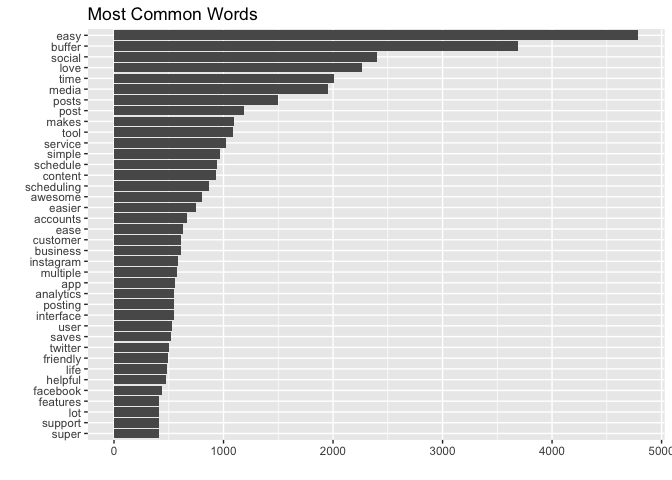

Aww. It's good to see "easy", "love", and "time" up there. Ok, now do words occur more frequently for promoters than for passives?

To find this out, we can calculate the relative frequency of words that appear in detractor's comments and compare that to the relative frequency of terms for passives and promoters.

``` r
# Calculate relative frequency of words
frequency <- text_df %>%
  filter(!(is.na(segment)) & segment != "") %>%
  count(segment, word) %>%
  group_by(segment) %>%
  mutate(proportion = n / sum(n)) %>% 
  select(-n) %>% 
  spread(segment, proportion) %>% 
  gather(segment, proportion, passive:promoter)
```

Now let's visualize these relative frequencies of terms in graphs.

``` r
library(scales)

# Expect a warning about rows with missing values being removed
ggplot(frequency, aes(x = proportion, y = detractor, color = abs(detractor - proportion))) +
  geom_abline(color = "gray40", lty = 2) +
  geom_jitter(alpha = 0.1, size = 2.5, width = 0.3, height = 0.3) +
  geom_text(aes(label = word), check_overlap = TRUE, vjust = 1.5) +
  scale_x_log10(labels = percent_format()) +
  scale_y_log10(labels = percent_format()) +
  scale_color_gradient(limits = c(0, 0.001), low = "darkslategray4", high = "gray75") +
  facet_wrap(~segment, ncol = 2) +
  theme(legend.position="none") +
  labs(y = "Detractors", x = "")
```

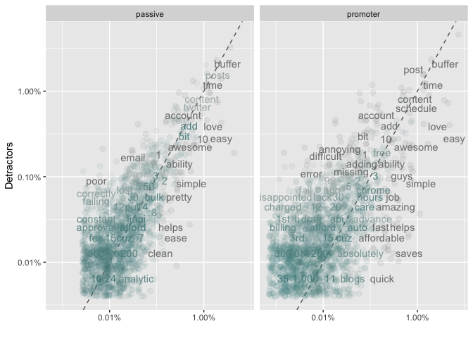

Words that are close to the line in these plots have similar frequencies in both sets of comments. For example, in both detractors and promoters' comments, “buffer”, “time”, and “post” are at the upper end. In both detractor and passive comments, "time", "posts", and "content" are commonly mentioned

Words that are far from the line are words that are found more in one set of comments than another. Words on the left side of the dotted line occur more frequently in detractors' comments than in passives or promoters. For example, in the promoter panel, words like "annoying", "charged", and "error" are much more common in detractors comments than in promoters, while words like “ease” and “saves” are found more commonly in the promoter comments.

Notice that words in the detractor-passive panel (on the left) are closer to the zero-slope dotted line than the promoter-detractor words. This suggests that comments from passives and detractors are more similar than those of promoters and detractors. This makes sense. :)

Sentiment analysis
------------------

Let's analyze the words we've gathered and find which appear to be the most positive and negative. The tidytext package contains several sentiment lexicons in the sentiments dataset that we can use to better understand some of the emotion behind the language.

``` r
# Look at the sentiments dataset
head(sentiments)
```

    ## # A tibble: 6 × 4
    ##        word sentiment lexicon score
    ##       <chr>     <chr>   <chr> <int>
    ## 1    abacus     trust     nrc    NA
    ## 2   abandon      fear     nrc    NA
    ## 3   abandon  negative     nrc    NA
    ## 4   abandon   sadness     nrc    NA
    ## 5 abandoned     anger     nrc    NA
    ## 6 abandoned      fear     nrc    NA

> The three general-purpose lexicons are AFINN from Finn Årup Nielsen, bing from Bing Liu and collaborators, and nrc from Saif Mohammad and Peter Turney. All three of these lexicons are based on unigrams, i.e., single words. These lexicons contain many English words and the words are assigned scores for positive/negative sentiment, and also possibly emotions like joy, anger, sadness, and so forth. The nrc lexicon categorizes words in a binary fashion (“yes”/“no”) into categories of positive, negative, anger, anticipation, disgust, fear, joy, sadness, surprise, and trust. The bing lexicon categorizes words in a binary fashion into positive and negative categories. The AFINN lexicon assigns words with a score that runs between -5 and 5, with negative scores indicating negative sentiment and positive scores indicating positive sentiment. All of this information is tabulated in the sentiments dataset, and tidytext provides a function get\_sentiments() to get specific sentiment lexicons without the columns that are not used in that lexicon.

``` r
# Preview afinn sentiments
get_sentiments("afinn")
```

    ## # A tibble: 2,476 × 2
    ##          word score
    ##         <chr> <int>
    ## 1     abandon    -2
    ## 2   abandoned    -2
    ## 3    abandons    -2
    ## 4    abducted    -2
    ## 5   abduction    -2
    ## 6  abductions    -2
    ## 7       abhor    -3
    ## 8    abhorred    -3
    ## 9   abhorrent    -3
    ## 10     abhors    -3
    ## # ... with 2,466 more rows

``` r
# Preview bing sentiments
get_sentiments("bing")
```

    ## # A tibble: 6,788 × 2
    ##           word sentiment
    ##          <chr>     <chr>
    ## 1      2-faced  negative
    ## 2      2-faces  negative
    ## 3           a+  positive
    ## 4     abnormal  negative
    ## 5      abolish  negative
    ## 6   abominable  negative
    ## 7   abominably  negative
    ## 8    abominate  negative
    ## 9  abomination  negative
    ## 10       abort  negative
    ## # ... with 6,778 more rows

``` r
# Preview nrc sentiments
get_sentiments("nrc")
```

    ## # A tibble: 13,901 × 2
    ##           word sentiment
    ##          <chr>     <chr>
    ## 1       abacus     trust
    ## 2      abandon      fear
    ## 3      abandon  negative
    ## 4      abandon   sadness
    ## 5    abandoned     anger
    ## 6    abandoned      fear
    ## 7    abandoned  negative
    ## 8    abandoned   sadness
    ## 9  abandonment     anger
    ## 10 abandonment      fear
    ## # ... with 13,891 more rows

Great! Now let's `inner_join` the sentiment words into our `text_df` data frame.

``` r
# Get NRC sentiments
nrc <- get_sentiments("nrc")

# Join sentiments with comments
text_df %>%
  inner_join(nrc, by = "word") %>%
  count(sentiment, sort = TRUE)
```

    ## # A tibble: 10 × 2
    ##       sentiment     n
    ##           <chr> <int>
    ## 1      positive 16161
    ## 2         trust  9125
    ## 3           joy  7535
    ## 4  anticipation  6226
    ## 5      negative  2178
    ## 6          fear  1175
    ## 7       sadness  1082
    ## 8         anger   995
    ## 9      surprise   898
    ## 10      disgust   563

We see many positive, trusting, and joyous words in the comments. Yay! Now let's look at the most common positive and negative words for each segment of responders.

``` r
# Get bing sentiments
bing_word_counts <- text_df %>%
  inner_join(get_sentiments("bing"), by = "word") %>%
  count(word, sentiment, sort = TRUE) %>%
  ungroup()

# View the word counts
head(bing_word_counts)
```

    ## # A tibble: 6 × 3
    ##       word sentiment     n
    ##      <chr>     <chr> <int>
    ## 1     easy  positive  4789
    ## 2     love  positive  2262
    ## 3  awesome  positive   803
    ## 4   easier  positive   745
    ## 5     ease  positive   626
    ## 6 friendly  positive   494

That's great to see positive sentiment words occurring most frequently! Let's plot the frequency of words for each sentiment.

``` r
# Plot most common words by sentiment
bing_word_counts %>%
  group_by(sentiment) %>%
  top_n(10) %>%
  ungroup() %>%
  mutate(word = reorder(word, n)) %>%
  ggplot(aes(word, n, fill = sentiment)) +
  geom_col(show.legend = FALSE) +
  facet_wrap(~sentiment, scales = "free_y") +
  labs(y = "Contribution to sentiment",
       x = NULL) +
  coord_flip()
```

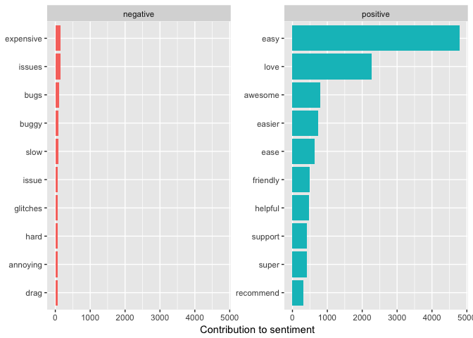

This is interesting, but not totally unexpected. Negative sentiment words that appear most frequently are associated with frustrating experiences it seems, while positive sentiment words mention ease and support. :)

Analyzing word frequency
------------------------

It may be useful to also see words that appear more frequently for certain segments of users. To do that, we can a term's *inverse document frequency (tdf)*, defined as:

`idf(term) = ln(documents / documents containing term)`

> The statistic tf-idf is intended to measure how important a word is to a document in a collection (or corpus) of documents, for example, to one novel in a collection of novels or to one website in a collection of websites.

Let's calculate the term frequencies in NPS comments for each segment of responders.

``` r
# Calculate the frequency of words for each segment
segment_words <- text_df %>%
  count(segment, word, sort = TRUE) %>%
  ungroup()

# Calculate the total number of words for each segment
total_words <- segment_words %>% 
  group_by(segment) %>% 
  summarize(total = sum(n))

# Join the total words back into the segment_words data frame
segment_words <- left_join(segment_words, total_words, by = "segment") %>%
  filter(segment != "")

# View data 
head(segment_words)
```

    ## # A tibble: 6 × 4
    ##    segment   word     n total
    ##     <fctr>  <chr> <int> <int>
    ## 1 promoter   easy  4296 71078
    ## 2 promoter buffer  2757 71078
    ## 3 promoter social  2044 71078
    ## 4 promoter   love  1900 71078
    ## 5 promoter  media  1700 71078
    ## 6 promoter   time  1531 71078

There is one row in this data frame for each word-segment combination. `n` is the number of times that word is used for that segment and total is the total number of words in the segment's comments.

Let’s look at the distribution of n/total for each segment, the number of times a word appears in a segment's comments divided by the total number of terms (words) for those comments. This is exactly what term frequency is.

``` r
# Plot distribution of term frequencies
ggplot(segment_words, aes(n/total, fill = segment)) +
  geom_histogram(show.legend = FALSE) +
  xlim(NA, 0.0009) +
  facet_wrap(~segment, ncol = 2, scales = "free_y") +
  labs(x = "Term Frequency")
```

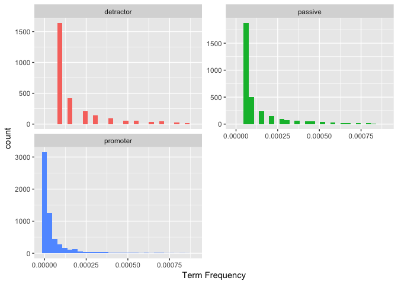

Hmm, that doesn't seem too helpful. Let's look at a different approach.

The `bind_tf_idf` function
--------------------------

The idea of tf-idf is to find the important words for the content of each collection of comments by decreasing the weight for commonly used words and increasing the weight for words that are not used very much in an entire collection of documents, in this case all NPS comments.

> Calculating tf-idf attempts to find the words that are important (i.e., common) in a text, but not too common.

The `bind_tf_idf` function takes a tidy text dataset as input with one row per token (term), per document. One column (`word` here) contains the terms/tokens, one column contains the documents (`segment` here), and the last necessary column contains the counts, how many times each document contains each term (`n`).

``` r
# Calculate tf_idf
segment_words <- segment_words %>%
  bind_tf_idf(word, segment, n)

segment_words
```

    ## # A tibble: 12,429 × 7
    ##     segment   word     n total         tf       idf      tf_idf
    ##      <fctr>  <chr> <int> <int>      <dbl>     <dbl>       <dbl>
    ## 1  promoter   easy  4296 71078 0.06044064 0.2876821 0.017387689
    ## 2  promoter buffer  2757 71078 0.03878837 0.2876821 0.011158720
    ## 3  promoter social  2044 71078 0.02875714 0.2876821 0.008272914
    ## 4  promoter   love  1900 71078 0.02673120 0.2876821 0.007690086
    ## 5  promoter  media  1700 71078 0.02391739 0.2876821 0.006880603
    ## 6  promoter   time  1531 71078 0.02153972 0.2876821 0.006196590
    ## 7  promoter  makes   994 71078 0.01398464 0.2876821 0.004023129
    ## 8  promoter  posts   879 71078 0.01236670 0.2876821 0.003557677
    ## 9  promoter   tool   868 71078 0.01221194 0.2876821 0.003513155
    ## 10 promoter simple   846 71078 0.01190242 0.2876821 0.003424112
    ## # ... with 12,419 more rows

The `idf` and `tf_idf` will be 0 for extremely common words like "the" and "a". We've already removed these stop words from our dataset.

Let's look at words with high `tf_idf` values.

``` r
# Look at high tf_idf value words
segment_words %>%
  select(-total) %>%
  arrange(desc(tf_idf))
```

    ## # A tibble: 12,429 × 6
    ##      segment   word     n         tf       idf      tf_idf
    ##       <fctr>  <chr> <int>      <dbl>     <dbl>       <dbl>
    ## 1   promoter   easy  4296 0.06044064 0.2876821 0.017387689
    ## 2   promoter buffer  2757 0.03878837 0.2876821 0.011158720
    ## 3    passive buffer   607 0.03178676 0.2876821 0.009144481
    ## 4   promoter social  2044 0.02875714 0.2876821 0.008272914
    ## 5   promoter   love  1900 0.02673120 0.2876821 0.007690086
    ## 6  detractor buffer   326 0.02573007 0.2876821 0.007402080
    ## 7   promoter  media  1700 0.02391739 0.2876821 0.006880603
    ## 8    passive   easy   449 0.02351278 0.2876821 0.006764205
    ## 9  detractor   post   282 0.02225730 0.2876821 0.006403026
    ## 10  promoter   time  1531 0.02153972 0.2876821 0.006196590
    ## # ... with 12,419 more rows

Now let's visualize these high `tf_idf` words for each segment of responders.

``` r
# Tidy the words
plot_words <- segment_words %>%
  arrange(desc(tf_idf)) %>%
  mutate(word = factor(word, levels = rev(unique(word))))

# Create the plot
plot_words %>% 
  group_by(segment) %>% 
  top_n(15) %>% 
  ungroup %>%
  ggplot(aes(word, tf_idf, fill = segment)) +
  geom_col(show.legend = FALSE) +
  labs(x = NULL, y = "tf-idf") +
  facet_wrap(~segment, ncol = 2, scales = "free") +
  coord_flip()
```

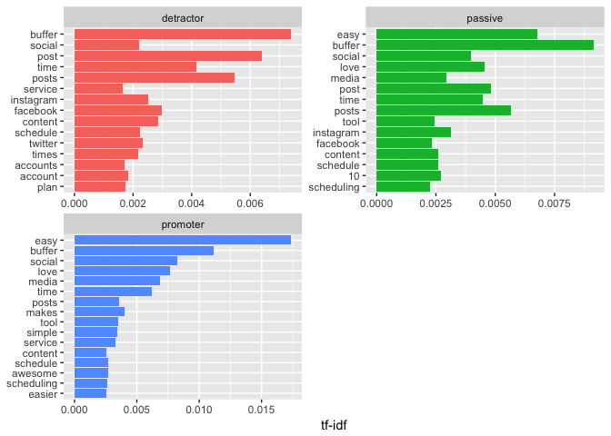

This doesn't seem to be too useful for us, perhaps because only single words are included. We don't have much context and are required to speculate on what the meaning and emotion behind the words might be.

It may be beneficial to look at groups of words to help us gather more information. :)

N-grams
-------

What if we looked at groups of words instead of just single words? We can check which words tend to appear immediately after another, and which words tend to appear together in the same document.

We’ve been using the `unnest_tokens` function to tokenize by word, but we can also use the function to tokenize into consecutive sequences of words, called n-grams. By seeing how often word X is followed by word Y, we can then build a model of the relationships between them.

We do this by adding the `token = "ngrams"` option to `unnest_tokens()`, and setting `n` to the number of words we wish to capture in each n-gram. When we set `n` to 2, we are examining pairs of two consecutive words, often called “bigrams”:

``` r
# Unnest bigrams from NPS responses
bigrams <- responses %>%
  unnest_tokens(bigram, comment, token = "ngrams", n = 2)

# View the bigrams
head(bigrams$bigram)
```

    ## [1] "useful and"     "and affordable" "very easy"      "easy to"       
    ## [5] "to use"         "use and"

Great! Each token now is represented by a bigram :) Let's take a quick look at the most common bigrams.

``` r
# Count the most common bigrams
bigrams %>%
  count(bigram, sort = TRUE)
```

    ## # A tibble: 76,485 × 2
    ##          bigram     n
    ##           <chr> <int>
    ## 1        to use  3727
    ## 2       easy to  3560
    ## 3  social media  1914
    ## 4       use and  1079
    ## 5        i love  1000
    ## 6         it is   795
    ## 7     buffer is   771
    ## 8      love the   639
    ## 9       ease of   571
    ## 10       i have   568
    ## # ... with 76,475 more rows

That's cool! As we might expect, a lot of the most common bigrams are groups of common words. This is a useful time to use tidyr’s `separate()`, which splits a column into multiple based on a delimiter. This lets us separate it into two columns, “word1” and “word2”, at which point we can remove cases where either is a stop-word.

``` r
# Separate words in bigrams
separated <- bigrams %>%
  separate(bigram, c("word1", "word2"), sep = " ")

# Filter out stop-words
filtered <- separated %>%
  filter(!word1 %in% stop_words$word) %>%
  filter(!word2 %in% stop_words$word)

# Calculate new bigram counts
bigram_counts <- filtered %>% 
  count(word1, word2, sort = TRUE)

bigram_counts
```

    ## Source: local data frame [16,883 x 3]
    ## Groups: word1 [4,114]
    ## 
    ##       word1    word2     n
    ##       <chr>    <chr> <int>
    ## 1    social    media  1914
    ## 2  customer  service   448
    ## 3      user friendly   369
    ## 4      love   buffer   346
    ## 5     super     easy   206
    ## 6    buffer    makes   187
    ## 7  schedule    posts   160
    ## 8     media accounts   156
    ## 9      time    saver   134
    ## 10 multiple accounts   125
    ## # ... with 16,873 more rows

Cool! We can see the most common 2-word phrases in our NPS comments here. It's great to see "customer service" in there. :)

In other analyses, we may want to work with the recombined words. tidyr’s `unite()` function is the inverse of separate(), and lets us recombine the columns into one.

``` r
# Reunite the words
bigrams_united <- filtered %>%
  unite(bigram, word1, word2, sep = " ")

head(bigrams_united$bigram)
```

    ## [1] "twitter accounts" "helpful service"  "listing saving"  
    ## [4] "saving system"    "easy scheduling"  "scheduling love"

Nice! Let's look at the most common bigrams.

``` r
# Find most common bigrams
bigrams_united %>%
  count(bigram, sort = TRUE)
```

    ## # A tibble: 16,883 × 2
    ##               bigram     n
    ##                <chr> <int>
    ## 1       social media  1914
    ## 2   customer service   448
    ## 3      user friendly   369
    ## 4        love buffer   346
    ## 5         super easy   206
    ## 6       buffer makes   187
    ## 7     schedule posts   160
    ## 8     media accounts   156
    ## 9         time saver   134
    ## 10 multiple accounts   125
    ## # ... with 16,873 more rows

A bigram can also be treated as a term in a document in the same way that we treated individual words. For example, we can look at the tf-idf of these bigrams across the NPS comments. These tf-idf values can be visualized within each segment, just as we did for words earlier.

``` r
# Calculate tf_idf
bigram_tf_idf <- bigrams_united %>%
  count(segment, bigram) %>%
  bind_tf_idf(bigram, segment, n) %>%
  arrange(desc(tf_idf))

bigram_tf_idf
```

    ## Source: local data frame [18,558 x 6]
    ## Groups: segment [3]
    ## 
    ##      segment           bigram     n          tf       idf      tf_idf
    ##       <fctr>            <chr> <int>       <dbl>     <dbl>       <dbl>
    ## 1   promoter     social media  1668 0.073283248 0.2876821 0.021082277
    ## 2    passive     social media   190 0.033807829 0.2876821 0.009725906
    ## 3   promoter customer service   408 0.017925399 0.2876821 0.005156816
    ## 4  detractor     social media    56 0.015748031 0.2876821 0.004530426
    ## 5   promoter    user friendly   312 0.013707658 0.2876821 0.003943447
    ## 6   promoter      love buffer   296 0.013004701 0.2876821 0.003741219
    ## 7   promoter       saves time   104 0.004569219 0.6931472 0.003167141
    ## 8   promoter        guys rock    48 0.002108870 1.3862944 0.002923515
    ## 9   promoter     makes social    83 0.003646588 0.6931472 0.002527623
    ## 10  promoter       super easy   189 0.008303677 0.2876821 0.002388819
    ## # ... with 18,548 more rows

Let's plot these results.

``` r
# Tidy the bigrams
plot_bigrams <- bigram_tf_idf %>%
  arrange(desc(tf_idf)) %>%
  mutate(bigram = factor(bigram, levels = rev(unique(bigram))))

# Create the plot
plot_bigrams %>% 
  group_by(segment) %>% 
  top_n(10) %>% 
  ungroup %>%
  ggplot(aes(reorder(bigram, tf_idf), tf_idf, fill = segment)) +
  geom_col(show.legend = FALSE) +
  labs(x = NULL, y = "tf-idf") +
  facet_wrap(~segment, ncol = 2, scales = "free") +
  coord_flip()
```

    ## Selecting by tf_idf

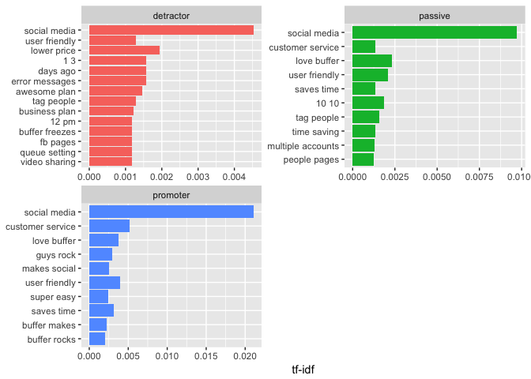

There are a couple bigrams in here, like "social media", that may be able to be taken out. Let's do that by creating a new stop words vector and anti-joining it. :)

``` r
# Create data frame of new stop words
mystopwords <- data_frame(bigram = c("social media", "10 10", "1 3", "10"))

# Remove those stop words from the bigram dataset
bigrams_united <- anti_join(bigrams_united, mystopwords, by = "bigram")
```

Now let's redo the plots we made above.

    ## Selecting by tf_idf

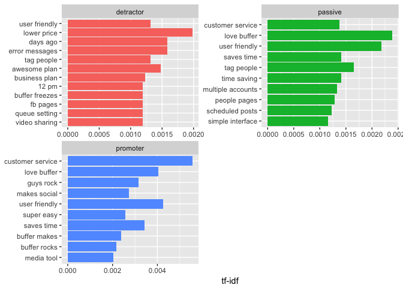

This is awesome! We can see that there is more context around the meaning of the comments for each group of users. For example, "lower price", "error messages", and "tag people" seem like quite clear messages from the detractors group.

We can use the same approach to look at trigrams as well!

``` r
# Get trigrams
trigrams <- responses %>%
  unnest_tokens(trigram, comment, token = "ngrams", n = 3) %>%
  separate(trigram, c("word1", "word2", "word3"), sep = " ") %>%
  filter(!word1 %in% stop_words$word,
         !word2 %in% stop_words$word,
         !word3 %in% stop_words$word)

# Reunite the words
trigrams_united <- trigrams %>%
  unite(trigram, word1, word2, word3, sep = " ")

# Calculate tf_idf
trigram_tf_idf <- trigrams_united %>%
  count(segment, trigram) %>%
  bind_tf_idf(trigram, segment, n) %>%
  arrange(desc(tf_idf))

# Tidy the trigrams
plot_trigrams <- trigram_tf_idf %>%
  arrange(desc(tf_idf)) %>%
  mutate(bigram = factor(trigram, levels = rev(unique(trigram))))

# Create the plot
plot_trigrams %>% 
  group_by(segment) %>% 
  top_n(10) %>% 
  ungroup %>%
  ggplot(aes(reorder(trigram, tf_idf), tf_idf, fill = segment)) +
  geom_col(show.legend = FALSE) +
  labs(x = NULL, y = "tf-idf") +
  facet_wrap(~segment, ncol = 2, scales = "free") +
  coord_flip()
```

    ## Selecting by bigram

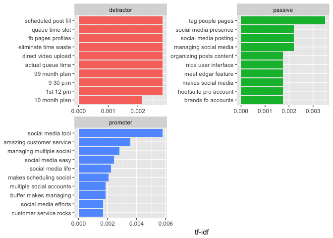

This might be a little less helpful than the bigram plots, because there is a much smaller sample of 3-term phrases, but it's still quite interesting to see!

We may want to visualize the relationship between these bigrams, instead of just listing the most common ones.

Visualizing a network of bigrams with ggraph
--------------------------------------------

As one common visualization, we can arrange the words into a network, or “graph.” Here we’ll be referring to a “graph” not in the sense of a visualization, but as a combination of connected nodes. A graph can be constructed from a tidy object since it has three variables:

-   from: the node an edge is coming from
-   to: the node an edge is going towards
-   weight: A numeric value associated with each edge

The `igraph` package has many powerful functions for manipulating and analyzing networks. One way to create an igraph object from tidy data is the `graph_from_data_frame()` function, which takes a data frame of edges with columns for “from”, “to”, and edge attributes (in this case n):

``` r
library(igraph)

# original counts
bigram_counts
```

    ## Source: local data frame [16,883 x 3]
    ## Groups: word1 [4,114]
    ## 
    ##       word1    word2     n
    ##       <chr>    <chr> <int>
    ## 1    social    media  1914
    ## 2  customer  service   448
    ## 3      user friendly   369
    ## 4      love   buffer   346
    ## 5     super     easy   206
    ## 6    buffer    makes   187
    ## 7  schedule    posts   160
    ## 8     media accounts   156
    ## 9      time    saver   134
    ## 10 multiple accounts   125
    ## # ... with 16,873 more rows

Let's create a bigram graph object.

``` r
# filter for only relatively common combinations
bigram_graph <- bigram_counts %>%
  filter(n > 25) %>%
  graph_from_data_frame()

bigram_graph
```

    ## IGRAPH DN-- 81 86 -- 
    ## + attr: name (v/c), n (e/n)
    ## + edges (vertex names):
    ##  [1] social    ->media      customer  ->service    user      ->friendly  
    ##  [4] love      ->buffer     super     ->easy       buffer    ->makes     
    ##  [7] schedule  ->posts      media     ->accounts   time      ->saver     
    ## [10] multiple  ->accounts   life      ->easier     saves     ->time      
    ## [13] media     ->posts      media     ->management multiple  ->social    
    ## [16] makes     ->social     customer  ->support    makes     ->life      
    ## [19] media     ->platforms  recommend ->buffer     time      ->saving    
    ## [22] scheduling->posts      awesome   ->plan       scheduling->tool      
    ## + ... omitted several edges

We can convert an igraph object into a ggraph with the ggraph function, after which we add layers to it, much like layers are added in ggplot2. For example, for a basic graph we need to add three layers: nodes, edges, and text.

``` r
library(ggraph)
set.seed(2017)

# Creage ggraph of bigrams
ggraph(bigram_graph, layout = "fr") +
  geom_edge_link() +
  geom_node_point() +
  geom_node_text(aes(label = name), vjust = 1, hjust = 1)
```

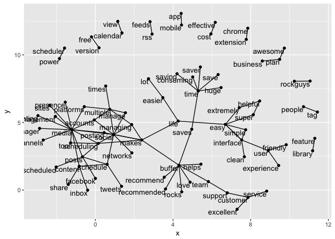

We can use this graph to visualize some details about the text structure. For example, we can see that "buffer", "customer", "media", and "time" form the centers of groups of nodes. We also see pairs or triplets along the outside that form common short phrases ("reasonable price", "calendar view", or "free version").

Let's add some polish to this graph that might make it easier to interpret.

``` r
# Set seed for reproducible graph
set.seed(2016)

# Set the error features
a <- grid::arrow(type = "closed", length = unit(.1, "inches"))

# Create the graph
ggraph(bigram_graph, layout = "fr") +
  geom_edge_link(aes(edge_alpha = n), show.legend = F, arrow = a, end_cap = circle(.07, 'inches')) +
  geom_node_point(color = "lightblue", size = 3) +
  geom_node_text(aes(label = name), vjust = 1, hjust = 1) +
  theme_void()
```

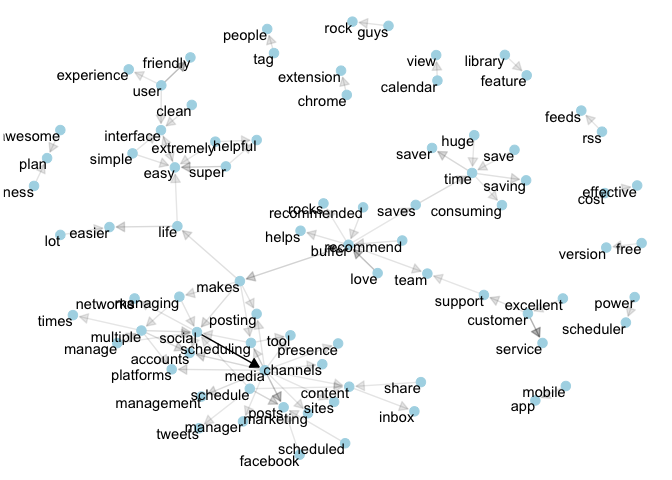

Awesome! Tthis is a visualization of a **Markov chain**, a common model in text processing. In a Markov chain, each choice of word depends only on the previous word. In this case, a random generator following this model might spit out "absolutely", then "love", then "buffer", by following each word to the most common words that follow it. To make the visualization interpretable, I chose to show only the most common word to word connections.

Now, what if we did the same, but only looked at passive and detractor comments?

``` r
# Calculate new bigram counts for detractors and passives
detractor_counts <- filtered %>% 
  filter(segment == "detractor") %>%
  count(word1, word2, sort = TRUE)

# Filter for only relatively common combinations
detractor_graph <- detractor_counts %>%
  filter(n > 3) %>%
  graph_from_data_frame()

# Set seed for reproducible graph
set.seed(2016)

# Set the error features
a <- grid::arrow(type = "closed", length = unit(.1, "inches"))

# Create the graph
ggraph(detractor_graph, layout = "fr") +
  geom_edge_link(aes(edge_alpha = n), show.legend = F, arrow = a, end_cap = circle(.07, 'inches')) +
  geom_node_point(color = "lightpink", size = 3) +
  geom_node_text(aes(label = name), vjust = 1, hjust = 1) +
  theme_void()
```

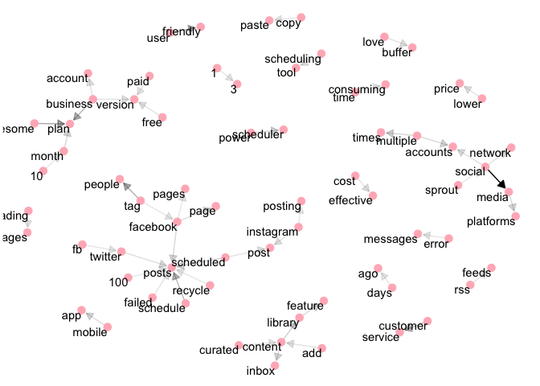

This is interesting. We can see "posts" at the center of a group of nodes, surrounded by terms like "failed", "scheduled", and "recycle". We can also see "facebook" at the center of a cluster containing "tag" and "pages".

I also see pairs of words representing different features, like "content library", "power scheduler", "rss feeds", and "mobile app". It is also interesting to see the "time consuming" pair.

Price and billing seem to be themes for these detractors as well.

Topic modeling
--------------

The following text is taken from the Tidy Text Mining with R book.

> In text mining, we often have collections of documents, such as blog posts or news articles, that we’d like to divide into natural groups so that we can understand them separately. Topic modeling is a method for unsupervised classification of such documents, similar to clustering on numeric data, which finds natural groups of items even when we’re not sure what we’re looking for.

> Latent Dirichlet allocation (LDA) is a particularly popular method for fitting a topic model. It treats each document as a mixture of topics, and each topic as a mixture of words. This allows documents to “overlap” each other in terms of content, rather than being separated into discrete groups, in a way that mirrors typical use of natural language.

We'll use this approach.

``` r
library(tm)
```

    ## Loading required package: NLP

    ## 
    ## Attaching package: 'NLP'

    ## The following object is masked from 'package:httr':
    ## 
    ##     content

    ## The following object is masked from 'package:ggplot2':
    ## 
    ##     annotate

``` r
# Create a text corpus
corpus <- Corpus(VectorSource(text_df$word))

# Created a document term matrix
dtm <- DocumentTermMatrix(corpus)

# Find the sum of words in each Document
rowTotals <- apply(dtm , 1, sum) 

# Remove all docs without words
dtm_new   <- dtm[rowTotals > 0, ]        

inspect(dtm_new)
```

    ## <<DocumentTermMatrix (documents: 100672, terms: 7822)>>
    ## Non-/sparse entries: 100790/787355594
    ## Sparsity           : 100%
    ## Maximal term length: 24
    ## Weighting          : term frequency (tf)
    ## Sample             :
    ##        Terms
    ## Docs    buffer easy love makes media post posts social time tool
    ##   1464       0    0    0     0     0    0     0      0    0    0
    ##   28232      0    0    0     0     0    0     0      0    0    0
    ##   335        0    0    0     0     0    0     0      0    0    0
    ##   4194       0    0    0     0     0    0     0      0    0    0
    ##   43         0    0    0     0     0    0     0      0    0    0
    ##   4840       0    0    0     0     0    0     0      0    0    0
    ##   56         0    0    0     0     0    0     0      0    0    0
    ##   6159       0    0    0     0     0    0     0      0    0    0
    ##   70         0    0    0     0     0    0     0      0    0    0
    ##   814        0    0    0     0     0    0     0      0    0    0

#### Latent Dirichlet allocation

Latent Dirichlet allocation is one of the most common algorithms for topic modeling. Without diving into the math behind the model, we can understand it as being guided by two principles.

-   Every document is a mixture of topics. We imagine that each document may contain words from several topics in particular proportions. For example, in a two-topic model we could say “Document 1 is 90% topic A and 10% topic B, while Document 2 is 30% topic A and 70% topic B.”

-   Every topic is a mixture of words. For example, we could imagine a two-topic model of American news, with one topic for “politics” and one for “entertainment.” The most common words in the politics topic might be “President”, “Congress”, and “government”, while the entertainment topic may be made up of words such as “movies”, “television”, and “actor”.

Importantly, words can be shared between topics; a word like “budget” might appear in both equally. LDA is a mathematical method for estimating both of these at the same time: finding the mixture of words that is associated with each topic, while also determining the mixture of topics that describes each document. There are a number of existing implementations of this algorithm, and we’ll explore one of them in depth.

We can use the `LDA()` function from the topicmodels package, setting k = 2, to create a two-topic LDA model.

``` r
# Load library
library(topicmodels)

# Set a seed so that the output of the model is predictable
text_lda <- LDA(dtm_new, k = 2, control = list(seed = 1234))
text_lda
```

    ## A LDA_VEM topic model with 2 topics.

The `tidytext` package provides a method for extracting the per-topic-per-word probabilities, called β (“beta”), from the LDA model we just created, called `tidy()`.

``` r
# Tidy topics
topics <- tidy(text_lda, matrix = "beta")
topics
```

    ## # A tibble: 15,644 × 3
    ##    topic      term         beta
    ##    <int>     <chr>        <dbl>
    ## 1      1    crunch 8.236682e-06
    ## 2      2    crunch 1.160581e-05
    ## 3      1     games 1.845296e-05
    ## 4      2     games 1.394055e-06
    ## 5      1      cmon 7.280991e-06
    ## 6      2      cmon 1.256108e-05
    ## 7      1    drinks 8.522373e-06
    ## 8      2    drinks 1.132025e-05
    ## 9      1 approvers 1.764853e-05
    ## 10     2 approvers 2.198129e-06
    ## # ... with 15,634 more rows

Notice that this has turned the model into a one-topic-per-term-per-row format. For each combination, the model computes the probability of that term being generated from that topic.

For example, the term “synched” has a 6.186602e-06 probability of being generated from topic 1, but a 1.368148e-05 probability of being generated from topic 2.

We could use dplyr’s `top_n()` to find the 10 terms that are most common within each topic. As a tidy data frame, this lends itself well to a ggplot2 visualization.

``` r
# Find the top terms
top_terms <- topics %>%
  group_by(topic) %>%
  top_n(10, beta) %>%
  ungroup() %>%
  arrange(topic, -beta)

top_terms %>%
  mutate(term = reorder(term, beta)) %>%
  ggplot(aes(term, beta, fill = factor(topic))) +
  geom_col(show.legend = FALSE) +
  facet_wrap(~ topic, scales = "free") +
  coord_flip()
```

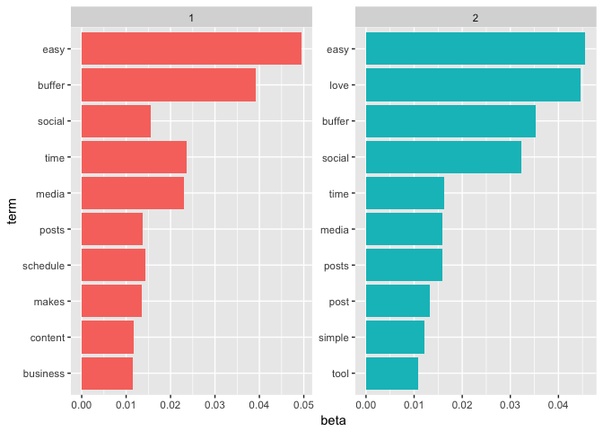

Hmm, well that doesn't seem to help us all that much! :-/
