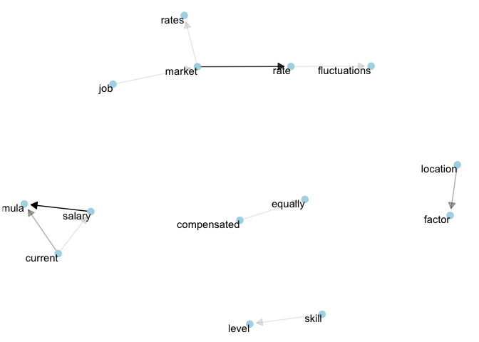

Salary Formula Survey Analysis
================

Motivation
----------

The purpose of this analysis is to distill and better understand what topics and concepts team members would like Buffer to consider when designing the new salary formula. To do that we'll simply list the top individual words and pairs of words, and visualize their relationship to one another.

Conclusions
-----------

To understand the conclusions, scroll down to the bottom of the page and view the graph with the nodes, words, and arrows. :)

Overall, I believe the graph illustrates the factors people find important quite well. **Market rates**, and their fluctuations, may lead to uncertainty about how uncontrollable forces might affect salaries. **Location** would naturally be an important consideration for a global, remote, and distributed team. This may lead to questions about **equal compensation** for equal work, with an emphasis on retaining incentives to grow and achieve more (I can work really hard and get promoted, or move to New York). And of course we must consider these factors in relation to the **current salary formula**.

``` r
# Import libraries
library(buffer); library(dplyr); library(tidyr); library(ggplot2); library(tidytext)
```

Data collection
---------------

Let's import the survey results from a CSV file.

``` r
# Import data from CSV
results <- read.csv("~/Downloads/salary_survey.csv", header = T)
```

Cool! We have 59 responses so far. Let's do a little bit of cleanup to get the text ready for analysis. I see that some of these responses are actually *replies* to responses, so let's filter them out.

``` r
# Filter out replies
responses <- results %>%
  filter(is_reply == FALSE)
```

Great. Now we have 31 responses to work with. Let's work on tidying the answers!

Tidy the text
-------------

To get a tidy data format, we need to both break the comments into individual tokens and transform it to a tidy data structure. To do this, we use tidytext’s `unnest_tokens()` function. This breaks the survey responses into individual words and includes one word per row while retaining the attributes (segment, user\_id, etc) of that word.

Later on, we can choose to define a token as a group of 2, 3, or `n` words to look at common phrases. :)

``` r
# Unnest the tokens
text <- responses %>%
  unnest_tokens(word, employee_answer)
```

Sweet! Here is a small sample how the resulting data frame looks:

``` r
# Preview data
head(text)
```

    ##              conversation_id is_reply                date   employee
    ## 1   5915c70451163418e891f414    FALSE 2017-05-12 09:30:28 Roy Olende
    ## 1.1 5915c70451163418e891f414    FALSE 2017-05-12 09:30:28 Roy Olende
    ## 1.2 5915c70451163418e891f414    FALSE 2017-05-12 09:30:28 Roy Olende
    ## 1.3 5915c70451163418e891f414    FALSE 2017-05-12 09:30:28 Roy Olende
    ## 1.4 5915c70451163418e891f414    FALSE 2017-05-12 09:30:28 Roy Olende
    ## 1.5 5915c70451163418e891f414    FALSE 2017-05-12 09:30:28 Roy Olende
    ##                                                                                   question_asked
    ## 1   What do you think should be some of the biggest factors we consider in a new salary formula?
    ## 1.1 What do you think should be some of the biggest factors we consider in a new salary formula?
    ## 1.2 What do you think should be some of the biggest factors we consider in a new salary formula?
    ## 1.3 What do you think should be some of the biggest factors we consider in a new salary formula?
    ## 1.4 What do you think should be some of the biggest factors we consider in a new salary formula?
    ## 1.5 What do you think should be some of the biggest factors we consider in a new salary formula?
    ##     type important follow_up  idea label_4 label_5 label_6    word
    ## 1   Poll     FALSE     FALSE FALSE   FALSE   FALSE   FALSE       i
    ## 1.1 Poll     FALSE     FALSE FALSE   FALSE   FALSE   FALSE   think
    ## 1.2 Poll     FALSE     FALSE FALSE   FALSE   FALSE   FALSE     the
    ## 1.3 Poll     FALSE     FALSE FALSE   FALSE   FALSE   FALSE current
    ## 1.4 Poll     FALSE     FALSE FALSE   FALSE   FALSE   FALSE  salary
    ## 1.5 Poll     FALSE     FALSE FALSE   FALSE   FALSE   FALSE formula

Oftentimes in text analysis, we will want to remove stop words; stop words are words that are not useful for an analysis, typically extremely common words such as "the", "of", "to", and so forth in English. We can remove stop words (kept in the tidytext dataset `stop_words`) with an `anti_join()`.

``` r
# Collect stop words
data(stop_words)

# Remove stop words from our dataset with an anti_join()
text <- text %>%
  anti_join(stop_words, by = "word")
```

Great! I think we've got a tidy data frame now.

Exploratory analysis
--------------------

Let's take a moment here to see the most common words overall from the survey results.


Sentiment
---------

Now let's look at the most common words *by sentiment*. We'll use the `nrc` dataset which includes a list of words and their associated sentiments.

``` r
# Get NRC sentiments
nrc <- get_sentiments("nrc")

# Join sentiments with comments
text %>%
  inner_join(nrc, by = "word") %>%
  count(sentiment, sort = TRUE)
```

    ## # A tibble: 10 x 2
    ##       sentiment     n
    ##           <chr> <int>
    ##  1     positive   121
    ##  2        trust    85
    ##  3 anticipation    52
    ##  4          joy    51
    ##  5     negative    33
    ##  6      sadness    18
    ##  7         fear    12
    ##  8        anger    10
    ##  9     surprise     7
    ## 10      disgust     5

Cool, we see mostly positive and trusting words in the responses! There are, however a fair amount of negative, sad, and fearful words as well.

Let's see if we can look at the most common words for only positive and negative sentiments

``` r
# Get bing sentiments
bing_word_counts <- text %>%
  inner_join(get_sentiments("bing"), by = "word") %>%
  count(word, sentiment, sort = TRUE) %>%
  ungroup()

# View the word counts
head(bing_word_counts)
```

    ## # A tibble: 6 x 3
    ##           word sentiment     n
    ##          <chr>     <chr> <int>
    ## 1         love  positive     5
    ## 2 contribution  positive     3
    ## 3         fair  positive     3
    ## 4        skill  positive     3
    ## 5      support  positive     3
    ## 6       afford  positive     2

That's great to see positive sentiment words occurring most frequently! Now let's plot the frequency of words for each sentiment.


This is interesting, but I think we may be able to get a little more context by looking at groups of words instead of only single words.

N-grams
-------

Let's start out by looking at groups of two words. We'll call them bigrams.

``` r
# Unnest bigrams from NPS responses
bigrams <- responses %>%
  unnest_tokens(bigram, employee_answer, token = "ngrams", n = 2) 

# View the bigrams
head(bigrams$bigram)
```

    ## [1] "location i"     "i currently"    "currently live" "live in"       
    ## [5] "in a"           "a city"

And now let's look at the most common bigrams.

``` r
# Count the most common bigrams
bigrams %>%
  count(bigram, sort = TRUE)
```

    ## # A tibble: 1,569 x 2
    ##            bigram     n
    ##             <chr> <int>
    ##  1         in the    11
    ##  2        cost of     8
    ##  3      of living     7
    ##  4          to be     7
    ##  5           in a     6
    ##  6 salary formula     6
    ##  7         to see     6
    ##  8          a lot     5
    ##  9        i think     5
    ## 10          if we     5
    ## # ... with 1,559 more rows

As we might expect, a lot of the most common bigrams are groups of common words. This is a useful time to use the `separate()` function, which splits a column into multiple based on a delimiter. This lets us separate it into two columns, "word1" and "word2" at which point we can remove cases where either is a stop-word.

``` r
# Separate words in bigrams
separated <- bigrams %>%
  separate(bigram, c("word1", "word2"), sep = " ")

# Filter out stop-words
filtered <- separated %>%
  filter(!word1 %in% stop_words$word) %>%
  filter(!word2 %in% stop_words$word)

# Calculate new bigram counts
bigram_counts <- filtered %>% 
  count(word1, word2, sort = TRUE)

bigram_counts
```

    ## Source: local data frame [173 x 3]
    ## Groups: word1 [137]
    ## 
    ## # A tibble: 173 x 3
    ##          word1        word2     n
    ##          <chr>        <chr> <int>
    ##  1      salary      formula     6
    ##  2      market         rate     5
    ##  3     current      formula     3
    ##  4    location       factor     3
    ##  5 compensated      equally     2
    ##  6     current       salary     2
    ##  7         job       market     2
    ##  8      market        rates     2
    ##  9        rate fluctuations     2
    ## 10       skill        level     2
    ## # ... with 163 more rows

Looking better! Now lets us recombine the columns into one and look at the *new* most common bigrams

``` r
# Reunite the words
bigrams_united <- filtered %>%
  unite(bigram, word1, word2, sep = " ")

# Find most common bigrams
bigrams_united %>%
  count(bigram, sort = TRUE)
```

    ## # A tibble: 173 x 2
    ##                 bigram     n
    ##                  <chr> <int>
    ##  1      salary formula     6
    ##  2         market rate     5
    ##  3     current formula     3
    ##  4     location factor     3
    ##  5 compensated equally     2
    ##  6      current salary     2
    ##  7          job market     2
    ##  8        market rates     2
    ##  9   rate fluctuations     2
    ## 10         skill level     2
    ## # ... with 163 more rows

Alright! Now let's plot the most frequent bigrams.


Visualizing networks of words
-----------------------------

For this visualization we can arrange the words into a network, or "graph". Here we’ll be referring to a graph not in the sense of a visualization, but as a combination of connected nodes. A graph can be constructed from a tidy object since it has three variables:

-   from: the node an edge is coming from
-   to: the node an edge is going towards
-   weight: A numeric value associated with each edge

Let's give it a shot.

``` r
# Load igraph library
library(igraph)

# Original counts
bigram_counts
```

    ## Source: local data frame [173 x 3]
    ## Groups: word1 [137]
    ## 
    ## # A tibble: 173 x 3
    ##          word1        word2     n
    ##          <chr>        <chr> <int>
    ##  1      salary      formula     6
    ##  2      market         rate     5
    ##  3     current      formula     3
    ##  4    location       factor     3
    ##  5 compensated      equally     2
    ##  6     current       salary     2
    ##  7         job       market     2
    ##  8      market        rates     2
    ##  9        rate fluctuations     2
    ## 10       skill        level     2
    ## # ... with 163 more rows

Now let's create a bigram graph object.

``` r
# Filter for only relatively common combinations
bigram_graph <- bigram_counts %>%
  filter(n > 1) %>%
  graph_from_data_frame()

bigram_graph
```

    ## IGRAPH DN-- 14 10 -- 
    ## + attr: name (v/c), n (e/n)
    ## + edges (vertex names):
    ##  [1] salary     ->formula      market     ->rate        
    ##  [3] current    ->formula      location   ->factor      
    ##  [5] compensated->equally      current    ->salary      
    ##  [7] job        ->market       market     ->rates       
    ##  [9] rate       ->fluctuations skill      ->level

We can convert an igraph object into a ggraph with the ggraph function, after which we add layers to it, much like layers are added in ggplot2. For example, for a basic graph we need to add three layers: nodes, edges, and text.



We can use this graph to visualize some details about the text structure. For example, we can see that "market" forms the center of a group of nodes containing the words like "rates" and "job". We also see pairs or triplets along the outside that form common short phrases ("skill level", "location factor", or "compensated equally").

I believe this graph illustrates the factors people find important quite well. Market rates, and their fluctuations, may lead to uncertainty about how uncontrollable forces might affect salaries. Location would naturally be a consideration for a global, remote, and distributed team. This may lead to questions about equal compensation for equal work. And of course we must tie consider these factors in relation to the current salary formula.
