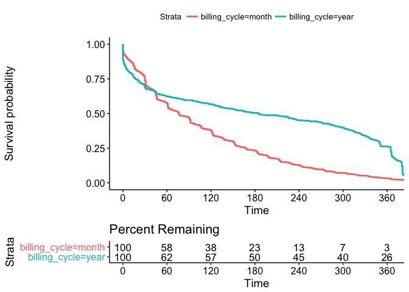
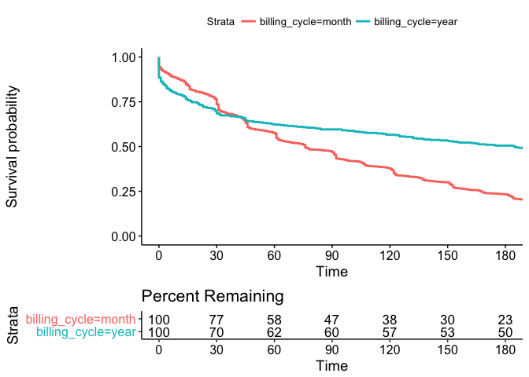
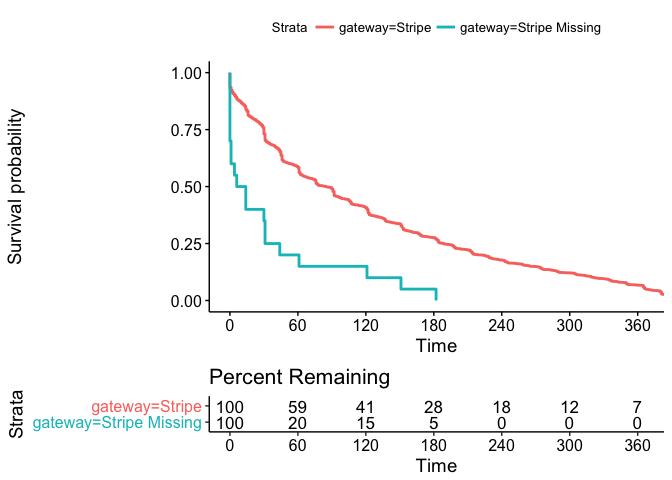

Business Churn
================

Motivation
----------

The purpose of this analysis is to explore Buffer for Business subscriptions to determine how many of them churn after a certain time period. We will visualize the distribution of the length of the subscriptions and run a Kaplan-Meier analysis to determine the percentage of subscriptions that churn X months after beginning.

TL;DR
-----

***The data seems to suggest the first 60 days are a crucial period for monthly Business subscriptions, and the first few days are crucial for yearly Business subscriptions.*** I might suggest designing features for the churn prediction model based on activity during the first 60 days after a subscription was created.

Data collection and tidying
---------------------------

Let's grab the subscriptions from [**this Look**](https://looker.buffer.com/looks/3859) using the `buffer` package.

``` r
# Get data from Looker
subs <- get_look(3859)
```

Alright cool, there are over 5000 subscriptions here. Let's do a bit of cleanup to get it in good shape for analysis.

``` r
# Rename columns
colnames(subs) <- c('created_at', 'canceled_at', 'ended_at', 'status', 'id', 'plan', 
                    'gateway', 'billing_cycle', 'amount')

# Set dates as date objects
subs$created_at <- as.Date(subs$created_at, "%Y-%m-%d")
subs$canceled_at <- as.Date(subs$canceled_at, "%Y-%m-%d")
subs$ended_at <- as.Date(subs$ended_at, "%Y-%m-%d")
```

Now let's calculate the length of the subscription in days for those that have cancelled and add an indicator if the subscirption canceled.

``` r
# Calculate subscription length
subs <- subs %>%
  mutate(length = as.numeric(canceled_at - created_at),
         churned = !(is.na(canceled_at)))
```

Alright, we're all set.

Survival analysis
-----------------

Clasically, survival analysis was used to model the time it takes for people to die of a disease. However it can be used to model and analyze the time it takes for a specific event to occur, churn in this case.

It's particularly useful in this case because of missing data -- there must be subscriptions that will churn in our dataset *that haven't yet*. This is called *censoring*, and in particular *right censoring*.

Right censoring occurs when the date of the event is unknown, but is after some known date. Survival analysis can account for this kind of censoring.

There is also left censoring, for example when the date the subscription begain is unknown, but that is less applicable to our case.

The survival function, or survival curve, (`S`) models the probability that the time of the event (`T`) is greater than some specified time (`t`) and is composed of:

-   The underlying Hazard function (how the risk of churn per unit time changes over time at baseline covariates).

-   The effect parameters (how the hazard varies in response to the covariates).

Let's try it out!

``` r
# Kaplan Meier Survival Curve
subs$survival <- Surv(subs$length, subs$churned)

# Fit the model
fit <- survfit(survival ~ billing_cycle, data = subs)
```

Alright! Let's summarize and plot the model.

``` r
# Create survival plot
library(survminer)

# Visualize with survminer
ggsurvplot(fit, data = subs, risk.table = "percentage", risk.table.title = "Percent Left",
           break.x.by = 60, xlim = c(0, 365))
```



Interesting! Based on the survival curve, we can see that most of the churn occurs in the first couple of months. Only 58% of monthly subscriptions and 62% of yearly subscriptions are active after 60 days.

The percentage of monthly subscriptions that remain continues to decrease (at a decreasing rate), while the percentage of yearly subscriptions that remain decreases at a slower rate, *up until the year mark* when their subscriptions are up for renewal.

Let's look at the plot a bit more closely, zooming in on the first 6 months.

``` r
# Build survival plot of first 6 months
ggsurvplot(fit, data = subs, risk.table = "percentage", risk.table.title = "Percent Left",
           break.x.by = 30, xlim = c(0, 180))
```



It's interesting to note that a relatively high percentage of yearly subscriptions churn quickly after being created. After around 30 days, the churn rate slows dramatically. Perhaps this could be something to hone in on.

Monthly subscriptions tend to churn at a fairly consistent (and consistently decreasing) rate. We can see that there are little kinks in the curve around each 30-day mark, which suggests that people cancel their subscriptions around the time that they are up for renewal. This makes sense.

We can see that 23% of monthly Business subscriptions and *30%* of yearly subscriptions are canceled in the first 30 days.

In the second 30 days (day 31-60), around 22% of monthly subscriptions and 8% of yearly subscriptions cancel.

***The data seems to suggest the first 60 days are a crucial period for monthly Business subscriptions, and the first few days are crucial for yearly Business subscriptions.***

Testing different covariates
----------------------------

Let's repeat the process above, but use different covariates to see if we can spot any patterns.

``` r
# Kaplan Meier Survival Curve
subs$survival <- Surv(subs$length, subs$churned)

# Fit the model using gateway as a covariate
fit <- survfit(survival ~ gateway, data = subs)

# Plot the survival curves
ggsurvplot(fit, data = subs, risk.table = "percentage", risk.table.title = "Percent Left",
           break.x.by = 60, xlim = c(0, 365))
```



Well we can see that when we're missing a `user_id` for a subscription, they don't tend to fair so well.
