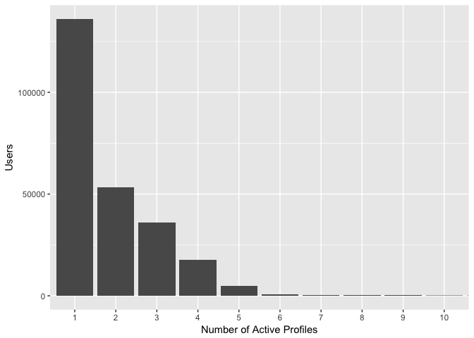
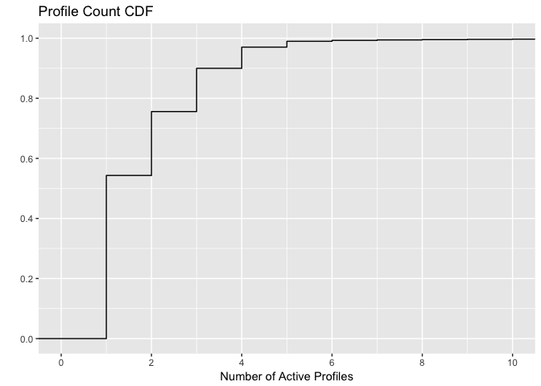

How many profiles do Free users use?
================

Motivation
----------

The purpose of this analysis is to get a better understanding of how users on the Individual plan use Buffer, in order to better inform decisions around the plan limits. Specifically, we would love to learn about how many profiles Free users actually schedule updates for.

More data questions and context can be found in [**this Paper**](https://paper.dropbox.com/doc/Free-Plan-data-KJNJLDW3KtfMdZK4Z6DRS), and potential changes to the Free plan can be found in [**this Paper**](https://paper.dropbox.com/doc/Free-plan-changes-DVheYkvNs3yiE9Nhb9XRF).

Methodology
-----------

In order to answer this question reliably with data, we would like to only consider users that are currently *active*, and analyze their updates *during the period in which they were active in Buffer*. In this case, *active* is defined as having scheduled at least one update with Buffer in the past 28 days.

To answer the question of how many profiles Free users actually use, we'll first gather all of the currently active Free users. Then, we will gather data on the number of profiles they have, and the number of updates that they have scheduled *for each profile*.

Once we have this data, we will gather some summary statistics on the number of active profiles for each active user, and visualize the distribution of the number of profiles in use. It is unlikely to be normally distributed (bell shaped), so visualizing this breakdown would be useful to understanding the potential impact that changing the limits might have.

Data collection
---------------

Let's start by getting the Free users that have scheduled at least one update in the past 28 days. We'll use the following SQL query to grab them.

``` sql
with user_facts as (
  select
    up.user_id
    , max(up.created_at) as last_update_created_at
  from transformed_updates as up
  inner join users
    on users.user_id = up.user_id
  where up.status != 'service'
  and users.billing_plan = 'individual'
  group by up.user_id
)
select
  user_id
  , last_update_created_at
from user_facts
where last_update_created_at > (current_date - 29)
```

Great! Now we need to get the number of updates they have scheduled, and the number of profiles that they have scheduled updates for, in the past 28 days.

``` sql
select
  up.user_id
  , count(distinct up.id) as updates_count
  , count(distinct up.profile_id) as profile_count
from transformed_updates as up
left join users
  on up.user_id = users.user_id
where users.billing_plan = 'individual'
and up.created_at > (current_date - 29)
group by up.user_id
```

Awesome! Now let's join the two datasets -- then we'll be ready to explore. :)

``` r
# Join updates and users
users <- users %>%
  left_join(updates, by = 'user_id')

# Replace NAs with 0s
users[is.na(users)] <- 0
```

Exploratory analysis
--------------------

So how does the profile count break down?

``` r
# Get summary stats on the number of profiles
summary(users$profile_count)
```

    ##    Min. 1st Qu.  Median    Mean 3rd Qu.    Max. 
    ##   1.000   1.000   1.000   1.903   2.000 194.000

Alright, here is the breakdown:

-   Around 50% of active Free plan users scheduled updates for only 1 profile in the past 28 days.
-   The average number of profiles that active Free plan users used in the past 28 days is 1.9.
-   Around 75% of active Free plan users scheduled updates for only 2 or less profiles.
-   Someone scheduled updates for 194 profiles in the past 28 days!

The maximum of 194 brings up a good point about our sample: these are only users that are *currently* on individual plans. This means that they could have been on a paid plan in the past 28 days. I don't think it's a huge portion, or very significant for this particular analysis, but it's something to keep in mind!

Let's look at the distribution.



Wow, that's interesting! It looks like most currently active Free users have only scheduled updates to one profile in the past 28 days. Let's look at the CDF of this distribution.



Interesting! This graph tells us the following:

-   Around 54% of users scheduled updates to 1 profile in the past 28 days.
-   Around 76% of users scheduled updates to 2 or less profiles in the past 28 days.
-   Around 90% of users scheduled updates to 3 or less profiles in the past 28 days.

Conclusions
-----------

If we were to go with the "less limited" Free plan and only allow users to connect up to 3 profiles, the data suggests that somewhere around 10% of currently active users would be affected. This equates to around 25k users.

If we were to go with the "more limited" Free plan and only allow 2 profiles, the data suggests that somewhere around 25% of currently active users would be affected! This equates to around 63k users.

I think it's important to note that this is just a snapshot of *currently* active users that are *currently* on Individual plans, but I do think we can infer some insights from them!
