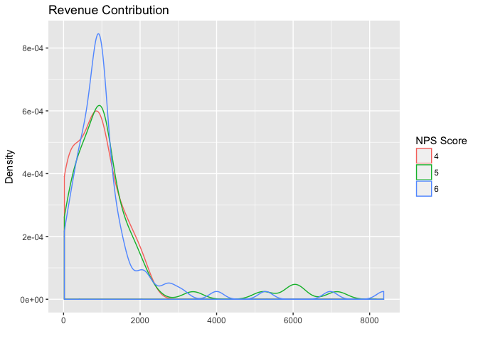
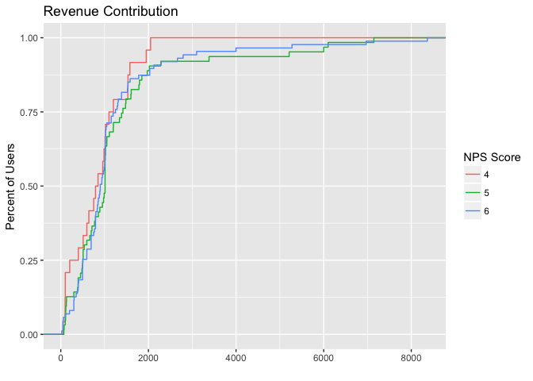

NPS and Revenue
================

Motivation
----------

The goal of this small analysis is to determine if the average revenue per user (ARPU) is significanly different for users that responded to Buffer's NPS survey with a 5, relative to those that responded with a 4 or 6.

The sample sizes are quite small, so I don't anticipate a statistically significantly different average for these scores, but let's see!

Conclusions
-----------

The ARPU of users that responded with a 6 is not significantly different than that of users that responded with a 5, however the ARPU of users that responded with a 4 is signfincantly different than that of users that responded with a 5!

Data collection
---------------

The responses can be viewed in [**this Look**](https://looker.buffer.com/x/dwzYVGs). I simply downloaded a CSV since the dataset is small.

``` r
# Read CSV
nps <- read.csv('~/Downloads/nps.csv', header = T)

# Change column names
colnames(nps) <- c('user_id', 'score', 'total_revenue')
```

Exploration
-----------

Let's summarise the data and visualize the distribution of the revenue contributed by these users.

``` r
# Summarize the dataset
summary(nps)
```

    ##                      user_id        score       total_revenue   
    ##  540678f7bc9722406824d202:  2   Min.   :4.000   Min.   :  20.0  
    ##  564ca39c3e7acaef3e601f73:  2   1st Qu.:5.000   1st Qu.: 501.4  
    ##  56a7e3d75b653c371a78d586:  2   Median :5.500   Median : 950.0  
    ##  4ed359a8512f7ee056000002:  1   Mean   :5.362   Mean   :1166.8  
    ##  4f24b26a512f7ebe09000000:  1   3rd Qu.:6.000   3rd Qu.:1277.8  
    ##  4f96fa81402f0b0b1800019f:  1   Max.   :6.000   Max.   :8367.8  
    ##  (Other)                 :165

There are 171 users in our dataset that gave Buffer a score of 4, 5, or 6. The minimum revenue amount contributed by these users is 20, the median is 950, and the max is 8367. Let's visualize the distribution of revenue amounts.

``` r
# Plot revenue distributions
ggplot(nps, aes(x = total_revenue, color = as.factor(score))) +
  geom_density() +
  labs(x = "", y = "Density", color = "NPS Score", title = "Revenue Contribution")
```



Now let's plot the cumulative distribution function (CDF) for each segment of user.

``` r
# Plot CDF
ggplot(nps, aes(x = total_revenue, color = as.factor(score))) +
  stat_ecdf() +
  labs(x = "", y = "Percent of Users", color = "NPS Score", title = "Revenue Contribution")
```



There is a slight suggestion that users that gave a score of 4 contribute less revenue.

T-test
------

Let's use a t-test to determine if the samples have significantly different means. We'll compare 4's and 5's first.

``` r
# Get samples
fours <- filter(nps, score == 4)
fives <- filter(nps, score == 5)
sixes <- filter(nps, score == 6)

# Run t-test
t.test(fours$total_revenue, fives$total_revenue)
```

    ## 
    ##  Welch Two Sample t-test
    ## 
    ## data:  fours$total_revenue and fives$total_revenue
    ## t = -2.0187, df = 84.175, p-value = 0.0467
    ## alternative hypothesis: true difference in means is not equal to 0
    ## 95 percent confidence interval:
    ##  -866.488245   -6.516993
    ## sample estimates:
    ## mean of x mean of y 
    ##  837.7217 1274.2243

Interesting! Even with the small sample, the ARPU is significantly different for users that responded with a 4 than a 5! Let's test the 5's and 6's.

``` r
# Run t-test
t.test(fives$total_revenue, sixes$total_revenue)
```

    ## 
    ##  Welch Two Sample t-test
    ## 
    ## data:  fives$total_revenue and sixes$total_revenue
    ## t = 0.41651, df = 126.37, p-value = 0.6777
    ## alternative hypothesis: true difference in means is not equal to 0
    ## 95 percent confidence interval:
    ##  -354.3579  543.2899
    ## sample estimates:
    ## mean of x mean of y 
    ##  1274.224  1179.758

The ARPU of users that responded with a 6 is not significantly different than that of users that responded with a 5. :)
