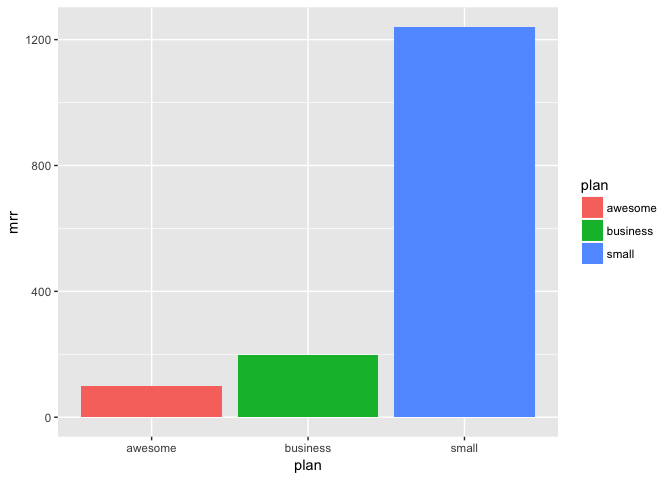

Profile Updates and MRR
================

Motivation
----------

The purpose of this exploration is to estimate the effect that banning Buffer users that have sent over 200 updates per profile in a given day would have on our MRR.

It also has to be taken into consideration that each individual user has the potential to do much more harm if his or her links lead to Buffer being blocked or suspended on bit.ly or one of the networks.

Data collection
---------------

We'll use the data collected in [**this look**](https://looker.buffer.com/x/sZVvNXm) which contains, the `user_id`, `profile_id`, `billing_plan`, `updates_count`, and most recent `mrr_value` of users that have scheduled 200 or more updates *for a single profile* yesterday.

``` r
library(dplyr)

# Import dataset
updates <- read.csv("~/Downloads/profile_updates.csv", header = TRUE)
```

Alright, there are 107 occurrences. Let's clean up just a little bit.

``` r
# Rename columns
colnames(updates) <- c('user_id', 'plan' , 'profile_id', 'updates', 'mrr_value')
```

Data tidying
------------

To estimate the effect on MRR, we need to group the data on the `user`, and calculate the MRR *per user* (instead of for each profile -- that would be double counting).

``` r
# Group by user
by_user <- updates %>%
  group_by(user_id, plan) %>%
  summarise(profiles = n_distinct(profile_id), 
            updates = sum(updates), 
            mrr = max(mrr_value))
```

Alright, we have 31 offenders from yesterday (June 5, 2017).

Summary graphs
--------------

Let's see how much MRR would be affected if we banned each user.

``` r
# Sum MRR
sum(by_user$mrr)
```

    ## [1] 1537.667

It would only be around $1500 per month, which is much less than 1% of total MRR! Let's break it down by plan.

``` r
library(ggplot2)

# Group by plan
by_plan <- by_user %>%
  group_by(plan) %>%
  summarise(mrr = sum(mrr))

# Plot MRR values for each plan
ggplot(by_plan, aes(x = plan, y = mrr, fill = plan)) +
  geom_bar(stat = 'identity')
```



The MRR lost would mostly come from small business plans, which makes sense.

Conclusion
----------

Since there are a small number of users in the sample, I would manually go through them and determine if they are spamming or not. If so, I think it would be worth it to suspend the ***profiles*** from Buffer.
