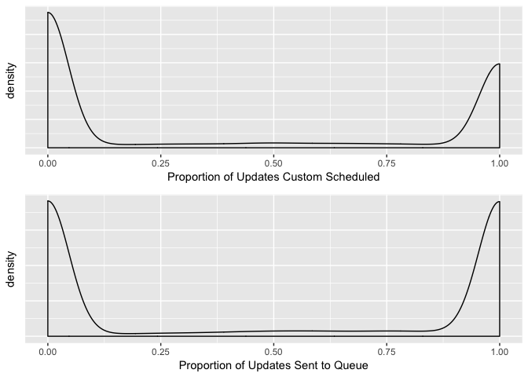

Custom Scheduled Updates
================

Motivation
----------

The purpose of this analysis is to get an estimate of the percentage of Buffered posts that are shared now, shared to the queue, and scheduled at a custom time. It is in reference to [this issue](https://github.com/bufferapp/data-team/issues/63).

Methodology
-----------

Because there are many users that share many updates through Buffer, we will take a small sample of users that shared updates in Buffer *in the past 7 days*. We will then determine the type of share by looking at the full scope of the `actions_taken` event associated with the update. Then we can run some summary statistics and visualize the breakdown.

Data collection
---------------

It should be a fairly straightforward SQL query to get this data. Let's try it by querying `actions_taken`.

``` sql
select
  user_id
  , full_scope
  , count(distinct id)
from actions_taken
where full_scope like '%updates shared%'
and date > (current_date - 7)
group by user_id, full_scope
```

``` r
# Save the data
# save(updates, file = "queue_updates.Rda")

# Load the data
load('queue_updates.Rda')
```

Determine update types
----------------------

Let's quickly examine the different values of `full_scope`.

``` r
updates %>%
  group_by(full_scope) %>%
  summarise(count = n()) %>%
  arrange(desc(count))
```

    ## # A tibble: 35 x 2
    ##                                                         full_scope count
    ##                                                              <chr> <int>
    ##  1                         dashboard updates shared composer later 43150
    ##  2                      dashboard updates shared composer schedule 41994
    ##  3      extension composer multiple-composers updates shared later 32200
    ##  4                           dashboard updates shared composer now 30206
    ##  5        extension composer multiple-composers updates shared now 15639
    ##  6               dashboard updates shared composer schedule pinned 13068
    ##  7                dashboard updates shared composer later rebuffer 10780
    ##  8   extension composer multiple-composers updates shared schedule  9127
    ##  9             dashboard updates shared composer schedule rebuffer  4079
    ## 10 extension composer multiple-composers updates shared later next  4028
    ## # ... with 25 more rows

Hm. It seems like the last two words in the full scope in particular indicate whether the update was shared at a custom time, added to the queue, or shared now.

If the `full_scope` contains "now", the update was shared now. Let's start with that.

``` r
# Create new column
updates$type <- character(nrow(updates))

# Get index of updates that contain 'now' in full_scope
now_index <- grep("now", updates$full_scope, ignore.case = T)

# Set the type of these rows to 'now'
updates$type[now_index] = "now"
```

Cool, now let's do the same for the word "schedule"

``` r
# Get index of updates that contain 'schedule' in full_scope
schedule_index <- grep("schedule", updates$full_scope, ignore.case = T)

# Set the type of these rows to 'custom_schedule'
updates$type[schedule_index] = "custom_schedule"
```

Now let's make an assumption: the rest of the updates were sent to the queue (in whichever slot).

``` r
# Set remaining types to 'queue'
updates[updates$type == "", ]$type <- 'queue'
```

Great! I think we're ready now.

Exploratory analysis
--------------------

Let's look at the overall percent of updates by type.

``` r
# Group by update type
updates %>% 
  group_by(type) %>%
  summarise(users = n_distinct(user_id), updates = sum(count)) %>%
  mutate(updates_percent = updates / sum(updates)) %>%
  arrange(desc(updates_percent))
```

    ## # A tibble: 3 x 4
    ##              type users updates updates_percent
    ##             <chr> <int>   <dbl>           <dbl>
    ## 1           queue 73527 1082959       0.5100536
    ## 2 custom_schedule 56449  789603       0.3718883
    ## 3             now 44641  250664       0.1180581

Cool, so around 51% of all updates sent in the past 7 days were sent to the queue, around 37% were sent via a custom schedule, and around 12% were sent now.

***This might not tell the whole story however, as these percentages might be disproportionately influenced by users that send large numbers of updates.*** It might be worth getting this breakdown for *each* user, and then analyzing the distribution of that breakdown.

### Get breakdown per user

We want to group the updates by user and type of update. We first need to tidy the data a bit and make sure each user has a value for each type. Let's also only look at users that scheduled at least 5 updates

``` r
# Group by user
by_user <- updates %>%
  group_by(user_id, type) %>%
  summarise(updates = sum(count)) %>%
  filter(updates >= 5)
```

Now we need to make sure the users have values for all three types of updats.

``` r
library(tidyr)

# Spread the update types
spread <- by_user %>%
  spread(type, updates)

# Replace the new NAs with 0
spread[is.na(spread)] <- 0

# Now gather the updates into tidy format again
long <- spread %>%
  gather(type, updates, custom_schedule:queue)
```

There we go! Now for each user, we can calculate the proportion of updates for each type.

``` r
# Calculate proportions for each user
proportions <- long %>%
  group_by(user_id, type) %>%
  summarise(updates = updates) %>%
  mutate(proportion = updates / sum(updates))
```

Now let's look at the plots of the distributions. 

Interesting, for both custom-scheduled posts and posts sent to the queue, users either did it a lot, or not very much. For custom-scheduled posts, most users only custom scheduled for a very small percentage of updates. However, some users sent a very high proportion of posts via a custom schedule.

For queue updates, it's a similar story, except *more* users sent the vast majority of updates to the queue. :)

Conclusions
-----------

Most posts are sent directly to the queue, but a high proportion are also sent via a custom-schedule. The distribution doesn't seem to be even for users - either they send most directly to the queue or they send a low percentage of posts directly to the queue.

Most users send a small percentage of their posts via a custom schedule, but there are also users that send a high proportion of updates via a custom schedule. :)
