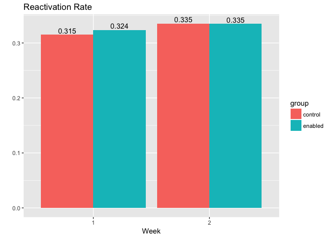

Effect of Weekly Digest
================

Motivation
----------

The purpose of this analysis is to determine the effect that the weekly digest has on dormant users. We'll try to measure the percent of users that reactivated (defined as scheduling at least one update after receiving the digest).

We'll also calculate the percentage of dormant users that *did not* receive the digest that reactivated.

Conclusions
-----------

Based on this sample of users from the first two Dormant emails of 2017, the data suggests that the weekly digest does not have a signficant effect on reactivation (defined as scheduling an update through Buffer on or after the week of the digest). Both the `control` group and the `enabled` group reactivated at similar rates of 31% to 34%.

In the analysis we might assume that users do receive and open the emails, and that the emails are different for users in the `control` and `enabled` groups.

Data collection
---------------

We'll gather a small-ish users from [this look](https://looker.buffer.com/looks/3895). These users were part of the `Weekly Digest Week2017 Dormant Test` experiment for the *first two weeks of 2017*.

``` r
# Get users
users <- get_look(3895)
```

    ## Loading required package: httr

``` r
# Rename columns
colnames(users) <- c('user_id', 'name', 'group')

# Set name as character obj
users$name <- as.character(users$name)
```

This dataset has around 100K users. Now let's try to extract the week numbers and get the dates from there.

``` r
# Remove non-numeric characters and 2017
users <- users %>%
  mutate(week = gsub("[^0-9]", "", name)) %>%
  mutate(week_num = as.numeric(gsub("2017", "", week)))

# Get the date from the week number
users <- users %>%
  mutate(date = as.Date(paste(2017, week_num, 1, sep="-"), "%Y-%U-%u")) %>%
  mutate(date = date - 1)
```

Next we'll need to get the number of updates these users sent on each week *after* receiving the weekly digest. This might be a tricky ask. Let's grab these updates from [**another look**](https://looker.buffer.com/looks/3896), and join it in to our initial dataset.

``` r
# Get updates
updates <- get_look(3896)
```

Cool! Now that we have the updates, let's join them back into our `users` dataframe. Then we're finally ready for some analysis!

Exploratory analysis
--------------------

Let's start simply. We'll see how many users (and what percentage) in each group sent any updates after receiving the dormant email.

``` r
# Replace NAs with 0s
user_updates$updates[is.na(user_updates$updates)] <- 0

# Group by experiment group
by_group <- user_updates %>%
  mutate(reactivated = (updates > 0)) %>%
  group_by(week_num, group, reactivated) %>%
  summarise(users = n_distinct(user_id)) %>%
  mutate(proportion = users / sum(users)) %>%
  filter(reactivated == TRUE)

by_group
```

    ## Source: local data frame [4 x 5]
    ## Groups: week_num, group [4]
    ## 
    ## # A tibble: 4 x 5
    ##   week_num   group reactivated users proportion
    ##      <dbl>  <fctr>       <lgl> <int>      <dbl>
    ## 1        1 control        TRUE 10721  0.3153050
    ## 2        1 enabled        TRUE 10906  0.3237451
    ## 3        2 control        TRUE  9239  0.3354757
    ## 4        2 enabled        TRUE  9106  0.3352601

Cool, it looks like both the experiment and control groups reactivate at very similar rates, between 31% and 34%. Let's graph it out just for fun.



Conclusions
-----------

Based on this sample of users from the first two Dormant emails of 2017, the data suggests that the weekly digest does not have a signficant effect on reactivation (defined as scheduling an update through Buffer on or after the week of the digest).
